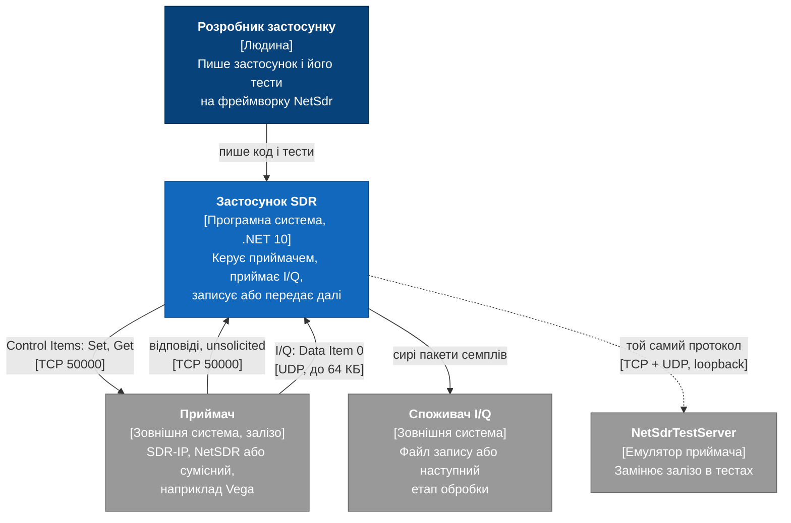
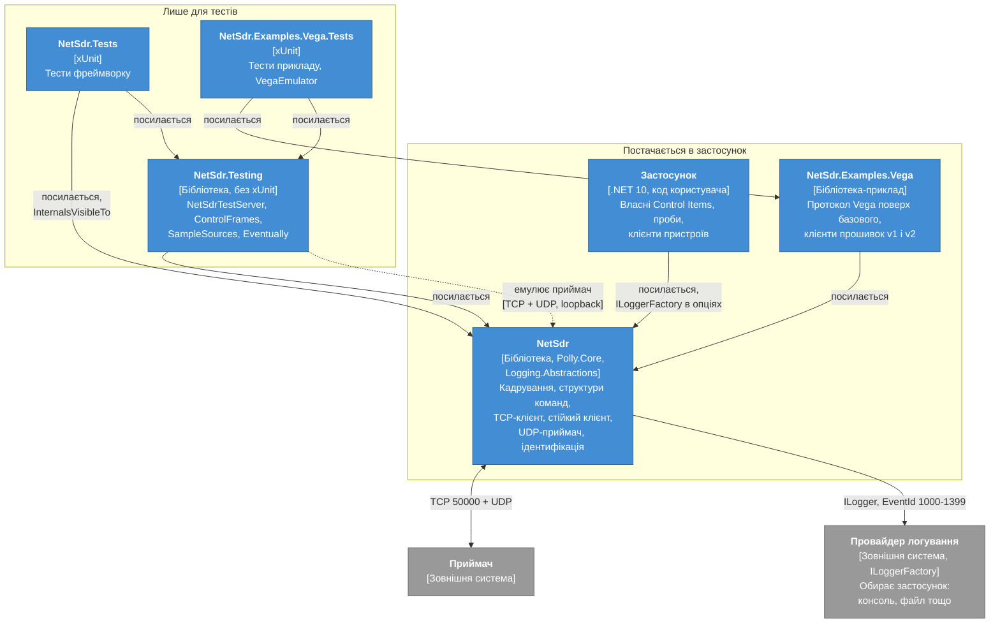
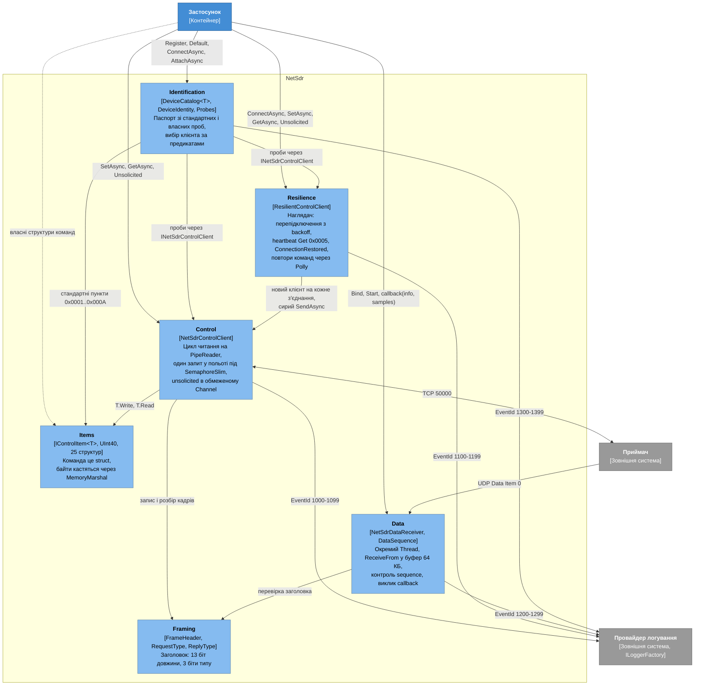
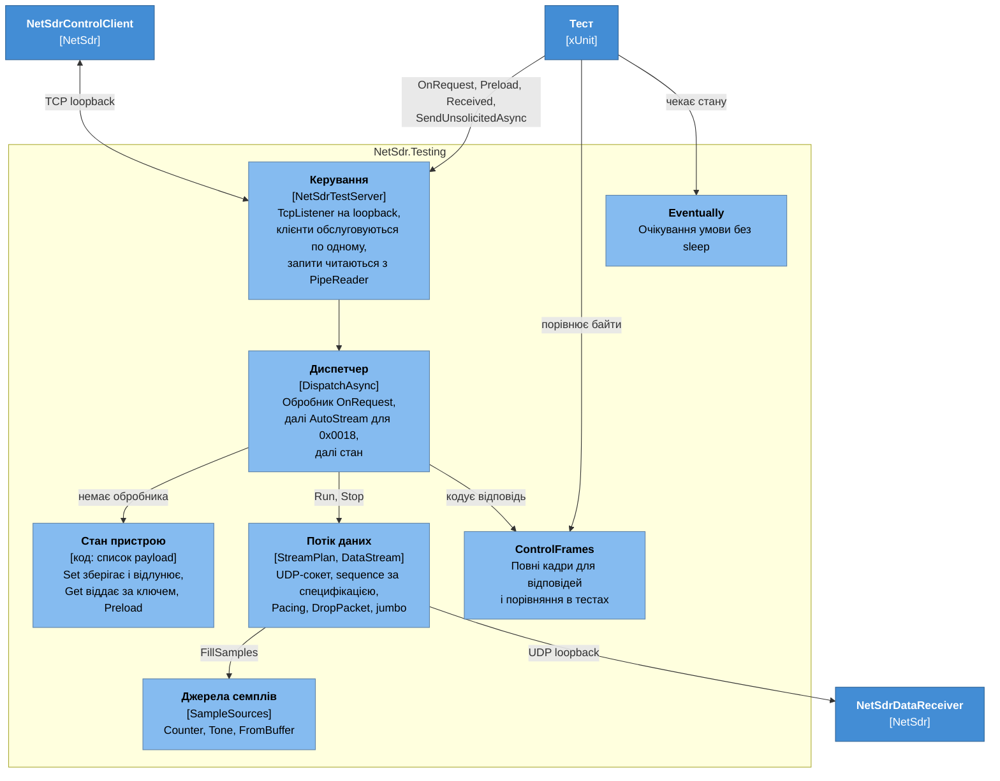
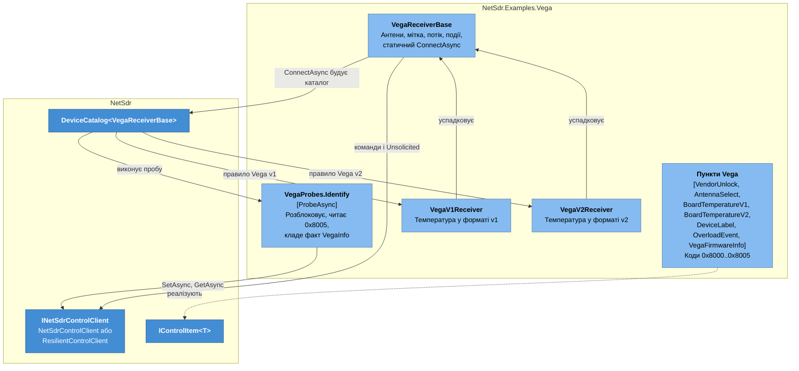
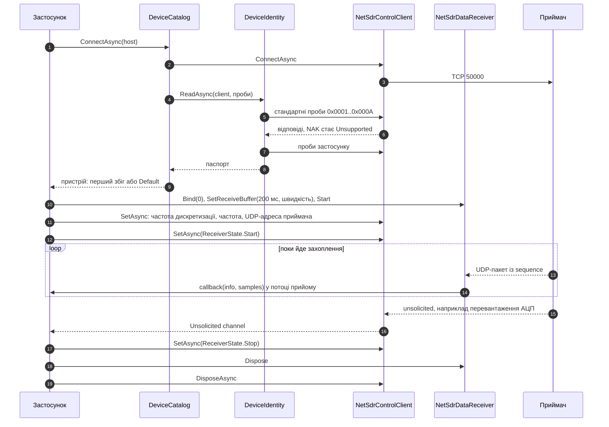
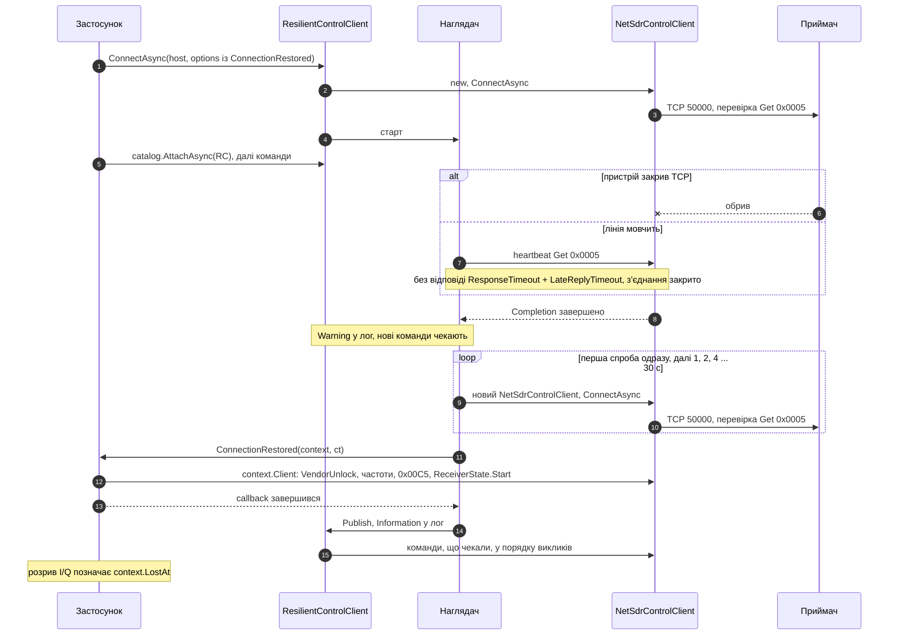

# Архітектура NetSdr

Огляд у нотації [C4](https://c4model.com): контекст, контейнери, компоненти і дві
динамічні діаграми, що зшивають їх у робочі сценарії. Діаграми описують код у цьому
репозиторії. Деталі API і поведінки лежать у специфікаціях:

- [Фреймворк](superpowers/specs/2026-10-02-netsdr-framework-design.md): кадрування,
  структури команд, канали керування і даних, тестовий сервер, приклад Vega.
- [Ідентифікація пристрою](superpowers/specs/2026-10-02-netsdr-device-identification-design.md):
  паспорт, проби, каталог клієнтів, версії Vega.
- [Стійкість і логування](superpowers/specs/2026-10-07-netsdr-resilience-logging-design.md):
  `ResilientControlClient` з перепідключенням і heartbeat, `INetSdrControlClient`,
  логування всієї бібліотеки.

Рівень 4 (код) окремо не малюю. Класові діаграми ключових типів є в специфікаціях, а решту
швидше прочитати в самому коді.

**Нотація.** Діаграми це Mermaid `flowchart` у кольорах C4. Вбудований синтаксис C4 у
Mermaid досі експериментальний і розкладає блоки внахлест, тому він не використовується.

| Колір | Значення |
|---|---|
| Темно-синій | Людина |
| Синій | Система або контейнер у фокусі |
| Блакитний | Компонент |
| Сірий | Зовнішня система |
| Пунктир | Зв'язок, що існує лише в тестах |

## 1. Контекст

Хто користується системою і з чим вона говорить.

- Канали незалежні. TCP несе запит-відповідь і повідомлення, які пристрій надсилає сам.
  UDP несе лише потік I/Q від приймача до застосунку.
- Застосунок не декодує семпли: перший споживач записує сирі пакети.
- Пошук пристроїв broadcast-ом на порти 48321/48322 поза межами системи.

## 2. Контейнери

Застосунок працює одним процесом, тому контейнерами тут названо збірки .NET. Саме вони є
одиницями постачання, і межі між ними задаються посиланнями проєктів.

- `NetSdr` залежить від двох пакетів поза BCL. `Polly.Core` дає повтори і backoff
  усередині `ResilientControlClient`, у публічному API типів Polly немає.
  `Microsoft.Extensions.Logging.Abstractions` дає `ILoggerFactory` в опціях і генератор
  `[LoggerMessage]`. `System.IO.Pipelines` і `System.Threading.Channels` входять у runtime.
- Логування за замовчуванням вимкнене: `NullLoggerFactory`. `NetSdr.Testing` не логує.
- `NetSdr.Testing` окрема бібліотека без тестового фреймворку, тому тести застосунку
  беруть емулятор, не тягнучи xUnit у продакшн-код і не залежачи від тестів фреймворку.
- `NetSdr.Tests` бачить внутрішній метод клієнта, що приймає `PipeReader` і `Stream`.
  Так кадрування тестується на пам'яті, без сокетів. Так само він бачить internal-опції
  `TimeProvider`: backoff, відмова, `ResponseTimeout` і підсумки UDP тестуються на
  `FakeTimeProvider`, решта стійкого клієнта на справжньому часі з короткими таймаутами,
  логи на `FakeLogger` (пакети `Microsoft.Extensions.TimeProvider.Testing` і
  `Microsoft.Extensions.Diagnostics.Testing`).
- Приклад Vega показує, як будується застосунок: свої структури, своя проба, свої
  клієнти, свій емулятор поверх `NetSdrTestServer`.

## 3. Компоненти `NetSdr`

- `Control` і `Data` не знають одне про одного. Застосунок з'єднує їх сам: бере
  `LocalEndPoint` приймача і передає його пристрою командою 0x00C5.
- `Identification` це надбудова над `Control`, а не частина клієнта. Паспортом можна
  користуватися без каталогу, а клієнтом без паспорта.
- `Resilience` теж надбудова над `Control`. На кожне з'єднання він створює новий
  `NetSdrControlClient`, і одночасно існує лише одне з'єднання. Обидва клієнти реалізують
  `INetSdrControlClient`, тому `Identification` і клієнти пристроїв працюють з будь-яким.
  Стан пристрою після перепідключення відновлює застосунок у `ConnectionRestored`.
- Логування наскрізне. Кожен компонент бере `ILoggerFactory` зі своїх опцій, категорія це
  повне ім'я класу, EventId стабільні й лежать у діапазоні компонента.
- `Items` не залежить ні від чого, крім BCL. Нова команда застосунку це нова структура,
  без реєстрації: код береться зі статичного члена `Code`.

### 3.1. Потоки виконання

Хто де виконується, бо від цього залежить, що можна робити в обробниках.

| Код | Потік | Наслідок |
|---|---|---|
| `SetAsync`, `GetAsync`, `SendAsync` | Потік виклику, далі пул | Запити стають у чергу на семафорі в порядку надходження |
| Цикл читання TCP | Задача пулу, одна на клієнт | Розбирає кадри і `T.Read` прямо з буфера pipe |
| Продовження після `await SetAsync` | Пул | `RunContinuationsAsynchronously`, код застосунку не блокує цикл читання |
| Читання `Unsolicited` | Будь-який, один читач | Канал обмежений, при переповненні викидається найстаріше |
| Наглядач `ResilientControlClient` | Задача пулу, одна на клієнт | Єдиний створює, перевіряє і публікує з'єднання. Чекає на `Completion` внутрішнього клієнта, перепідключається з backoff |
| Heartbeat | Усередині наглядача, затримки через `TimeProvider` | Get 0x0005 лише на вільній лінії, коли від пристрою нічого не чути `HeartbeatInterval`; новий не йде, поки попередній без відповіді |
| Callback `ConnectionRestored` | Наглядач, до публікації нового з'єднання | Не виконується паралельно сам із собою чи з heartbeat. Команди застосунку чекають, запити йдуть через `context.Client`; виклик самого `ResilientControlClient` звідси фатальний |
| Перекачування `Unsolicited` у `ResilientControlClient` | Задача пулу на кожне з'єднання | Один канал на весь час життя клієнта, повідомлення в порядку з'єднань |
| Callback `DataPacketHandler` | Виділений потік прийому UDP | Довга робота тут означає втрати в сокеті; span дійсний лише всередині виклику |
| Підсумок статистики UDP у лог | Той самий потік прийому, раз на `StatisticsLogInterval` | Таймера немає: годинник читається раз на 256 пакетів, окремі пакети не логуються |

## 4. Компоненти `NetSdr.Testing`

- Порядок вибору відповіді: обробник для коду, потім `AutoStream` для 0x0018, потім стан.
  Тому перекриття в тесті завжди перемагає поведінку за замовчуванням.
- Параметри потоку беруться зі стану, який клієнт сам задав командами 0x00B8, 0x00C4,
  0x00C5 і 0x0018. Явні `StreamOptions` мають пріоритет.

## 5. Компоненти прикладу Vega

Як застосунок розширює фреймворк, нічого в ньому не змінюючи.

- Версія прошивки визначається власною командою після розблокування: NAK на 0x8005
  означає v1.
- Той самий код 0x8002 має дві структури. Версійні класи відрізняються лише читанням
  температури і розбором подій.

## 6. Динамічна діаграма: підключення і запис I/Q

Наскрізний сценарій через компоненти `NetSdr` зі звичайним `NetSdrControlClient`. Обрив і
відновлення з `ResilientControlClient` показано в розділі 7. Послідовності окремих частин
детальніше показано в специфікаціях.

## 7. Динамічна діаграма: обрив і відновлення керування

Той самий застосунок із `ResilientControlClient`. Деталі в спеці
[стійкості і логування](superpowers/specs/2026-10-07-netsdr-resilience-logging-design.md).

- Жодна команда застосунку не доходить до нового з'єднання, доки `ConnectionRestored` не
  повернувся. Команду, яку перервав обрив, клієнт надсилає знову вже на новому з'єднанні.
- Повільна відповідь це ще не обрив. Повтор чекає на запізнілу відповідь і не надсилає
  запит удруге. З'єднання замінюється, лише коли запит лишився без відповіді
  `ResponseTimeout + LateReplyTimeout`.
- `NetSdrDataReceiver` не змінюється і тримає свій порт. Пристрій після `ReceiverState.Start`
  починає sequence з 0, тому простій не потрапляє в `Lost`. Розрив застосунок позначає за
  `context.LostAt`.
