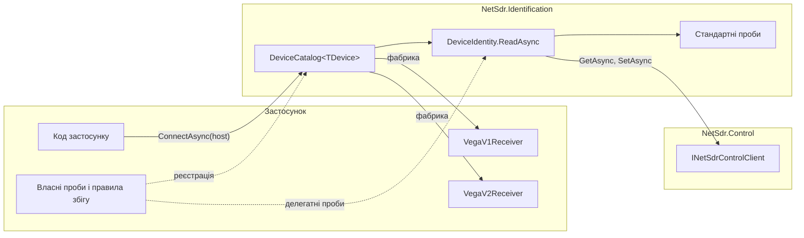
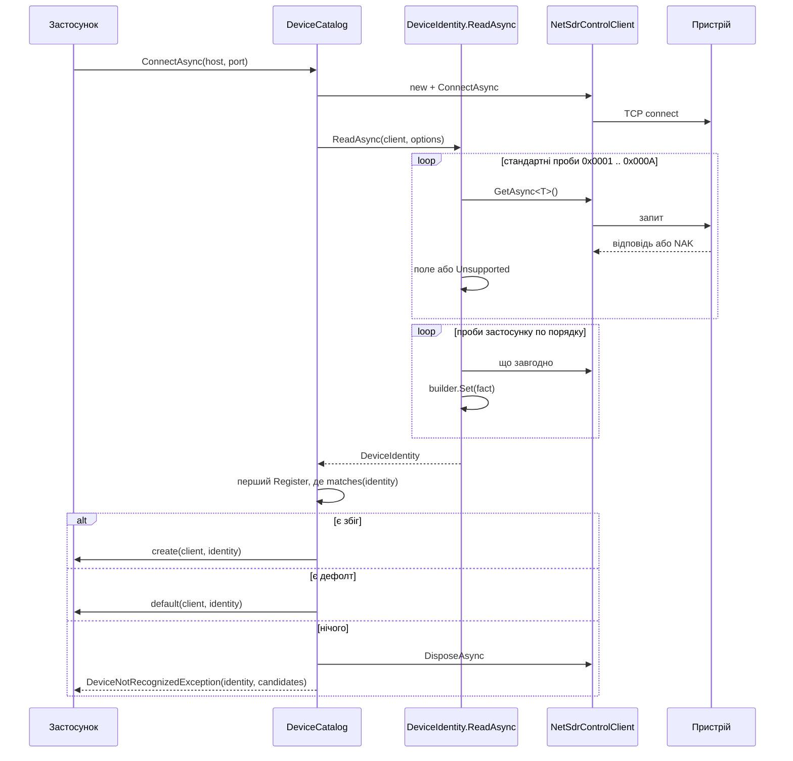
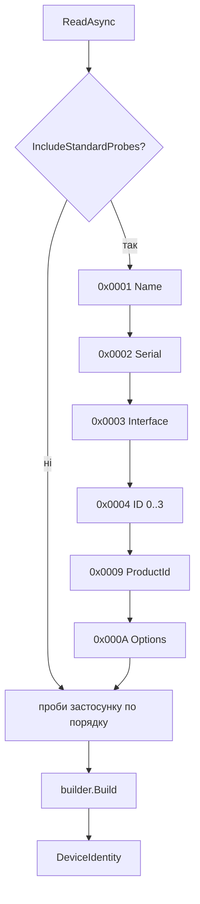
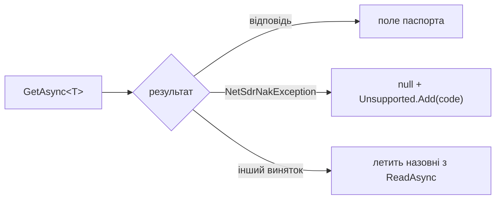
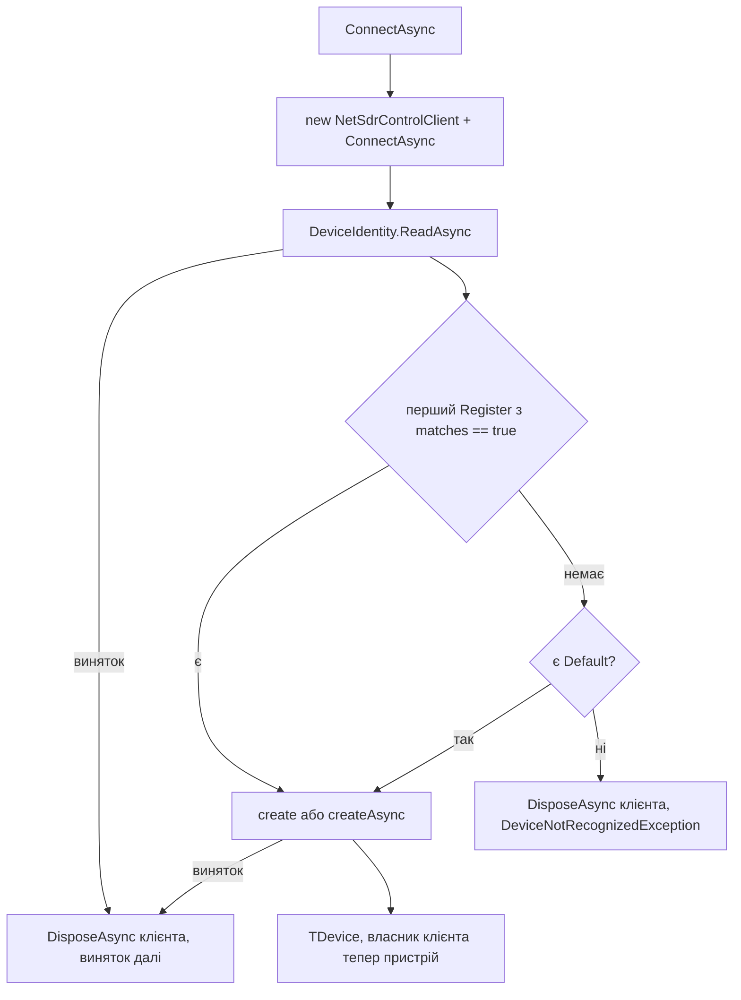
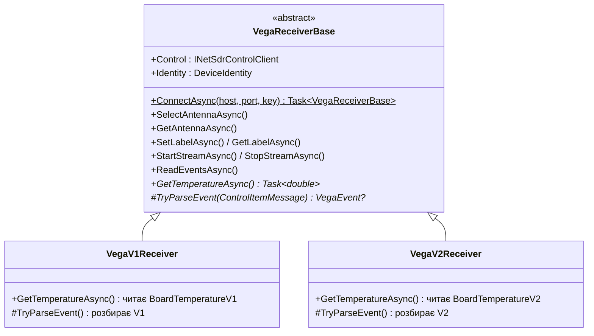

# NetSdr: ідентифікація пристрою і вибір клієнта

Дата: 2026-10-02
Статус: узгоджено в обговоренні, чекає на огляд письмової версії.
Узгоджено з реалізацією 2026-10-02 (фінальний огляд гілки): розділ 8 називає шість кодів
стандартних проб, не сім.
Доповнено 2026-10-07 спекою `2026-10-07-netsdr-resilience-logging-design.md`: проби,
`ReadAsync`, фабрики і `AttachAsync` каталогу приймають `INetSdrControlClient`,
`IdentificationOptions` має `LoggerFactory` (розділи 2, 3.1, 4.1, 4.2, 5.1, 5.2 і 6.3).
Базується на: `2026-10-02-netsdr-framework-design.md` (далі "базова спека")

## 1. Мета і межі

**Мета.** Після TCP-підключення фреймворк сам з'ясовує, що це за пристрій, і створює
клієнт потрібного класу. Модель визначає профіль (набір команд), версія прошивки всередині
моделі змінює формати тих самих команд, а частину інформації доводиться брати з власних
команд пристрою, які можуть вимагати попередніх кроків на кшталт розблокування.

**Що входить**
- `DeviceIdentity`: незмінний паспорт пристрою зі стандартних пунктів 0x0001 до 0x000A
  плюс факти з проб застосунку.
- Проби: стандартні, прості типізовані (`Probes.Item<T>`) і довільні делегатні.
- `DeviceCatalog<TDevice>`: реєстр кандидатів із предикатами і фабриками, перший збіг
  перемагає, є дефолтний кандидат.
- Інтеграція з прикладом Vega з розділу 11 базової спеки: v1 і v2 прошивки, різні формати
  одного пункту, версія з власної команди після розблокування.

**Що не входить**
- Пошук пристроїв у мережі (broadcast 48321/48322). Паспорт читається лише з уже
  підключеного клієнта.
- Таблиці можливостей моделей RFSPACE (дозволені sample rate тощо). Є лише
  `KnownModel` за рядком Target Name.
- Декларативні правила збігу через атрибути чи конфігурацію. Правила пишуться кодом.

## 2. Архітектура

Два шари в просторі імен `NetSdr.Identification` бібліотеки `NetSdr`. Нижній шар
працює сам по собі, верхній це тонка надбудова.



Розміщення у проєктах базової спеки:

```
NetSdr/
  Identification/   DeviceIdentity, DeviceIdentityBuilder, KnownModel, FpgaInfo,
                    IdentificationOptions, Probes, ProbeAsync, DeviceCatalog<T>,
                    DeviceNotRecognizedException, DeviceVersion
examples/Vega/NetSdr.Examples.Vega/
  Items/            BoardTemperatureV1, BoardTemperatureV2, VegaFirmwareInfo (додаються)
  VegaProbes.cs, VegaInfo.cs, VegaReceiverBase.cs, VegaV1Receiver.cs, VegaV2Receiver.cs
NetSdr.Tests/Identification/
examples/Vega/NetSdr.Examples.Vega.Tests/
```

### 2.1. Повний сценарій



## 3. Паспорт

### 3.1. `DeviceIdentity`

```csharp
public sealed record DeviceIdentity
{
    public string? Name { get; }                // 0x0001 Target Name
    public string? SerialNumber { get; }        // 0x0002
    public Version? InterfaceVersion { get; }   // 0x0003, 529 → 5.29
    public Version? BootVersion { get; }        // 0x0004, ID 0
    public Version? FirmwareVersion { get; }    // 0x0004, ID 1
    public Version? HardwareVersion { get; }    // 0x0004, ID 2
    public FpgaInfo? Fpga { get; }              // 0x0004, ID 3
    public uint? ProductId { get; }             // 0x0009
    public Options? Options { get; }            // 0x000A, структура з базової спеки
    public KnownModel Model { get; }            // за Name
    public IReadOnlySet<ushort> Unsupported { get; }   // коди, на які прийшов NAK

    public bool TryGet<TFact>([MaybeNullWhen(false)] out TFact fact) where TFact : notnull;
    public TFact Get<TFact>() where TFact : notnull;   // KeyNotFoundException з іменем типу
    public IReadOnlyCollection<Type> FactTypes { get; } // для діагностики

    public static Task<DeviceIdentity> ReadAsync(INetSdrControlClient client,
        IdentificationOptions? options = null, CancellationToken ct = default);
}

public readonly record struct FpgaInfo(byte ConfigId, byte Revision);

public enum KnownModel { Unknown = 0, SdrIp, NetSdr, CloudIq, CloudSdr }

public static class DeviceVersion
{
    public static Version FromHundredths(ushort value);   // 529 → new Version(5, 29)
}
```

- Паспорт незмінний. `ReadAsync` нічого не кешує і не закриває клієнт.
- Мішок фактів ключований типом: `Dictionary<Type, object>`. Один факт на тип, пізніший
  `Set` замінює попередній. Структури боксяться один раз, це не гарячий шлях.
- `Model` визначається за `Name` без урахування регістру за префіксом: `SDR-IP`,
  `NetSDR`, `CloudIQ` (також `Cloud-IQ`), `CloudSDR`. Усе інше `Unknown`. Жодних
  таблиць можливостей.
- `Fpga` береться з 0x0004 ID 3: молодший байт `Version` це ID конфігурації, старший
  це ревізія (особливість описана в базовій спеці, розділ 4.2).

### 3.2. `DeviceIdentityBuilder`

Мутабельний накопичувач, який бачать проби.

```csharp
public sealed class DeviceIdentityBuilder
{
    public DeviceIdentity Current { get; }               // знімок на цей момент
    public void Set<TFact>(TFact fact) where TFact : notnull;
    public void MarkUnsupported(ushort code);
    // стандартні поля заповнюють стандартні проби через internal-методи
}
```

`Current` будує новий незмінний знімок при кожному зверненні. Делегатна проба читає з
нього вже зібране, наприклад `ProductId`, і вирішує, чи працювати далі.

## 4. Проби

### 4.1. Типи

```csharp
public delegate Task ProbeAsync(INetSdrControlClient client, DeviceIdentityBuilder builder,
    CancellationToken ct);

public sealed class IdentificationOptions
{
    public bool IncludeStandardProbes { get; set; } = true;
    public IList<ProbeAsync> Probes { get; } = new List<ProbeAsync>();
    public ILoggerFactory LoggerFactory { get; set; } = NullLoggerFactory.Instance;  // null: ArgumentNullException
}

public static class Probes
{
    public static ProbeAsync Item<T>()
        where T : struct, IControlItem<T>;
    public static ProbeAsync Item<T, TKey>(TKey key)
        where T : struct, IControlItem<T> where TKey : unmanaged;
}
```

`Probes.Item<T>` робить `GetAsync<T>` і кладе структуру в мішок як факт типу `T`. На
`NetSdrNakException` викликає `MarkUnsupported(T.Code)` і нічого не кладе.

Логування ідентифікації: `IdentificationOptions.LoggerFactory`, EventId 1300-1399, деталі в
спеці 2026-10-07. Кожна проба і її результат на рівні Debug, прочитаний паспорт і обрана
реєстрація каталогу на рівні Information, нерозпізнаний пристрій на рівні Warning.
`DeviceCatalog` бере логер із тих самих опцій.

### 4.2. Порядок виконання



Кожен запит стандартної проби:



- NAK це властивість пристрою, не помилка. Таймаут, обрив, `NetSdrProtocolException` це
  проблема зв'язку або несумісність, вони пролітають назовні.
- 0x0004 запитується чотири рази з ID 0, 1, 2, 3. Відсутній окремий ID лишає своє поле
  `null`. Код 0x0004 потрапляє в `Unsupported` лише якщо NAK прийшов на всі чотири.
  Порожній payload на будь-який ID трактується як відсутність.
- Проби застосунку йдуть після стандартних у порядку списку. Так делегатна проба вже
  бачить `ProductId` і `FirmwareVersion` у `builder.Current`.
- Усі запити йдуть через переданий клієнт (`NetSdrControlClient` або
  `ResilientControlClient`), тобто послідовно і з його таймаутами.

### 4.3. Делегатна проба

Бачить клієнт і накопичувач, робить що завгодно: кілька запитів, Set перед Get,
обчислення. Якщо проба не хоче працювати на чужому пристрої, вона перевіряє
`builder.Current` і виходить. Приклад для Vega в розділі 6.

## 5. Каталог

### 5.1. API

```csharp
public sealed class DeviceCatalog<TDevice> where TDevice : class
{
    public DeviceCatalog(IdentificationOptions? identification = null,
                         NetSdrControlClientOptions? clientOptions = null);

    public DeviceCatalog<TDevice> Register(string name,
        Func<DeviceIdentity, bool> matches,
        Func<INetSdrControlClient, DeviceIdentity, TDevice> create);
    public DeviceCatalog<TDevice> Register(string name,
        Func<DeviceIdentity, bool> matches,
        Func<INetSdrControlClient, DeviceIdentity, CancellationToken, Task<TDevice>> createAsync);

    public DeviceCatalog<TDevice> Default(
        Func<INetSdrControlClient, DeviceIdentity, TDevice> create);
    public DeviceCatalog<TDevice> Default(
        Func<INetSdrControlClient, DeviceIdentity, CancellationToken, Task<TDevice>> createAsync);

    public IReadOnlyList<string> Registrations { get; }
    public bool HasDefault { get; }

    // ConnectAsync створює звичайний NetSdrControlClient з clientOptions
    public Task<TDevice> ConnectAsync(string host, int port = 50000, CancellationToken ct = default);
    public Task<TDevice> ConnectAsync(IPEndPoint endPoint, CancellationToken ct = default);
    public Task<TDevice> AttachAsync(INetSdrControlClient client, CancellationToken ct = default);
}

public sealed class DeviceNotRecognizedException : NetSdrException
{
    public DeviceIdentity Identity { get; }
    public IReadOnlyList<string> Candidates { get; }   // імена Register по порядку
}
```

### 5.2. Поведінка



- `TDevice` це базовий тип застосунку, зазвичай інтерфейс. Усі кандидати його
  реалізують, результат типізований без кастів.
- Порядок `Register` і є пріоритетом: перший збіг перемагає, конкретніші правила
  реєструються раніше. Предикат бачить весь паспорт, включно з фактами проб.
- `Default` один, повторний виклик замінює попередній. Він не бере участі в переборі й не
  фігурує в `Candidates`: спершу всі `Register`, потім дефолт.
- `ConnectAsync` володіє клієнтом до моменту, коли фабрика повернула пристрій. Будь-який
  виняток до цього закриває клієнт. Після успіху власник це пристрій, каталог нічого не
  тримає.
- `AttachAsync` робить те саме з уже підключеним клієнтом і ніколи його не закриває,
  навіть при `DeviceNotRecognizedException`. Власник лишається викликач. Потрібно для
  тестів і коли застосунок підключається сам, наприклад через `ResilientControlClient`.
- `Register` і `Default` не потокобезпечні й призначені для старту застосунку.
  `ConnectAsync` і `AttachAsync` можна викликати паралельно, кожен виклик має свій клієнт.
- Проби беруться з `identification.Probes` каталогу. Якщо кандидатам потрібні різні
  проби, усі вони реєструються на каталозі, а умовність реалізує сама проба через
  `builder.Current`.

### 5.3. Приклад

```csharp
var catalog = new DeviceCatalog<IMyDevice>(
        new IdentificationOptions { Probes = { VegaProbes.Identify(unlockKey) } })
    .Register("Vega v2",
        id => id.ProductId == VegaProtocol.ProductId && id.Get<VegaInfo>().Firmware >= new Version(2, 0),
        (client, id) => new VegaV2Receiver(client, id))
    .Register("Vega v1",
        id => id.ProductId == VegaProtocol.ProductId,
        (client, id) => new VegaV1Receiver(client, id))
    .Default((client, id) => new GenericDevice(client, id));

await using var device = await catalog.ConnectAsync("192.168.1.50");
```

## 6. Інтеграція з прикладом Vega

Розділ 11 базової спеки лишається чинним; цей розділ його розширює. Зміни до розділу 11
внесені в базову спеку з посиланням сюди.

### 6.1. Версії прошивки

| | Vega v1 | Vega v2 |
|---|---|---|
| `BoardTemperature` 0x8002 | `BoardTemperatureV1`: `TemperatureSensor Sensor`, `short CentiCelsius` | `BoardTemperatureV2`: `TemperatureSensor Sensor`, `int MilliCelsius`, `byte Status` |
| `VegaFirmwareInfo` 0x8005 | немає, NAK | `ushort Version` ×100, лише після `VendorUnlock` |
| Решта пунктів | однакові | однакові |

Той самий код 0x8002, дві структури. Unsolicited-телеметрія теж приходить у форматі
своєї версії. Приклади кадрів для -12.5 °C з сенсора АЦП: v1 `07 20 02 80 01 1E FB`,
v2 `0A 20 02 80 01 2C CF FF FF 00`.

`BoardTemperatureV1` це перейменована `BoardTemperature` з базової спеки, поведінка та
сама. `BoardTemperatureV2.Celsius` це `MilliCelsius / 1000.0`; `Status` у прикладі не
інтерпретується і лише переноситься в подію.

### 6.2. Проба

```csharp
public sealed record VegaInfo(Version Firmware, bool Unlocked);

public static class VegaProbes
{
    public static ProbeAsync Identify(uint unlockKey) => async (client, builder, ct) =>
    {
        if (builder.Current.ProductId != VegaProtocol.ProductId)
            return;                                                    // не Vega: мовчки вийти

        await client.SetAsync(new VendorUnlock(unlockKey), ct);       // NAK летить назовні: ключ неправильний

        try
        {
            var info = await client.GetAsync<VegaFirmwareInfo>(ct);
            builder.Set(new VegaInfo(DeviceVersion.FromHundredths(info.Version), Unlocked: true));
        }
        catch (NetSdrNakException)
        {
            builder.Set(new VegaInfo(new Version(1, 0), Unlocked: true)); // v1 не знає 0x8005
        }
    };
}
```

### 6.3. Клієнти



- `VegaReceiverBase` замінює `VegaReceiver` з базової спеки. Спільне: антени, мітка,
  потік, події, `DisposeAsync`. Версійне: `GetTemperatureAsync` і розбір unsolicited у
  захищеному віртуальному `TryParseEvent`. `OverloadEvent` розбирається в базі, бо він
  однаковий.
- Конструктори `VegaV1Receiver(INetSdrControlClient, DeviceIdentity)` і
  `VegaV2Receiver(...)` публічні, щоб каталог застосунку міг їх створювати напряму.
- Статичний `VegaReceiverBase.ConnectAsync(host, port, key, options, ct)` зберігається
  як зручний шлях. Усередині це `DeviceCatalog<VegaReceiverBase>` з пробою
  `VegaProbes.Identify(key)`, двома реєстраціями "Vega v2" і "Vega v1" і без дефолту.
  `DeviceNotRecognizedException` перетворюється на `VegaException` з паспортом усередині,
  тож контракт "чужий пристрій дає `VegaException`" з базової спеки зберігається.
  `NetSdrNakException` від розблокування проходить як є.

### 6.4. Емулятор

```csharp
public enum VegaFirmware { V1, V2 }

public sealed class VegaEmulator : IAsyncDisposable
{
    public VegaEmulator(uint unlockKey = DefaultKey, VegaFirmware firmware = VegaFirmware.V2);
    public VegaFirmware Firmware { get; }
    // решта як у базовій спеці, розділ 11.4
}
```

- У режимі V1: 0x8005 завжди `Nak`; температура у форматі `BoardTemperatureV1`.
- У режимі V2: 0x8005 віддає `VegaFirmwareInfo(200)` після розблокування, інакше `Nak`;
  температура у форматі `BoardTemperatureV2` зі `Status = 0`.
- `SetTemperature` і `SendTemperatureAsync` приймають градуси і кодують за режимом.

## 7. Помилки

| Ситуація | Поведінка |
|---|---|
| NAK на стандартну або `Probes.Item` пробу | не помилка: поле `null`, код у `Unsupported` |
| NAK усередині делегатної проби | що проба вирішить сама; `VegaProbes.Identify` пропускає NAK на 0x8005 і не ловить NAK на розблокування |
| Таймаут, обрив, `NetSdrProtocolException` під час проб | летить назовні з `ReadAsync`; `ConnectAsync` закриває клієнт, `AttachAsync` ні |
| Жодне правило не збіглося, дефолту немає | `DeviceNotRecognizedException` з `Identity` і `Candidates`; `ConnectAsync` закриває клієнт |
| Фабрика кинула виняток | пролітає як є; `ConnectAsync` закриває клієнт |
| Фабрика повернула `null` | `InvalidOperationException` з назвою реєстрації (або "default"); `ConnectAsync` закриває клієнт, `AttachAsync` ні |
| `Get<TFact>` без факту | `KeyNotFoundException` з іменем типу |
| `Register` або `Default` паралельно з `ConnectAsync` | не підтримується, поведінка не визначена; у документації явно |
| Vega: неправильний ключ | `NetSdrNakException` з кодом 0x8000 з проби, клієнт закрито |
| Vega: чужий `ProductId` через `VegaReceiverBase.ConnectAsync` | `VegaException`, запитів 0x8000 і 0x8005 немає |

## 8. Тестування

Усі інтеграційні тести через `NetSdrTestServer` на loopback, TDD.

**Identification**
- Сервер із `Preload` усіх шести кодів (0x0001, 0x0002, 0x0003, 0x0004, 0x0009, 0x000A):
  кожне поле паспорта заповнене, `Unsupported` порожній, 529 дає `5.29`, ID 3 дає `Fpga`,
  не версію.
- Голий сервер: усі поля `null`, `Unsupported` містить шість кодів (0x0001, 0x0002, 0x0003,
  0x0004, 0x0009, 0x000A), `Model == Unknown`, винятку немає.
- `Model` за іменем: `SDR-IP`, `NetSDR`, `CloudIQ`, `Cloud-IQ`, `CloudSDR`, `netsdr`
  у нижньому регістрі, невідоме ім'я.
- 0x0004 з NAK лише на ID 2: `HardwareVersion == null`, 0x0004 не в `Unsupported`.
  NAK на всі чотири: 0x0004 в `Unsupported`.
- `Probes.Item<T>` кладе структуру в мішок; на NAK код у `Unsupported`, факту немає.
- Делегатна проба бачить у `builder.Current` уже зібраний `ProductId`.
- Два факти різних типів зберігаються обидва; другий `Set` того ж типу замінює перший.
- `Silent` на 0x0001: `TimeoutException`, не `Unsupported`.
- `IncludeStandardProbes = false`: у `Received` лише запити проб застосунку.
- `ReadAsync` не закриває клієнт: після нього `GetAsync` працює.

**Catalog**
- Два правила, що підходять обидва: перемагає зареєстроване першим.
- Без збігу і без дефолту: `DeviceNotRecognizedException`, `Candidates` по порядку,
  `Identity` заповнений, сервер бачить відключення клієнта.
- Без збігу з дефолтом: пристрій від дефолту, винятку немає.
- Повторний `Default` замінює попередній.
- Фабрика кидає: виняток пролітає, клієнт закрито.
- `AttachAsync` без збігу і без дефолту: виняток, але клієнт живий і відповідає на
  `GetAsync`.
- Асинхронна фабрика: скасування токеном доходить у фабрику.
- Два паралельні `ConnectAsync` до двох серверів дають два незалежні пристрої.
- Проба каталогу виконується після стандартних: у `Received` її запит після 0x000A.

**Vega**
- Емулятор V2: `VegaReceiverBase.ConnectAsync` повертає `VegaV2Receiver`,
  `Identity.Get<VegaInfo>().Firmware == 2.0`, температура з формату v2.
- Емулятор V1: повертає `VegaV1Receiver`, у `Received` є запит 0x8005 після 0x8000,
  температура з формату v1.
- Через власний `DeviceCatalog<IMyDevice>` із дефолтом: Vega дає версійний клієнт,
  голий `NetSdrTestServer` дає дефолт.
- Неправильний ключ: `NetSdrNakException` з кодом 0x8000, клієнт закрито, 0x8005 не
  запитувався.
- Чужий `ProductId`: `VegaException`, у `Received` немає 0x8000 і 0x8005.
- Події температури у V1 і V2 приходять правильно розібраними, `OverloadEvent` в обох.

## 9. Рішення, ухвалені в обговоренні

- Паспорт і каталог це два шари; паспортом можна користуватися без каталогу.
- Проби замість таблиць моделей: фреймворк знає лише стандартні пункти і рядок імені.
- Правила збігу кодом, не атрибутами: предикат бачить факти власних проб, і це головний
  сценарій.
- Перший збіг перемагає, порядок реєстрації явний; дефолт окремо від перебору.
- Версії форматів вирішуються структурою на версію і клієнтом на версію; фреймворк для
  цього нічого не додає, патерн показано на Vega.
