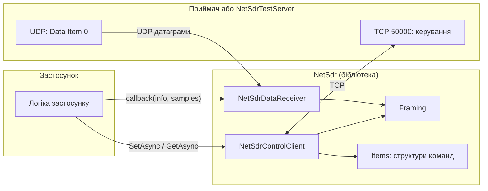
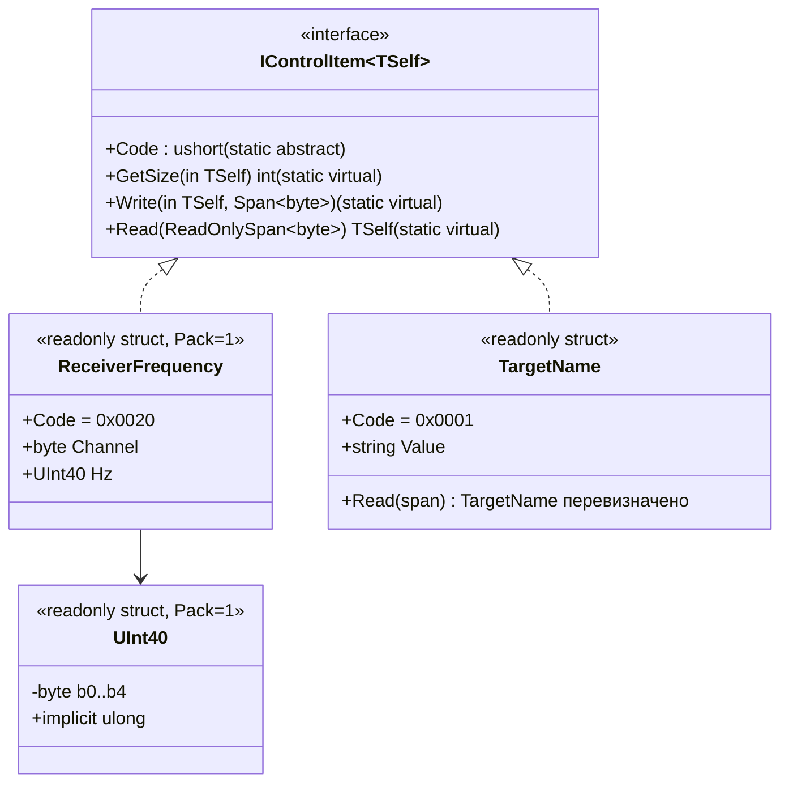
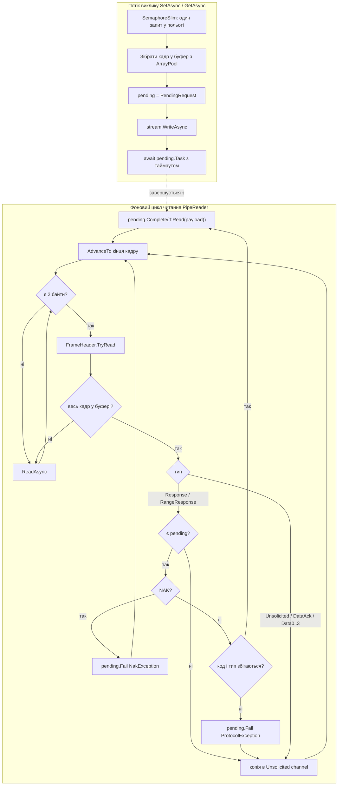
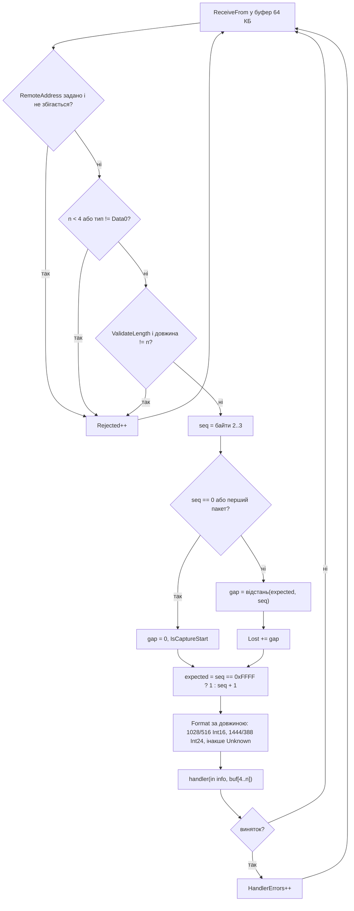
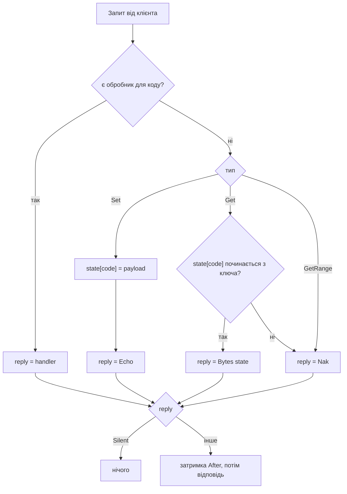
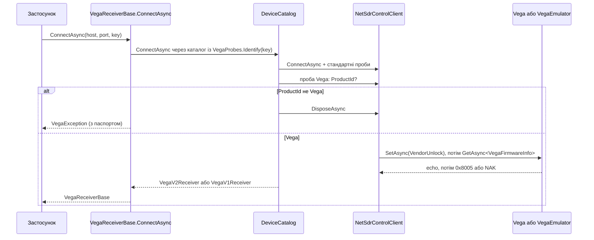

# NetSdr: фреймворк для клієнтів протоколу NetSDR/SDR-IP на C#

Дата: 2026-10-02
Статус: узгоджено. Розділ 11 (приклад Vega) і окремий `NetSdr.Testing` додано того ж дня,
чекають на огляд письмової версії. Розділ 11 доповнено версіями v1/v2 згідно зі спекою
`2026-10-02-netsdr-device-identification-design.md`.

## 1. Мета і межі

**Мета.** Бібліотека на .NET 10, на якій автор пише власний застосунок для приймачів
RFSPACE (SDR-IP, NetSDR і сумісні). Перший застосунок записує I/Q у файл або передає
потік далі без обробки.

**Що входить**
- Канал керування по TCP: кадрування, запит-відповідь, unsolicited-повідомлення.
- Канал даних по UDP: прийом пакетів, перевірка заголовка і sequence number, виклик
  callback із сирими семплами. Jumbo frames. Буфер сокета в мілісекундах.
- Опис команд (Control Items) як `unmanaged`-структур, у які кастяться байти.
- Стандартний набір структур зі специфікації SDR-IP 1.03, розділи 4.1 до 4.4.
- Тестовий сервер, що емулює приймач через справжні TCP і UDP порти. Окрема бібліотека
  `NetSdr.Testing`, щоб її брали і тести фреймворку, і тести застосунків.
- Приклад застосунку з власним протоколом поверх базового (вигаданий приймач Vega) і його
  тести на тестовому сервері, розділ 11.

**Що свідомо не входить у першу версію**
- Протокол виявлення пристроїв (broadcast UDP 48321/48322).
- Оновлення прошивки (0x0300, 0x0302, Data Item 0 до пристрою).
- RS232 через Data Item 2 (0x0200, 0x0201).
- Автоматичне перепідключення, keepalive.
- Декодування семплів у числа. Для 16 біт це `MemoryMarshal.Cast<byte, short>` на боці
  застосунку, для 24 біт застосунок розбирає сам.

**Джерела.** RFSPACE, "SDR-IP Interface Specification" ver. 1.03 від 2011-07-20
(файл `sdripinterfacespec103.pdf` з www.rfspace.com; у репозиторії не зберігається);
реалізація в gr-osmosdr (`lib/rfspace/rfspace_source_c.cc`) як перевірка на практиці.

## 2. Архітектура

Три незалежні компоненти ядра і тестовий сервер. Застосунок сам з'єднує їх: порядок
кроків залежить від застосунку, фреймворк його не нав'язує.



### 2.1. Проєкти

```
NetSdr.sln
NetSdr/                     бібліотека, net10.0, без залежностей поза BCL
  Framing/                  FrameHeader, RequestType, ReplyType
  Control/                  NetSdrControlClient, options, ControlItemMessage, винятки
  Data/                     NetSdrDataReceiver, options, DataPacketInfo, SampleFormat, DataRate
  Items/                    IControlItem<T>, UInt40, стандартні структури
NetSdr.Testing/             бібліотека, net10.0, залежить лише від NetSdr, без xUnit
                            NetSdrTestServer, ControlRequest, ControlReply, StreamOptions, SampleSources
NetSdr.Tests/               xUnit, посилається на NetSdr і NetSdr.Testing
  Framing/ Control/ Data/ Items/ Testing/   тести за компонентами
examples/Vega/
  NetSdr.Examples.Vega/         бібліотека: команди і клієнт вигаданого приймача Vega
  NetSdr.Examples.Vega.Tests/   xUnit, посилається на приклад і NetSdr.Testing
docs/superpowers/specs/     ця специфікація
```

`System.IO.Pipelines` і `System.Threading.Channels` входять у runtime, окремих пакетів
не потрібно. Nullable увімкнено, `AllowUnsafeBlocks` вимкнено: усе через
`MemoryMarshal` і `Unsafe` із BCL.

### 2.2. Типовий сценарій

```mermaid
sequenceDiagram
    participant App as Застосунок
    participant CC as NetSdrControlClient
    participant DR as NetSdrDataReceiver
    participant Dev as Приймач

    App->>CC: ConnectAsync(host, 50000)
    CC->>Dev: TCP connect
    App->>CC: GetAsync<TargetName>()
    CC->>Dev: [04 20] [01 00]
    Dev-->>CC: [0B 00] [01 00] "SDR-IP\0"
    CC-->>App: TargetName { Value = "SDR-IP" }

    App->>DR: Bind(0); Start()
    App->>DR: SetReceiveBuffer(200 ms, DataRate.BytesPerSecond(...))
    App->>CC: SetAsync(new OutputSampleRate(0, 500_000))
    App->>CC: SetAsync(new ReceiverFrequency(0, 14_010_000))
    App->>CC: SetAsync(DataOutputUdpAddress.For(DR.LocalEndPoint))
    App->>CC: SetAsync(ReceiverState.Start(complex: true, bits24: true))
    CC->>Dev: [08 00] [18 00] [80 02 80 00]
    Dev-->>CC: echo
    loop поки Run
        Dev-->>DR: UDP [A4 85] [seq] 1440 байт
        DR->>App: handler(in info, samples)
    end
    App->>CC: SetAsync(ReceiverState.Stop)
    App->>DR: Dispose()
    App->>CC: DisposeAsync()
```

## 3. Кадрування (`NetSdr.Framing`)

Спільне для обох каналів і для тестового сервера. Усі багатобайтові поля little-endian.

```
Повідомлення Control Item:
+--------+--------+--------+--------+------------------------+
| hdr lo | hdr hi | code lo| code hi| параметри (0..N байт)   |
+--------+--------+--------+--------+------------------------+

Повідомлення Data Item:
+--------+--------+-------------------------------------------+
| hdr lo | hdr hi | дані (N байт)                              |
+--------+--------+-------------------------------------------+

16-бітний заголовок (hdr hi : hdr lo):
  біти 15..13   тип повідомлення (3 біти)
  біти 12..0    довжина всього повідомлення разом із заголовком (13 біт)
```

- Довжина 0 дозволена лише для типів 4..7 і означає 8194 байти (8192 даних + 2 заголовка).
- Для типів 0..3 довжина менша за 2 означає порушення протоколу.
- NAK: тип 0, довжина 2, без коду: `[02][00]`.
- ACK даних: `[03][60] [n]`, n це номер Data Item.
- Максимальний кадр 8194 байти.

Два переліки для напрямків, обидва 3-бітні:

| Значення | `RequestType` (хост до пристрою) | `ReplyType` (пристрій до хоста) |
|---|---|---|
| 0 | `Set` | `Response` (на Set або Get) |
| 1 | `Get` | `Unsolicited` |
| 2 | `GetRange` | `RangeResponse` |
| 3 | `DataAck` | `DataAck` |
| 4..7 | `Data0`..`Data3` | `Data0`..`Data3` |

API: `FrameHeader.TryRead(ReadOnlySpan<byte>, out int length, out byte type)`,
`FrameHeader.Write(Span<byte>, int length, byte type)`, константи `FrameHeader.Size = 2`,
`FrameHeader.MaxLength = 8194`.

Статичний конструктор ядра перевіряє `BitConverter.IsLittleEndian` і кидає
`PlatformNotSupportedException` на big-endian хості, щоб помилка була явною.

## 4. Опис команд (`NetSdr.Items`)

### 4.1. Інтерфейс

Один інтерфейс. За замовчуванням структура серіалізується і читається blittable-кастом.
Пункти змінної довжини перевизначають `Read`, а за потреби `Write` і `GetSize`.

```csharp
public interface IControlItem<TSelf> where TSelf : struct, IControlItem<TSelf>
{
    static abstract ushort Code { get; }

    static virtual int GetSize(in TSelf item) => Unsafe.SizeOf<TSelf>();
    static virtual void Write(in TSelf item, Span<byte> destination) => MemoryMarshal.Write(destination, in item);
    static virtual TSelf Read(ReadOnlySpan<byte> source) => MemoryMarshal.Read<TSelf>(source);
}
```

Правила для структур із фіксованим розміром:
- `[StructLayout(LayoutKind.Sequential, Pack = 1)]`, `readonly struct`, лише `unmanaged` поля.
- Поля `byte`, `sbyte`, `ushort`, `short`, `uint`, `int` використовуються як є.
- 40-бітна частота це тип `UInt40`: 5 байтів, неявні конверсії в `ulong` і з нього.
- Конструктор із усіма полями для зручності, бо структури `readonly`.

Поведінка `Read` за замовчуванням: якщо `source` коротший за `Unsafe.SizeOf<TSelf>()`,
`MemoryMarshal.Read` кидає виняток, клієнт загортає його в `NetSdrProtocolException`.
Довший `source` допускається, зайві байти ігноруються: так новіша прошивка з додатковими
полями не ламає старий клієнт.

Для пункту змінної довжини структура може містити `string` або масив і перевизначає
`Read`. `Write` за замовчуванням для такої структури кине `ArgumentException` із
`MemoryMarshal`, і це прийнятно, бо всі такі пункти лише читаються. Якщо колись знадобиться
записувати змінну довжину, структура перевизначає `GetSize` і `Write`.



### 4.2. Стандартний набір

Фіксований розмір, blittable-каст. "Ключ Get" це параметр, який хост надсилає в запиті
типу 1; відповідь завжди має форму структури.

| Структура | Код | Поля | Ключ Get |
|---|---|---|---|
| `InterfaceVersion` | 0x0003 | `ushort Version` (×100) | немає |
| `FirmwareVersion` | 0x0004 | `byte Id`, `ushort Version` | `byte Id` |
| `ProductId` | 0x0009 | `uint Value` | немає |
| `Options` | 0x000A | `byte Flags`, `byte Custom`, `uint Detail` | немає |
| `SecurityCode` | 0x000B | `uint Value` | `uint Key` |
| `ReceiverState` | 0x0018 | `byte DataType`, `byte Run`, `byte CaptureMode`, `byte FifoBlocks` | немає |
| `ReceiverChannelSetup` | 0x0019 | `byte Mode` | немає |
| `ReceiverFrequency` | 0x0020 | `byte Channel`, `UInt40 Hz` | `byte Channel` |
| `RfGain` | 0x0038 | `byte Channel`, `sbyte GainDb` | `byte Channel` |
| `RfFilter` | 0x0044 | `byte Channel`, `byte Filter` | `byte Channel` |
| `AfGain` | 0x0048 | `byte Channel`, `byte Level` | `byte Channel` |
| `AdModes` | 0x008A | `byte Channel`, `byte Flags` | `byte Channel` |
| `AdInputSampleRate` | 0x00B0 | `byte Channel`, `uint Hz` | `byte Channel` |
| `InputSyncMode` | 0x00B4 | `byte Channel`, `byte Mode`, `ushort PacketCount` | `byte Channel` |
| `PulseOutputMode` | 0x00B6 | `byte Channel`, `byte Mode` | `byte Channel` |
| `OutputSampleRate` | 0x00B8 | `byte Channel`, `uint Hz` | `byte Channel` |
| `DataOutputPacketSize` | 0x00C4 | `byte Size` (0 великий, 1 малий) | немає |
| `DataOutputUdpAddress` | 0x00C5 | `uint Ip`, `ushort Port` | немає |
| `DcCalibration` | 0x00D0 | `byte Channel`, `short Offset` | `byte Channel` |
| `DacOutputMode` | 0x012A | `byte Channel`, `byte Mode` | `byte Channel` |

Змінна довжина, власний `Read`:

| Структура | Код | Вміст |
|---|---|---|
| `TargetName` | 0x0001 | `string Value`, ASCII до нуля |
| `SerialNumber` | 0x0002 | `string Value` |
| `StatusCodes` | 0x0005 | `byte[] Codes` |
| `FpgaConfiguration` | 0x000C | `byte Selected`, `byte Id`, `byte Revision`, `string Description`; Set-форма це 1 байт, тому `Write` і `GetSize` перевизначені |
| `FrequencyRanges` | 0x0020 | `byte Channel`, масив `(ulong Min, ulong Max, ulong Vco)`; відповідь на `GetRange` |

Допоміжні члени, щоб не пам'ятати магічні байти: `ReceiverState.Start(bool complex, bool bits24, CaptureMode mode = CaptureMode.Contiguous, byte fifoBlocks = 0)`, `ReceiverState.Stop`, `DataOutputUdpAddress.For(IPEndPoint)`, переліки `CaptureMode` (Contiguous, Fifo, HardwareTriggered) і `RfFilterSelection` з 14 значень, константи режимів у `ReceiverChannelSetup`, `InputSyncMode`, `PulseOutputMode`, `DacOutputMode`.

Особливість `FirmwareVersion`: для ID 3 (конфігурація FPGA) пристрій повертає не версію
×100, а два байти: ID конфігурації і ревізію. Розмір той самий, тому структура одна, а
властивості `FpgaConfigId` і `FpgaRevision` читають молодший і старший байт `Version`.

### 4.3. Приклад власної команди в застосунку

```csharp
[StructLayout(LayoutKind.Sequential, Pack = 1)]
public readonly struct MyVendorItem : IControlItem<MyVendorItem>
{
    public static ushort Code => 0x0150;
    public readonly byte Channel;
    public readonly uint Value;
    public MyVendorItem(byte channel, uint value) { Channel = channel; Value = value; }
}

var reply = await client.SetAsync(new MyVendorItem(0, 42));
```

Жодної реєстрації: код береться зі структури, і та сама структура працює в тестовому сервері.

## 5. Канал керування (`NetSdrControlClient`)

### 5.1. Публічне API

```csharp
public sealed class NetSdrControlClient : IAsyncDisposable
{
    public NetSdrControlClient(NetSdrControlClientOptions? options = null);
    public Task ConnectAsync(string host, int port = 50000, CancellationToken ct = default);
    public Task ConnectAsync(IPEndPoint endPoint, CancellationToken ct = default);

    public Task<T> SetAsync<T>(T item, CancellationToken ct = default)
        where T : struct, IControlItem<T>;
    public Task<T> GetAsync<T>(CancellationToken ct = default)
        where T : struct, IControlItem<T>;
    public Task<T> GetAsync<T, TKey>(TKey key, CancellationToken ct = default)
        where T : struct, IControlItem<T> where TKey : unmanaged;
    public Task<T> GetRangeAsync<T, TKey>(TKey key, CancellationToken ct = default)
        where T : struct, IControlItem<T> where TKey : unmanaged;
    public Task<ControlItemMessage> SendAsync(RequestType type, ushort code,
        ReadOnlyMemory<byte> payload, CancellationToken ct = default);

    public ChannelReader<ControlItemMessage> Unsolicited { get; }
    public Task Completion { get; }
    public bool IsConnected { get; }
    public ValueTask DisposeAsync();
}

public sealed class NetSdrControlClientOptions
{
    public TimeSpan ResponseTimeout { get; set; } = TimeSpan.FromSeconds(2);
    public int UnsolicitedCapacity { get; set; } = 256;      // DropOldest при переповненні
    public bool FaultOnTimeout { get; set; } = true;
}

public readonly struct ControlItemMessage
{
    public ReplyType Type { get; }
    public ushort Code { get; }                 // 0 для Data Items і ACK
    public ReadOnlyMemory<byte> Payload { get; } // копія, належить споживачу
    public bool Is<T>() where T : struct, IControlItem<T>;   // Code == T.Code
    public T As<T>() where T : struct, IControlItem<T>;      // T.Read(Payload.Span); збій читання
                                                             // загортається в NetSdrProtocolException
}
```

`SendAsync` це сирий шлях для коду без структури і для експериментів. Відповідь
копіюється в `ControlItemMessage`.

### 5.2. Внутрішня будова



Деталі:
- Цикл читання: `PipeReader.Create(NetworkStream)`. Кадр розбирається з
  `ReadOnlySequence<byte>`; якщо він розбитий на кілька сегментів, payload збирається в
  орендований буфер. `AdvanceTo(consumed, examined)` лише після обробки кадру.
- `PendingRequest<T>` зберігає очікувані код і `ReplyType`, має
  `TaskCompletionSource<T>` з `RunContinuationsAsynchronously`, щоб продовження
  застосунку не виконувалися в потоці читання. `T.Read` виконується в потоці читання
  прямо з буфера pipe, копії немає.
- Один запит у польоті, бо в протоколі немає ідентифікатора транзакції. Конкурентні
  виклики чекають на семафорі в порядку надходження.
- `Response` без активного запиту або з чужим кодом іде в `Unsolicited`, активний запит
  при чужому коді провалюється `NetSdrProtocolException`. З'єднання при цьому живе.
- Таймаут: `ResponseTimeout` або токен виклику, що спрацює раніше. При
  `FaultOnTimeout = true` таймаут переводить клієнт у стан помилки: `Completion`
  завершується `TimeoutException`, сокет закривається. Причина: без ідентифікаторів
  запізніла відповідь могла б закрити наступний запит із тим самим кодом. Пристрій, що
  не відповідає, вважається втраченим, застосунок створює новий клієнт.
- Запис: заголовок + код + `T.Write` в один орендований буфер, один `WriteAsync`.
  Для `GetAsync<T, TKey>` payload це `MemoryMarshal.AsBytes` від ключа.
- `Unsolicited` обмежений, при переповненні викидається найстаріше. Повідомлення
  копіюється, бо споживач асинхронний.
- `DisposeAsync`: скасування циклу, закриття сокета, провал активного запиту
  `ObjectDisposedException`, завершення `Unsolicited`, `Completion` завершується успішно.
- Обрив з'єднання з боку пристрою: активний запит провалюється `IOException`,
  `Completion` завершується тим самим винятком, `Unsolicited` закривається.

## 6. Канал даних (`NetSdrDataReceiver`)

### 6.1. Публічне API

```csharp
public delegate void DataPacketHandler(in DataPacketInfo info, ReadOnlySpan<byte> samples);

public readonly struct DataPacketInfo
{
    public ushort Sequence { get; }
    public int GapBefore { get; }        // скільки пакетів загубилося перед цим
    public bool IsCaptureStart { get; }  // Sequence == 0
    public SampleFormat Format { get; }  // Int16, Int24, Unknown
    public long Timestamp { get; }       // Stopwatch.GetTimestamp(), монотонний
    public DateTime UtcTime { get; }     // час прийому для запису у файл
}

public enum SampleFormat : byte { Unknown = 0, Int16 = 1, Int24 = 2 }

public sealed class NetSdrDataReceiver : IDisposable
{
    public NetSdrDataReceiver(DataPacketHandler handler, DataReceiverOptions? options = null);
    public void Bind(int localPort = 0);
    public void Bind(IPEndPoint localEndPoint);
    public IPEndPoint LocalEndPoint { get; }
    public void Start();                          // один раз; зупинка лише через Dispose
    public void SetReceiveBuffer(int bytes);
    public void SetReceiveBuffer(TimeSpan duration, long bytesPerSecond);
    public int ActualReceiveBufferSize { get; }   // SO_RCVBUF, прочитаний назад із сокета
    public DataReceiverStatistics Statistics { get; }
    public void Dispose();
}

public sealed class DataReceiverOptions
{
    public bool ValidateLength { get; set; } = true;
    public IPAddress? RemoteAddress { get; set; }
    public int InitialReceiveBufferBytes { get; set; } = 4 * 1024 * 1024;
    public ThreadPriority ThreadPriority { get; set; } = ThreadPriority.AboveNormal;
}

public readonly record struct DataReceiverStatistics(
    long Received, long Bytes, long Lost, long Rejected, long HandlerErrors);

public static class DataRate
{
    // sampleRate × (Int16: 4, Int24: 6) × channels
    public static long BytesPerSecond(double sampleRate, SampleFormat format, int channels = 1);
}
```

### 6.2. Цикл прийому

Окремий фоновий потік, синхронний `ReceiveFrom` в один буфер на 65535 байт, тобто
максимальна UDP-датаграма. Жодних Task, пулів і каналів. `SocketAddress`
перевикористовується, алокацій на пакет немає. Зупинка через закриття сокета: `ReceiveFrom`
кидає виняток, цикл завершується.



Правила sequence number зі специфікації 4.5.1.4: старт із 0, інкремент, після 0xFFFF
іде 1, нуль буває лише на старті захоплення. Відстань рахується з урахуванням пропуску
нуля: `seq >= expected ? seq - expected : seq + 0xFFFF - expected`. Якщо перший
отриманий пакет має ненульовий номер, приймач вважає, що приєднався до потоку
посередині, і розрив не рахує.

Jumbo frames: поле довжини 13-бітне, максимум 8194 через спеціальний нуль. Пристрій із
датаграмами понад 8194 байти не може описати їх стандартним заголовком. Для нього
застосунок вимикає `ValidateLength`, і payload це все після 4 байтів.

Буфер сокета: `SetReceiveBuffer(TimeSpan, bytesPerSecond)` обчислює байти і виставляє
`SO_RCVBUF`. Приймач не знає sample rate, тому застосунок викликає це після встановлення
0x00B8 і перед Start. На Windows великі значення приймаються, на Linux ядро обрізає до
`net.core.rmem_max`, тому `ActualReceiveBufferSize` читає значення назад.

Callback виконується в потоці прийому. Довга робота в ньому означає втрати на рівні
сокета, і це свідома відповідальність застосунку. `samples` дійсний лише всередині
виклику. Виняток із callback ловиться і рахується, прийом триває.

Орієнтир навантаження: 100 МГц × 4 байти = 400 МБ/с. З пакетами по 1444 байти це
277 тисяч датаграм на секунду, що один потік не витягне; з jumbo по 8 КБ це близько
50 тисяч, що реально. 200 мс буфера на цій швидкості це 80 МБ.

## 7. Тестовий сервер (простір імен і проєкт `NetSdr.Testing`)

Емулює приймач через справжні сокети на loopback. Використовується і тестами фреймворку,
і тестами застосунку. Бібліотека не залежить від тестового фреймворку: перевірки
робить тест, сервер лише відповідає і записує запити.

### 7.1. Публічне API

```csharp
public sealed class NetSdrTestServer : IAsyncDisposable
{
    public Task StartAsync(int port = 0, CancellationToken ct = default);
    public int Port { get; }
    public Task ClientConnected { get; }       // завершується при підключенні клієнта

    public void OnRequest<T>(Func<ControlRequest<T>, ControlReply> handler)
        where T : struct, IControlItem<T>;
    public void OnRequest(ushort code, Func<ControlRequest, ControlReply> handler);
    public void Preload<T>(T item) where T : struct, IControlItem<T>;
    public IReadOnlyList<ControlRequest> Received { get; }

    public Task SendUnsolicitedAsync<T>(T item) where T : struct, IControlItem<T>;
    public Task SendUnsolicitedAsync(ushort code, ReadOnlyMemory<byte> payload);
    public Task DisconnectClientAsync();       // емуляція обриву

    public StreamOptions Stream { get; }       // параметри потоку за замовчуванням
    public bool AutoStream { get; set; } = true;
    public Task StartStreamingAsync(IPEndPoint target, StreamOptions? options = null);
    public Task StopStreamingAsync();
}

public readonly struct ControlRequest
{
    public RequestType Type { get; }
    public ushort Code { get; }
    public ReadOnlyMemory<byte> Payload { get; }
}

public readonly struct ControlRequest<T> where T : struct, IControlItem<T>
{
    public RequestType Type { get; }
    public T Item { get; }                          // для Set: T.Read(payload); інакше default
    public ReadOnlyMemory<byte> Payload { get; }    // для Get це ключ
    public TKey Key<TKey>() where TKey : unmanaged;
}

public readonly struct ControlReply
{
    public static ControlReply Echo { get; }        // повернути запит як є
    public static ControlReply Nak { get; }
    public static ControlReply Silent { get; }      // нічого не відповідати
    public static ControlReply Bytes(ReadOnlyMemory<byte> payload);
    public static ControlReply Item<T>(T item) where T : struct, IControlItem<T>;
    public ControlReply After(TimeSpan delay);
}

public delegate void FillSamples(Span<byte> destination, long firstSampleIndex);

public enum Pacing { RealTime, Unthrottled }

public sealed class StreamOptions
{
    public SampleFormat Format { get; set; } = SampleFormat.Int16;
    public int PayloadSize { get; set; } = 1024;    // байтів семплів у пакеті
    public double SampleRate { get; set; } = 200_000;
    public int Channels { get; set; } = 1;
    public Pacing Pacing { get; set; } = Pacing.RealTime;   // або Unthrottled
    public FillSamples Source { get; set; } = SampleSources.Counter();
    public Func<ushort, bool>? DropPacket { get; set; }
}

public static class SampleSources
{
    public static FillSamples FromBuffer(ReadOnlyMemory<byte> samples);   // зациклений буфер
    public static FillSamples Tone(double frequencyHz, double sampleRate, double amplitude, SampleFormat format);
    public static FillSamples Counter();   // I = індекс семпла, Q = ~індекс; детерміновано для assert-ів
}

// Повні кадри керування із заголовком: сервер збирає ними відповіді,
// тести порівнюють їх із байтовими прикладами специфікації.
public static class ControlFrames
{
    public static byte[] Request<T>(RequestType type, in T item) where T : struct, IControlItem<T>;
    public static byte[] Reply<T>(ReplyType type, in T item) where T : struct, IControlItem<T>;
    public static byte[] Encode(byte type, ushort code, ReadOnlySpan<byte> payload);
}
```

### 7.2. Поведінка керування



- Обробник за кодом має пріоритет над станом. `OnRequest<T>` реєструє обробник для
  `T.Code`; для Set `Item` читається через `T.Read`, для Get `Item` дорівнює `default`,
  а ключ доступний через `Key<TKey>()`.
- Стан заповнюється при Set і через `Preload<T>` до підключення.
- Усі запити накопичуються в `Received` для перевірок. Список потокобезпечний: сервер
  додає з потоку з'єднання, тест читає знімок.
- Один клієнт за раз, як у специфікації. Другий підключається після відключення першого.
- Відповіді і unsolicited пишуться в сокет під одним замком, тому `SendUnsolicitedAsync`
  можна викликати з обробника або паралельно з відповіддю, кадри не перемішаються.

### 7.3. Потік даних

- При `AutoStream = true` і відсутності обробника для 0x0018 сервер сам реагує на
  `ReceiverState`: Run запускає потік, Stop зупиняє. Параметри береться зі стану: адреса
  і порт з 0x00C5 або IP клієнта і порт його TCP-з'єднання (якщо в 0x00C5 адреса
  0.0.0.0, береться IP клієнта з портом із 0x00C5); розмір пакета з 0x00C4;
  16 чи 24 біти з біта 7 режиму захоплення; sample rate з 0x00B8. Явні `StreamOptions`
  мають пріоритет.
- Розмір payload за замовчуванням відповідає специфікації: 1024 або 512 для 16 біт,
  1440 або 384 для 24 біт. `PayloadSize` можна задати довільно для jumbo-тестів; якщо
  довжина кадру не вміщається в 13 біт, заголовок отримує нуль.
- Sequence number: 0 на старті, після 0xFFFF одиниця. `DropPacket(seq)` пропускає
  надсилання, номер при цьому споживається.
- `Pacing.RealTime` рахує інтервал між пакетами з sample rate, формату і розміру
  payload; `Unthrottled` шле без пауз.
- `StartStreamingAsync` для ручного запуску без команди Run.

## 8. Помилки

| Ситуація | Поведінка |
|---|---|
| Пристрій відповів NAK | `NetSdrNakException` із кодом і типом запиту |
| Зламаний заголовок, довжина < 2, чужий код у відповіді, короткий payload для `T.Read` | `NetSdrProtocolException`; зламаний заголовок зупиняє з'єднання, решта лише провалює запит |
| Немає відповіді | `TimeoutException`; при `FaultOnTimeout` з'єднання закривається |
| Скасування токеном | `OperationCanceledException` |
| Обрив з'єднання | `IOException` для активного запиту і `Completion` |
| Виклик після `DisposeAsync` або в стані помилки | `ObjectDisposedException` або `InvalidOperationException` відповідно |
| UDP: чужий заголовок, невідповідна довжина, чужа адреса | пакет відкинуто, `Rejected++` |
| UDP: розрив послідовності | `Lost += gap`, `GapBefore` у наступному пакеті |
| UDP: виняток у callback | `HandlerErrors++`, прийом триває |

Усі винятки фреймворку успадковують `NetSdrException`.

## 9. Тестування

Розробка через TDD: тест, провал, мінімальна реалізація, рефакторинг. Усі інтеграційні
тести ходять через `NetSdrTestServer` на loopback із портом 0.

**Framing**
- Заголовок з усіма 8 типами в обидва боки, довжина 0 як 8194 для даних і як помилка для
  керування, граничні довжини 2 і 8191.

**Items**
- Кожна структура стандартного набору ганяється на байтових прикладах зі специфікації,
  наприклад `0A 00 20 00 00 90 C6 D5 00 00` для частоти 14.010 МГц каналу 0, `06 00 38 00
  00 EC` для -20 дБ, `0B 00 01 00 53 44 52 2D 49 50 00` для імені `SDR-IP`.
- `UInt40`: межі 0 і 2^40-1, приклад 7.123456789 ГГц зі специфікації.
- `Read` на короткому буфері кидає, на довшому читає префікс.

**Control client**
- Кадрування через in-memory `Pipe`: кадр по одному байту, два кадри в одному читанні,
  кадр через межу сегментів.
- Set з відлунням, Get із ключем, Get без ключа, GetRange, сирий `SendAsync`.
- NAK, таймаут на `Silent` із закриттям з'єднання, скасування токеном.
- Unsolicited під час активного запиту не плутається з відповіддю; переповнення каналу
  викидає найстаріше.
- Чужий код у відповіді провалює запит і кладе кадр в `Unsolicited`.
- Обрив сервера провалює запит і `Completion`.
- Десять конкурентних викликів виконуються послідовно і всі отримують свої відповіді.

**Data receiver**
- 16 і 24 біти, великі й малі пакети, формат визначено правильно.
- Розрив через `DropPacket`: `Lost` і `GapBefore` збігаються з кількістю пропущених.
- Перехід 0xFFFF на 1 без фальшивого розриву; нуль посередині потоку це новий старт.
- Чужий заголовок і неправильна довжина відкидаються; з `ValidateLength = false` jumbo
  на 9000 байт доставляється.
- `RemoteAddress` відкидає датаграми з іншої адреси.
- Виняток у callback рахується, наступні пакети доставляються.
- `SetReceiveBuffer` у мілісекундах дає очікувану кількість байтів, `ActualReceiveBufferSize`
  читається назад.
- `Counter`-джерело: байти, що прийшли, дорівнюють очікуваним індексам.

**Test server**
- Echo-стан, перекриття обробником, збіг ключа Get для різних каналів, `Preload`,
  `Received`, `After` затримує відповідь, `AutoStream` реагує на Run і Stop.

## 10. Рішення, ухвалені в обговоренні

- Структури замість реєстру дескрипторів або source generator: один застосунок, команди
  відомі, байти кастяться напряму.
- Тестовий сервер в окремій бібліотеці `NetSdr.Testing`, бо його беруть тести прикладу
  і тести застосунків. Спочатку він жив у проєкті тестів; рішення змінено разом із
  додаванням прикладу.
- UDP без проміжних буферів і каналів: callback у потоці прийому.
- Таймаут за замовчуванням закриває з'єднання, бо протокол не має ідентифікаторів запитів.
- Keepalive і перепідключення на боці застосунку.

## 11. Приклад: власний протокол поверх базового (Vega)

Vega це вигаданий приймач, сумісний із NetSDR: стандартні пункти він підтримує як є, а
поверх них має власні коди 0x8000+. Приклад показує, як застосунок описує свій протокол
структурами, загортає базовий клієнт у типізований і тестує все на `NetSdrTestServer`
через емулятор свого пристрою. Приклад це бібліотека плюс тести, консольного застосунку
немає. Коди і поведінка вигадані.

Vega має дві версії прошивки, v1 і v2, які відрізняються форматом пункту 0x8002 і
наявністю 0x8005. Автоматичний вибір версії клієнта описаний у спеці
`2026-10-02-netsdr-device-identification-design.md`, розділ 6; тут наведено лише те, що
потрібно для структури прикладу.

### 11.1. Проєкти

```
examples/Vega/
  NetSdr.Examples.Vega/         net10.0, посилається на NetSdr
    Items/                      VendorUnlock, AntennaSelect, BoardTemperatureV1, BoardTemperatureV2,
                                VegaFirmwareInfo, DeviceLabel, OverloadEvent
    VegaProtocol.cs             константи: ProductId, коди, межі
    VegaReceiverBase.cs         спільна частина типізованого клієнта, статичний ConnectAsync
    VegaV1Receiver.cs           версійна частина для v1
    VegaV2Receiver.cs           версійна частина для v2
    VegaProbes.cs, VegaInfo.cs  проба ідентифікації і її факт
    VegaEvent.cs                події з unsolicited
    VegaException.cs
  NetSdr.Examples.Vega.Tests/   xUnit, посилається на приклад і NetSdr.Testing
    VegaEmulator.cs             NetSdrTestServer, налаштований як Vega
    Items/ Receiver/            тести
```

### 11.2. Пункти протоколу

| Структура | Код | Поля | Ключ Get | Що показує |
|---|---|---|---|---|
| `VendorUnlock` | 0x8000 | `uint Key` | лише Set | без розблокування пристрій відповідає NAK на всі коди 0x8001+ |
| `AntennaSelect` | 0x8001 | `byte Channel`, `AntennaPort Port` | `byte Channel` | Set і Get із ключем; enum як поле blittable-структури |
| `BoardTemperatureV1` | 0x8002 | `TemperatureSensor Sensor`, `short CentiCelsius` | `TemperatureSensor` | Get із ключем-enum; той самий пункт приходить unsolicited як телеметрія; формат прошивки v1 |
| `BoardTemperatureV2` | 0x8002 | `TemperatureSensor Sensor`, `int MilliCelsius`, `byte Status` | `TemperatureSensor` | той самий код, інший формат у прошивці v2 |
| `DeviceLabel` | 0x8003 | `string Value` | немає | змінна довжина в обидва боки: власні `GetSize`, `Write`, `Read` |
| `OverloadEvent` | 0x8004 | `byte Channel`, `OverloadFlags Flags` | лише unsolicited | подія, яку хост ніколи не запитує |
| `VegaFirmwareInfo` | 0x8005 | `ushort Version` (×100) | немає | є лише у v2 і лише після розблокування; v1 відповідає NAK |

Переліки: `AntennaPort : byte { A = 0, B = 1, Loop = 2 }`,
`TemperatureSensor : byte { Board = 0, Adc = 1, Fpga = 2 }`,
`[Flags] OverloadFlags : byte { None = 0, Adc = 1, Rf = 2 }`.

`VegaProtocol.ProductId = 0x41474556`, тобто байти `56 45 47 41`, ASCII "VEGA" у відповіді
на 0x0009.

`BoardTemperatureV1.Celsius` це `CentiCelsius / 100.0`, `BoardTemperatureV2.Celsius` це
`MilliCelsius / 1000.0`. Приклади кадрів: Set антени B на каналі 0 це `06 00 01 80 00 01`,
Get антени каналу 1 це `05 20 01 80 01`, unsolicited температура АЦП -12.5 °C це
`07 20 02 80 01 1E FB` у v1 і `0A 20 02 80 01 2C CF FF FF 00` у v2.

`DeviceLabel`: ASCII, до `VegaProtocol.MaxLabelLength = 32` символів, на дроті з нулем у
кінці. Конструктор кидає `ArgumentException` для довшого рядка або символів поза ASCII,
тому некоректна мітка не доходить до сокета. `GetSize` це довжина плюс 1. `Read` бере
байти до першого нуля або до кінця payload. `default(DeviceLabel).Value` це порожній рядок.

### 11.3. `VegaReceiverBase`, `VegaV1Receiver`, `VegaV2Receiver`

```csharp
public abstract class VegaReceiverBase : IAsyncDisposable
{
    public static Task<VegaReceiverBase> ConnectAsync(string host, int port, uint unlockKey,
        NetSdrControlClientOptions? options = null, CancellationToken ct = default);
    public static Task<VegaReceiverBase> ConnectAsync(IPEndPoint endPoint, uint unlockKey,
        NetSdrControlClientOptions? options = null, CancellationToken ct = default);

    public NetSdrControlClient Control { get; }      // стандартні пункти напряму
    public DeviceIdentity Identity { get; }          // паспорт, зібраний при підключенні

    public Task SelectAntennaAsync(byte channel, AntennaPort port, CancellationToken ct = default);
    public Task<AntennaPort> GetAntennaAsync(byte channel, CancellationToken ct = default);
    public abstract Task<double> GetTemperatureAsync(TemperatureSensor sensor, CancellationToken ct = default);
    public Task SetLabelAsync(string label, CancellationToken ct = default);
    public Task<string> GetLabelAsync(CancellationToken ct = default);

    public Task StartStreamAsync(IPEndPoint target, ulong frequencyHz, uint sampleRate,
        CancellationToken ct = default);
    public Task StopStreamAsync(CancellationToken ct = default);

    public IAsyncEnumerable<VegaEvent> ReadEventsAsync(CancellationToken ct = default);
    protected abstract VegaEvent? TryParseEvent(in ControlItemMessage message);   // версійний розбір
    public ValueTask DisposeAsync();                 // закриває Control
}

public sealed class VegaV1Receiver : VegaReceiverBase   // BoardTemperatureV1
{
    public VegaV1Receiver(NetSdrControlClient control, DeviceIdentity identity);
}

public sealed class VegaV2Receiver : VegaReceiverBase   // BoardTemperatureV2
{
    public VegaV2Receiver(NetSdrControlClient control, DeviceIdentity identity);
}

public abstract record VegaEvent;
public sealed record TemperatureReport(TemperatureSensor Sensor, double Celsius) : VegaEvent;
public sealed record OverloadDetected(byte Channel, OverloadFlags Flags) : VegaEvent;
```



- `ConnectAsync` це `DeviceCatalog<VegaReceiverBase>` з пробою `VegaProbes.Identify`,
  реєстраціями "Vega v2" і "Vega v1" і без дефолту. При будь-якій помилці після
  TCP-підключення каталог закриває клієнт і лише тоді кидає виняток.
  `DeviceNotRecognizedException` перетворюється на `VegaException`.
- Конструктори версійних класів публічні: застосунок із власним каталогом створює їх сам.
- Спільна логіка в базі, версійне лише `GetTemperatureAsync` і `TryParseEvent`.
  `OverloadEvent` розбирається в базі, бо однаковий в обох версіях.
- `StartStreamAsync` надсилає по черзі `OutputSampleRate(0, sampleRate)`,
  `ReceiverFrequency(0, frequencyHz)`, `DataOutputUdpAddress.For(target)`,
  `ReceiverState.Start(complex: true, bits24: false)`. Формат завжди 16 біт.
  `StopStreamAsync` надсилає `ReceiverState.Stop`.
- `ReadEventsAsync` перебирає `Control.Unsolicited` без фонової задачі. Бере лише
  повідомлення типу `Unsolicited`, перетворює `BoardTemperatureV1` або
  `BoardTemperatureV2` (залежно від класу) і `OverloadEvent` на події. Невідомі коди і
  повідомлення, на яких `As<T>` кидає `NetSdrProtocolException`, пропускаються: одна
  зламана телеметрія не зупиняє потік подій. Канал має одного читача, тому одночасно
  працює лише один перебір.

Помилки: чужий `ProductId` дає `VegaException`, NAK пристрою проходить як
`NetSdrNakException`, некоректна мітка дає `ArgumentException` ще до надсилання.
`VegaException` не успадковує `NetSdrException`, бо це помилка рівня застосунку.

### 11.4. `VegaEmulator` і тести

`VegaEmulator` у проєкті тестів прикладу показує, як застосунок будує емулятор свого
пристрою поверх `NetSdrTestServer`, не змінюючи фреймворк.

```csharp
public enum VegaFirmware { V1, V2 }

public sealed class VegaEmulator : IAsyncDisposable
{
    public const uint DefaultKey = 0xC0DE_5EC5;
    public VegaEmulator(uint unlockKey = DefaultKey, VegaFirmware firmware = VegaFirmware.V2);
    public NetSdrTestServer Server { get; }
    public VegaFirmware Firmware { get; }
    public int Port { get; }
    public bool IsUnlocked { get; }
    public Task StartAsync();
    public void SetTemperature(TemperatureSensor sensor, double celsius);
    public Task SendTemperatureAsync(TemperatureSensor sensor, double celsius);
    public Task SendOverloadAsync(byte channel, OverloadFlags flags);
    public ValueTask DisposeAsync();
}
```

- `Preload(new ProductId(VegaProtocol.ProductId))`; стандартні пункти обробляє стан
  сервера, включно з `AutoStream`.
- `OnRequest<VendorUnlock>`: правильний ключ розблоковує і дає `Echo`, інакше `Nak`.
- Для 0x8001..0x8005 обробники спершу перевіряють розблокування, без нього `Nak`.
  Антени зберігаються по каналах (за замовчуванням A), температура читається за ключем
  сенсора (Set дає `Nak`) і кодується за режимом `Firmware`, мітка зберігається при Set і
  віддається при Get. Запит 0x8004 завжди дає `Nak`. 0x8005 у режимі V1 завжди `Nak`,
  у режимі V2 віддає `VegaFirmwareInfo(200)`.
- Стан розблокування живе стільки ж, скільки емулятор.

Тести:

**Items.** Кадри з 11.2 через `ControlFrames`, від'ємна температура, `DeviceLabel` туди й
назад, 32 символи проходять, 33 і не-ASCII кидають, `Read` без нуля в кінці читає весь
payload.

**Receiver.**
- Правильний ключ: `IsUnlocked`, у `Received` Get 0x0009 передує Set 0x8000; емулятор V2
  дає `VegaV2Receiver`, V1 дає `VegaV1Receiver` (решта тестів вибору версії в спеці
  ідентифікації, розділ 8).
- Неправильний ключ: `NetSdrNakException` із кодом 0x8000.
- Чужий `ProductId` на голому `NetSdrTestServer`: `VegaException`, запиту 0x8000 немає.
- Вендорська команда через сирий `Control` до розблокування: `NetSdrNakException`.
- Антени на двох каналах незалежні; температура, зокрема від'ємна; мітка туди й назад;
  задовга мітка кидає і не з'являється в `Received`.
- Події: температура і перевантаження приходять у `ReadEventsAsync` у порядку
  надсилання; подія, надіслана з обробника до відповіді на активний запит, не ламає
  запит і з'являється в подіях; зламаний payload і невідомий код пропускаються.
- Потік: `NetSdrDataReceiver` на loopback, `StartStreamAsync(receiver.LocalEndPoint,
  7_100_000, 200_000)`; у `Received` по черзі 0x00B8, 0x0020, 0x00C5, 0x0018; пакети
  приходять у форматі Int16 із даними джерела `Counter`; після `StopStreamAsync` нові
  пакети перестають надходити.
