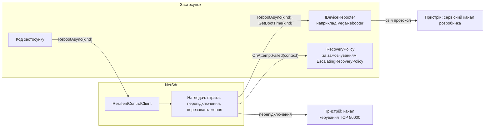
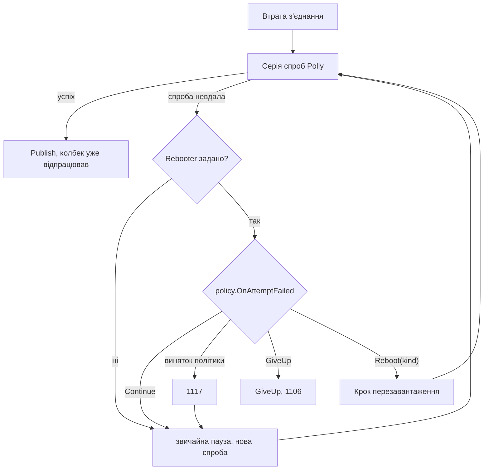

# NetSdr: перезавантаження пристрою і політика відновлення

Дата: 2026-10-07
Статус: реалізовано за планом docs/superpowers/plans/2026-10-07-netsdr-device-reboot.md
Базується на: `2026-10-07-netsdr-resilience-logging-design.md` (далі "спека стійкості") і
`2026-10-02-netsdr-framework-design.md` (розділ 11, приклад Vega)

## 1. Мета і межі

**Мета.** Стійкий клієнт уміє відновлювати пристрій, який перестав обслуговувати з'єднання: після
кількох невдалих спроб перепідключення він перезавантажує пристрій окремим каналом, чекає завантаження і
пробує знову. Застосунок також може перезавантажити пристрій сам, наприклад кнопкою в UI, і клієнт
проводить це як керовану втрату з'єднання.

**Що входить**
- `IDeviceRebooter`: транспорт перезавантаження, який пише розробник пристрою. Soft і hard ідуть його
  власним каналом (TCP, UDP або інший), не каналом керування.
- `IRecoveryPolicy`: рішення після кожної невдалої спроби перепідключення. Вбудована
  `EscalatingRecoveryPolicy` реалізує драбину soft, потім hard з числових налаштувань.
- `ResilientControlClient.RebootAsync(kind)`: ручне перезавантаження під керуванням наглядача.
- Вигаданий сервісний протокол Vega, `VegaRebooter` і його підтримка в `VegaEmulator`.
- `NetSdrTestServer.Availability` і `ClearState()` для емуляції завислого і завантажуваного пристрою.
- Перше `ResilientControlClient.ConnectAsync` теж іде через драбину, якщо задано `Rebooter`. Його межу
  задає нова опція `ConnectAttempts` (4.5).

**Що не входить**
- Перезавантаження через канал керування, наприклад командою NetSDR. Обидва види ідуть транспортом
  розробника.
- Перевірка, що після перезавантаження відповів той самий пристрій. Це справа колбека
  `ConnectionRestored`, як і раніше.

## 2. Архітектура



### 2.1. Файли

```
NetSdr/Control/
  RebootKind.cs                     новий: enum RebootKind { Soft, Hard }
  IDeviceRebooter.cs                новий
  RebootContext.cs                  новий
  IRecoveryPolicy.cs                новий: IRecoveryPolicy, RecoveryContext, RecoveryAction
  EscalatingRecoveryPolicy.cs       новий
  ReconnectPhase.cs                 новий: enum переїжджає з ResilientControlClient.Log.cs і стає public
  ResilientControlClientOptions.cs  змінено: Rebooter, RecoveryPolicy, RebootTimeout
  ConnectionRestoredContext.cs      змінено: AfterReboot
  ResilientControlClient.cs         змінено: RebootAsync, перевірка опцій
  ResilientControlClient.Supervisor.cs   змінено: кроки відновлення (розділ 5)
  ResilientControlClient.Recovery.cs     новий partial: запит ручного перезавантаження, виконання перезавантаження
  ResilientControlClient.Log.cs     змінено: події 1113-1118, причина відмови
NetSdr.Testing/
  NetSdrTestServer.cs               змінено: Availability, ClearState
  ServerAvailability.cs             новий: enum ServerAvailability { Normal, CloseOnAccept, Silent }
NetSdr.Tests/
  Control/EscalatingRecoveryPolicyTests.cs   новий
  Control/ResilientRecoveryTests.cs          новий: ескалація з фальшивим транспортом
  Control/ResilientRebootTests.cs            новий: ручне перезавантаження
  Control/ResilientFirstConnectTests.cs      новий: перше підключення з ConnectAttempts і драбиною
  Control/FakeRebooter.cs                    новий: скриптований IDeviceRebooter для тестів
  Testing/TestServerAvailabilityTests.cs     новий
examples/Vega/NetSdr.Examples.Vega/
  VegaProtocol.cs                   змінено: константи сервісного протоколу
  VegaRebooter.cs                   новий: VegaRebooter, VegaRebooterOptions
examples/Vega/NetSdr.Examples.Vega.Tests/
  VegaEmulator.cs                   змінено: сервісний сервер, Hang, перезавантаження
  VegaServiceServer.cs              новий: TCP-сервер сервісного протоколу емулятора
  Items/VegaRebooterTests.cs        новий: байти протоколу
  Receiver/VegaRecoveryTests.cs     новий: драбина на емуляторі
```

Нових залежностей немає. У спеці стійкості змінюється абзац про перше підключення в 5.1: він посилається на 4.5 цієї спеки.
XML-документація `ConnectAsync` перелічує нову поведінку з `ConnectAttempts`.

## 3. Публічні типи

```csharp
namespace NetSdr.Control;

public enum RebootKind { Soft, Hard }

public interface IDeviceRebooter
{
    /// Asks the device to reboot through the developer's own channel. Completes when the device has accepted
    /// the request, not when it has booted. Throws when the request could not be made or was refused.
    Task RebootAsync(RebootKind kind, RebootContext context, CancellationToken ct);

    /// How long the device needs after an accepted request before it accepts connections again. Not negative.
    TimeSpan GetBootTime(RebootKind kind);
}

public sealed class RebootContext
{
    public string Target { get; }                  // what ResilientControlClient connects to: "host:port" or the end point
    public IPEndPoint? LastRemoteEndPoint { get; } // the device end of the most recent connection, null if none
    public bool Requested { get; }                 // true for RebootAsync, false for an escalation of the policy
}

public enum ReconnectPhase { Connect, Verify, Restore }   // було internal, тепер public

public interface IRecoveryPolicy
{
    /// Called on the supervisor after every failed reconnection attempt while a Rebooter is configured.
    /// Must be fast and must not block.
    RecoveryAction OnAttemptFailed(RecoveryContext context);
}

public readonly record struct RecoveryContext(
    int FailedAttempts,             // failed attempts since the connection was lost
    int FailedAttemptsSinceReboot,  // failed attempts since the last reboot of this loss (or since the loss)
    ReconnectPhase Phase,           // where the attempt failed
    Exception Failure,              // what it failed with
    TimeSpan Downtime,              // since the loss was detected
    int SoftReboots,                // reboots of this loss, attempted (a failed reboot counts)
    int HardReboots);

public readonly struct RecoveryAction : IEquatable<RecoveryAction>
{
    public static RecoveryAction Continue { get; }
    public static RecoveryAction GiveUp { get; }
    public static RecoveryAction Reboot(RebootKind kind);
    public RecoveryActionKind Kind { get; }   // Continue, Reboot, GiveUp
    public RebootKind RebootKind { get; }     // meaningful when Kind == Reboot
}

public enum RecoveryActionKind { Continue, Reboot, GiveUp }

public sealed class EscalatingRecoveryPolicy : IRecoveryPolicy
{
    public int SoftRebootAfter { get; init; } = 3;    // >= 1
    public int HardRebootAfter { get; init; } = 3;    // >= 1
    public int MaxRebootsPerLoss { get; init; } = 2;  // >= 0
    public RecoveryAction OnAttemptFailed(RecoveryContext context);
}
```

### 3.1. Рішення `EscalatingRecoveryPolicy`

Нехай `n = SoftReboots + HardReboots`, `k = FailedAttemptsSinceReboot`.

| Умова | Рішення |
|---|---|
| `n >= MaxRebootsPerLoss` | `Continue` |
| `SoftReboots == 0` і `HardReboots == 0` і `k >= SoftRebootAfter` | `Reboot(Soft)` |
| `SoftReboots >= 1` або `HardReboots >= 1`, і `k >= HardRebootAfter` | `Reboot(Hard)` |
| інакше | `Continue` |

Політика ніколи не повертає `GiveUp`: межу на кількість спроб і далі задає `ReconnectAttempts`. Із
типовими числами одна втрата отримує не більше одного soft і одного hard перезавантаження, а далі лише
звичайні спроби з паузою до 30 с. Так фізично вимкнений приймач не смикається реле всю ніч.

Значення поза межами кидають `ArgumentOutOfRangeException` у сеттері `init`.

### 3.2. Зміни в наявних типах

```csharp
public sealed class ResilientControlClientOptions
{
    // ... наявні опції без змін
    public IDeviceRebooter? Rebooter { get; set; }
    public IRecoveryPolicy? RecoveryPolicy { get; set; }      // null з Rebooter означає new EscalatingRecoveryPolicy()
    public TimeSpan RebootTimeout { get; set; } = TimeSpan.FromSeconds(10);  // позитивний, не більше int.MaxValue мс
    public int? ConnectAttempts { get; set; }  // null: 1 без Rebooter, 8 з Rebooter; явне значення >= 1
}

public sealed class ConnectionRestoredContext
{
    // ... Client, Cause, LostAt без змін
    public RebootKind? AfterReboot { get; }   // вид останнього прийнятого перезавантаження цієї втрати, інакше null
}

public sealed partial class ResilientControlClient
{
    /// Reboots the device through ResilientControlClientOptions.Rebooter and completes once the client is connected
    /// again after the reboot.
    public Task RebootAsync(RebootKind kind, CancellationToken ct = default);
}
```

- Без `Rebooter` політика ніколи не викликається, і клієнт поводиться точно як до цієї зміни.
- `RecoveryPolicy` без `Rebooter` дозволено, але вона не викликається: без транспорту рішення
  `Reboot` нема чим виконати. Опції не кидають у цьому випадку.
- `RebootTimeout` поза межами або `ConnectAttempts` менше 1 дають `ArgumentOutOfRangeException` у
  `ConnectAsync`, як інші опції.
- Автоматичне значення `ConnectAttempts` з `Rebooter` дорівнює 8: три спроби, soft, ще три, hard, ще дві.
  Воно не залежить від чисел `EscalatingRecoveryPolicy`; хто міняє драбину, задає `ConnectAttempts` явно.
- Опції копіюються в `ConnectAsync`, тож посилання на `Rebooter` і `RecoveryPolicy` фіксуються там.
- Документація `CommandTimeout` отримує примітку: команди під час перезавантаження чекають так само, як під
  час перепідключення. Якщо час завантаження більший за `CommandTimeout`, вони впадуть з
  `TimeoutException`, тож `CommandTimeout` варто ставити більшим за найдовший час завантаження.

## 4. Поведінка

### 4.1. Ескалація в циклі перепідключення



- Політику викликають після кожної невдалої спроби, у тому числі останньої дозволеної, поки задано
  `Rebooter`. Вона бачить лічильники поточної втрати (розділ 5.1).
- `Continue` залишає все як зараз: пауза Polly і нова спроба.
- `Reboot(kind)` завершує поточну серію спроб Polly. Наглядач виконує крок перезавантаження (4.3) і
  починає нову серію, де паузи знову йдуть з 1 с. Лічильники втрати, `LostAt` і `Downtime` тривають.
- `GiveUp` веде до відмови з причиною "recovery policy gave up". Внутрішній виняток відмови це остання
  невдача спроби.
- Виняток із `OnAttemptFailed` пишеться Warning 1117 і вважається `Continue`.
- `ReconnectAttempts` обмежує сумарну кількість спроб однієї втрати крізь усі серії. Перезавантаження
  не дає нових спроб понад цю межу.

### 4.2. Ручне `RebootAsync(kind, ct)`

Синхронні перевірки, у порядку:
1. Виклик із `ConnectionRestored` цього клієнта: те саме правило повторного входу, що для команд
   (спека стійкості 6.5 крок 0). `InvalidOperationException`, і клієнт здається.
2. Клієнт закритий: `ObjectDisposedException` або `InvalidOperationException` відмови, як для команд.
3. `Rebooter` не задано: `InvalidOperationException("No Rebooter is configured; set ResilientControlClientOptions.Rebooter.")`.
4. `ct` уже скасовано: скасована задача, запит не реєструється.

Далі запит реєструється в слоті наглядача (5.2) і пишеться Information 1113.

| Стан клієнта | Що відбувається |
|---|---|
| `Connected` | Наглядач закриває з'єднання з причиною "reboot requested" (`IOException`). Warning 1103 не пишеться. Обмін у польоті стає втраченим, його команда повториться після відновлення, як після будь-якої втрати. Далі крок перезавантаження і звичайна серія спроб. |
| `Reconnecting`, триває спроба | Спроба доводиться до кінця. Якщо вона вдалася, з'єднання публікується, і запит одразу виконується як у стані `Connected`. Якщо ні, запит виконується замість наступної паузи, а політика для цієї невдачі не викликається. |
| `Reconnecting`, триває пауза Polly або пауза між спробами | Пауза переривається, запит виконується одразу. |
| `Reconnecting`, триває очікування завантаження після іншого перезавантаження | Запит приєднується до того перезавантаження (4.2, злиття). |

**Злиття запитів.** Слот тримає один запит.
- Запит, що прийшов, поки інший ще не почав виконуватися, зливається з ним: вид стає `Hard`, якщо
  хоч один запит `Hard`. Обидва виклики отримують ту саму задачу.
- Запит, що прийшов, поки перезавантаження виконується або триває його очікування завантаження,
  приєднується до нього незалежно від виду.

**Завершення задачі `RebootAsync`.**
- Успіх: після `Publish` з'єднання, підключеного після прийнятого перезавантаження.
- Транспорт кинув виняток або не вклався в `RebootTimeout`: задача завершується цим винятком
  (`TimeoutException` для таймауту). З'єднання вже закрите, тож наглядач продовжує звичайну серію спроб.
- Скасування `ct` після реєстрації: задача викликача стає скасованою, але перезавантаження не
  скасовується, бо команду могли вже надіслати. Інші приєднані виклики не зачіпаються.
- Клієнт закрили: `ObjectDisposedException`. Клієнт здався: виняток відмови.

Ручне перезавантаження рахується в `SoftReboots` або `HardReboots` поточної втрати і скидає
`FailedAttemptsSinceReboot`, як і ескалація.

### 4.3. Крок перезавантаження

Спільний для ескалації і ручного запиту. Виконується лише наглядачем, тож два перезавантаження ніколи
не йдуть одночасно.

1. Для ескалації пишеться Warning 1114 з видом, кількістю невдалих спроб, фазою і причиною.
2. `rebooter.RebootAsync(kind, context, token)`, де `token` скасовується `DisposeAsync` або після
   `RebootTimeout` (`CancellationTokenSource(RebootTimeout, TimeProvider)`, зв'язаний із часом життя).
   Таймаут перетворюється на `TimeoutException("The {kind} reboot of {target} did not complete within {RebootTimeout}.")`.
3. Лічильник виду збільшується, `FailedAttemptsSinceReboot` стає 0. Це робиться і при успіху, і при
   невдачі транспорту, щоб драбина могла піти далі до hard.
4. Невдача транспорту: Warning 1115 з винятком, ручний запит завершується цим винятком, очікування
   завантаження немає, наглядач переходить до нової серії спроб.
5. Успіх: `bootTime = rebooter.GetBootTime(kind)`. Від'ємне значення або виняток з `GetBootTime`
   трактується як невдача транспорту (крок 4). Information 1116 з видом і часом завантаження.
   `AfterReboot` поточної втрати стає `kind`.
6. Очікування `bootTime` на `TimeProvider` клієнта з токеном часу життя. Потім нова серія спроб, і
   перша спроба починає не раніше ніж через 1 с після початку попередньої (спека стійкості 7.4 крок 1).

Під час кроку `IsConnected` дорівнює `false`, команди чекають у межах `CommandTimeout`, heartbeat не йде.
`DisposeAsync` перериває виклик транспорту й очікування.

Транспорт може викликати сам клієнт, але наглядач його не чекає без межі. Очікування транспорту закінчується
за `RebootTimeout` або за `DisposeAsync`, тож такий виклик ніколи не тримає наглядача:
- Транспорт, що викликає `DisposeAsync` клієнта, не дає дедлока: закриття скасовує час життя, наглядач
  перестає чекати транспорт, і закриття завершується (тест `RebootAsync_TransportDisposesTheClient_DoesNotDeadlock`).
- Транспорт, що надсилає команду через клієнт, чекає на перепідключення, яке може почати лише кінець кроку.
  Цей круг розриває `RebootTimeout`: перезавантаження зараховане невдалим (1115), клієнт перепідключається
  (тест `RebootAsync_TransportCallsTheClient_EndsByRebootTimeout`).
Застосунку це не рекомендовано: транспорт має ходити лише своїм каналом.

### 4.4. Колбек `ConnectionRestored`

Після перезавантаження колбек отримує `context.AfterReboot = kind`. Колбек, що кинув виняток, і далі
лише провалює спробу (спека стійкості 7.5), а політика бачить фазу `Restore`. Так застосунок може
ескалювати з колбека: кинути виняток, коли пристрій відповідає, але стан неправильний.

### 4.5. Перше підключення

`ConnectAsync` робить `ConnectAttempts` спроб (автоматичне значення в 3.2) серією тієї самої форми, що й
перепідключення, але без наглядача: клієнта ще немає.

- Кожна спроба має фази `Connect` і `Verify`, як і зараз. Фази `Restore` немає: `ConnectionRestored` при
  першому підключенні не викликається, навіть після перезавантаження, бо застосунок ще нічого не налаштував.
- Паузи між спробами ті самі: 1, 2, 4 с і так до 30 с, щонайменше 1 с між початками спроб.
- Невдала спроба пише Warning 1118 (`ConnectAttemptFailed`), а не 1104, бо це ще не перепідключення.
- Якщо задано `Rebooter`, після кожної невдалої спроби викликається політика з тим самим `RecoveryContext`.
  `Downtime` рахується від початку `ConnectAsync`, `LastRemoteEndPoint` у `RebootContext` дорівнює `null`,
  поки жодна спроба не встановила TCP, `Requested` дорівнює `false`.
- `Reboot(kind)` виконує той самий крок перезавантаження (4.3): 1114, транспорт, 1116, очікування
  завантаження, нова серія з паузами з 1 с. `GiveUp` завершує `ConnectAsync` останньою невдачею спроби.
- Вичерпано `ConnectAttempts`: `ConnectAsync` кидає виняток останньої спроби як є (`SocketException`,
  `TimeoutException` або `IOException`), без обгортки. Так поведінка однієї спроби лишається такою, як зараз.
- Скасування `ct` перериває і спробу, і паузу, і транспорт, і очікування завантаження:
  `OperationCanceledException`, нічого не лишається працювати.
- Успіх пише Information 1109, як і зараз, і запускає наглядача. Лічильники першого підключення не
  переходять на першу втрату: вона починає з нуля.

Без `Rebooter` і без явного `ConnectAttempts` перше підключення поводиться точно як зараз: одна спроба,
швидка помилка адреси.

## 5. Вбудовування в наглядач

### 5.1. Стан втрати

`ReconnectState` (спека стійкості 8) отримує поля, які живуть усю втрату крізь усі серії спроб:

| Поле | Зміст |
|---|---|
| `Attempt` | уже є: номер поточної спроби втрати, сумарно |
| `FailedAttemptsSinceReboot` | скидається кроком перезавантаження |
| `SoftReboots`, `HardReboots` | спробувані перезавантаження втрати |
| `AfterReboot` | вид останнього прийнятого перезавантаження або `null` |
| `Phase`, `Cause`, `LostAt`, `LostTimestamp` | уже є |

Новий стан створюється на кожну втрату, тож лічильники нової втрати починаються з нуля.

### 5.2. Слот ручного запиту

Під `_sync` клієнт тримає `_rebootRequest`: вид, `TaskCompletionSource` з
`RunContinuationsAsynchronously` і прапорець "виконується". Наглядач забирає запит у точках 4.2 і
завершує задачу після `Publish`, після невдачі транспорту, при відмові або закритті. Логування поза `_sync`.

Щоб перервати очікування, клієнт тримає `CancellationTokenSource _rebootWake`, який скасовується при
реєстрації запиту і замінюється новим, коли наглядач забирає запит. Цей токен приєднується до:
- контексту Polly серії спроб, щоб перервати паузу Polly;
- паузи між спробами (1 с) у `ReconnectOnceAsync` крок 1;
- `WatchAsync`, щоб наглядач прокинувся на живому з'єднанні.

Тіло спроби (`OpenLinkAsync`, `RestoreAsync`) і далі отримує лише токен часу життя, тож запит не
перериває спробу, що вже йде. Скасування через `_rebootWake` ніколи не вважається невдалою спробою:
`ShouldHandle` його не повторює, а наглядач розпізнає його за наявністю запиту в слоті.

### 5.3. Рішення політики

`ReconnectOnceAsync` після закриття з'єднання невдалої спроби (крок 9), якщо задано `Rebooter`:
1. Якщо в слоті є запит: кинути internal `RebootScheduledException(requestedKind, inner = невдача)`.
   Політика не викликається.
2. Інакше `state.FailedAttemptsSinceReboot++` і `policy.OnAttemptFailed(context)` поза `_sync`.
3. `Reboot(kind)` дає `RebootScheduledException(kind, inner)`. `GiveUp` дає internal
   `RecoveryGaveUpException(inner)`. `Continue` і виняток політики (після 1117) повертають вихідну невдачу.

`ShouldHandle` пайплайна перепідключення не повторює `RebootScheduledException`,
`RecoveryGaveUpException` і скасування. `SuperviseAsync` ловить `RebootScheduledException` і виконує
крок перезавантаження (4.3), потім знову викликає пайплайн з тим самим `state`.
`RecoveryGaveUpException` іде в `GiveUp` з причиною "recovery policy gave up".

Перед кожною спробою `ReconnectOnceAsync` перевіряє `state.Attempt` проти `ReconnectAttempts`, і
вичерпана межа веде до відмови "attempts exhausted". Ця перевірка, а не `MaxRetryAttempts` Polly,
задає сумарну межу, бо кожна нова серія Polly рахує спроби з нуля.

### 5.4. Ручний запит на живому з'єднанні

`WatchAsync` повертається також тоді, коли `_rebootWake` скасовано. Наглядач бачить запит у слоті,
ставить `link.LossCause = new IOException("Reboot requested.")`, позначає втрату через `MarkLost`, не
пише 1103, закриває з'єднання і дренує pump, як при звичайній втраті. Далі створює `state` втрати і
виконує крок перезавантаження до першої серії спроб.

## 6. Vega

### 6.1. Сервісний протокол

Уявний протокол незалежного мікроконтролера Vega. TCP, порт 50001. Він живий, навіть коли основна
прошивка зависла.

| Напрямок | Байти | Зміст |
|---|---|---|
| Запит, 8 байт | `56 53 01 cmd k0 k1 k2 k3` | "VS", версія 1, `cmd` 1 soft або 2 hard, ключ розблокування little-endian |
| Відповідь, 4 байти | `56 53 cmd status` | `status` 0 прийнято, 1 неправильний ключ, 2 зайнято |

Після відповіді пристрій закриває з'єднання. Ключ той самий, що для `VendorUnlock`.

Приклад: soft із ключем `0xC0DE5EC5` це `56 53 01 01 C5 5E DE C0`, відповідь "прийнято" це `56 53 01 00`.

Константи в `VegaProtocol`: `ServicePort = 50001`, `ServiceVersion = 1`, `ServiceMagic0 = 0x56`,
`ServiceMagic1 = 0x53`, `SoftRebootCommand = 1`, `HardRebootCommand = 2`, `ServiceAccepted = 0`,
`ServiceBadKey = 1`, `ServiceBusy = 2`.

### 6.2. `VegaRebooter`

```csharp
public sealed class VegaRebooterOptions
{
    public string? Host { get; init; }                       // null: адреса з RebootContext
    public int Port { get; init; } = VegaProtocol.ServicePort;
    public uint UnlockKey { get; init; }
    public TimeSpan SoftBootTime { get; init; } = TimeSpan.FromSeconds(8);
    public TimeSpan HardBootTime { get; init; } = TimeSpan.FromSeconds(20);
}

public sealed class VegaRebooter : IDeviceRebooter
{
    public VegaRebooter(VegaRebooterOptions options);
    public Task RebootAsync(RebootKind kind, RebootContext context, CancellationToken ct);
    public TimeSpan GetBootTime(RebootKind kind);
}
```

- Адреса: `Host`, інакше `context.LastRemoteEndPoint.Address`, інакше хост із `context.Target` без порту.
- Одне TCP-з'єднання на запит: підключитися з `ct`, записати 8 байт, прочитати рівно 4, закрити.
- Неправильний magic або `cmd` у відповіді, або менше 4 байт до закриття: `IOException`.
- `status` 1: `VegaException("The Vega service rejected the reboot: wrong unlock key.")`.
  `status` 2: `VegaException("The Vega service is busy and did not accept the reboot.")`.
  Інший статус: `VegaException` з його значенням.
- Порт і час завантаження перевіряються в конструкторі (`ArgumentOutOfRangeException`).

### 6.3. Емулятор

`VegaEmulator` отримує `VegaServiceServer` на окремому loopback-порту (порт 0).

```csharp
public enum VegaHang { None, Firmware, Board }

public sealed class VegaEmulator
{
    // ... наявне
    public int ServicePort { get; }
    public TimeSpan SoftBootTime { get; set; } = TimeSpan.FromMilliseconds(200);
    public TimeSpan HardBootTime { get; set; } = TimeSpan.FromMilliseconds(400);
    public void Hang(VegaHang kind);
    public IReadOnlyList<(RebootKind Kind, bool KeyValid)> RebootRequests { get; }
}
```

| Подія | Поведінка емулятора |
|---|---|
| `Hang(Firmware)` | `Server.Availability = Silent` і зупинка UDP-потоку до будь-якого прийнятого перезавантаження |
| `Hang(Board)` | `Silent`, і soft не лікує, лише hard |
| Soft, правильний ключ | Відповідь 0, потім: розірвати клієнта, `CloseOnAccept` на `SoftBootTime`, скинути розблокування, зняти `Firmware`. Потім `Normal`, або `Silent`, якщо лишився `Board` |
| Hard, правильний ключ | Те саме, плюс `Server.ClearState()` і повторний `Preload` `ProductId`, антени за замовчуванням, порожня мітка, зняти будь-яке зависання, очікування `HardBootTime` |
| Неправильний ключ | Відповідь 1, нічого не відбувається |
| Запит під час завантаження | Відповідь 2 |

Кожен запит, і правильний, і ні, записується в `RebootRequests`.

## 7. `NetSdrTestServer`

```csharp
public enum ServerAvailability { Normal, CloseOnAccept, Silent }

public sealed partial class NetSdrTestServer
{
    public ServerAvailability Availability { get; set; }   // Normal за замовчуванням, потокобезпечно
    public void ClearState();                             // видаляє всі збережені payload, включно з Preload
}
```

- `CloseOnAccept`: кожне нове прийняте з'єднання закривається одразу, без читання. Поточне з'єднання
  не чіпається. Пристрій, що завантажується, саме так і виглядає для клієнта: TCP приймається, але
  перевірка падає у фазі `Verify`.
- `Silent`: запити читаються і записуються в `Received`, але жодна відповідь на них не надсилається. Діє і на
  поточне з'єднання з моменту зміни. Явний `SendUnsolicitedAsync` і UDP-потік не зачіпаються: емулятор
  Vega при `Hang` сам зупиняє потік через `StopStreamingAsync`.
- Слухач не зупиняється. Повторне прив'язування того самого порту на Windows ненадійне, а закриття після
  прийняття детерміноване.

## 8. Логування

Категорія `NetSdr.Control.ResilientControlClient`. Наявні номери і шаблони не змінюються.

| Id | Рівень | Name | Повідомлення |
|---|---|---|---|
| 1113 | Information | RebootRequested | `A {Kind} reboot of {Target} was requested` |
| 1114 | Warning | RebootEscalated | `Escalating to a {Kind} reboot of {Target} after {FailedAttempts} failed attempt(s), the last in phase {Phase}` (+exception) |
| 1115 | Warning | RebootFailed | `The {Kind} reboot of {Target} failed` (+exception) |
| 1116 | Information | RebootAccepted | `{Target} accepted a {Kind} reboot; waiting {BootTime} for it to boot` |
| 1117 | Warning | RecoveryPolicyFailed | `The recovery policy failed; continuing with the next attempt` (+exception) |
| 1118 | Warning | ConnectAttemptFailed | `Connect attempt {Attempt} of {Attempts} to {Target} failed in phase {Phase}; next attempt in {Delay}` (+exception) |

1106 отримує третю причину `recovery policy gave up`. Нічого не логується під `_sync`.

## 9. Помилки

| Ситуація | Поведінка |
|---|---|
| `RebootAsync` без `Rebooter` | `InvalidOperationException` синхронно |
| `RebootAsync` на закритому клієнті | `ObjectDisposedException` або виняток відмови синхронно |
| `RebootAsync` із `ConnectionRestored` | `InvalidOperationException`, клієнт здається (повторний вхід) |
| Транспорт кинув виняток, ручний запит | Виняток у задачі `RebootAsync`, 1115, перепідключення триває |
| Транспорт не вклався в `RebootTimeout` | `TimeoutException`, далі як рядок вище |
| Транспорт упав при ескалації | 1115, перезавантаження зараховане, спроби тривають |
| `GetBootTime` від'ємний або кинув | Як невдача транспорту |
| Політика кинула виняток | 1117, далі як `Continue` |
| Політика повернула `GiveUp` | 1106 з "recovery policy gave up", `Completion` падає з `IOException`, усередині остання невдача |
| `ReconnectAttempts` вичерпано крізь перезавантаження | Відмова "attempts exhausted", як і раніше |
| Перше підключення вичерпало `ConnectAttempts` | Виняток останньої спроби як є, кожна невдача пише 1118 |
| Політика повернула `GiveUp` під час першого підключення | `ConnectAsync` кидає останню невдачу спроби |
| `ct` скасовано під час першого підключення | `OperationCanceledException`, транспорт і очікування перервано |
| `DisposeAsync` під час транспорту або очікування завантаження | Обидва перериваються, ручні запити отримують `ObjectDisposedException`, без 1106 |
| Неправильні числа `EscalatingRecoveryPolicy`, `RebootTimeout`, `VegaRebooterOptions` | `ArgumentOutOfRangeException` |
| Vega: неправильний ключ, зайнято, інший статус | `VegaException` з причиною |
| Vega: обірвана або неправильна відповідь | `IOException` |

Нових публічних типів винятків немає. `RebootScheduledException` і `RecoveryGaveUpException` вкладені
й приватні, назовні не виходять.

## 10. Тестування

Усі тести стійкого клієнта на внутрішньому шві з `FakeTimeProvider` або на `NetSdrTestServer`, як у
спеці стійкості. Кожне очікування обмежене `Limits.Test`.

**`EscalatingRecoveryPolicyTests`**, без мережі
- `Defaults_ContinueBeforeSoft_SoftAtThree`: `k` 1 і 2 дають `Continue`, 3 дає `Reboot(Soft)`.
- `AfterSoft_HardAtThree`: `SoftReboots = 1`, `k` 1 і 2 `Continue`, 3 `Reboot(Hard)`.
- `AfterMaxReboots_AlwaysContinue`: `SoftReboots = 1`, `HardReboots = 1`, будь-яке `k` дає `Continue`.
- `MaxRebootsZero_NeverReboots`, `SoftRebootAfterOne_FirstFailureReboots`.
- `ManualHardFirst_NextIsHard`: `SoftReboots = 0`, `HardReboots = 1`, `MaxRebootsPerLoss = 3`, `k = 3` дає `Reboot(Hard)`.
- `InvalidValues_Throw` (Theory): `SoftRebootAfter` 0, `HardRebootAfter` 0, `MaxRebootsPerLoss` -1.
- `RecoveryAction_Equality`: `Reboot(Soft)` дорівнює `Reboot(Soft)` і не дорівнює `Reboot(Hard)` чи `Continue`.

**`ResilientRecoveryTests`**, `FakeRebooter` і шов з невдалими підключеннями, без jitter
- `NoRebooter_PolicyNeverCalled`: політика-шпигун при `Rebooter = null` не викликана за 5 невдалих спроб.
- `Escalation_SoftAfterThree_BootWait_BackoffRestarts`: спроби на 0, 1, 3 с, soft о 3 с, 1114 і 1116,
  очікування `bootTime = 2 с`, наступні спроби на 5, 6, 8 с.
- `Escalation_HardWhenSoftDidNotHelp`: після soft ще три невдачі, потім hard, `FakeRebooter.Calls`
  дорівнює `[Soft, Hard]`, далі лише звичайні спроби.
- `Escalation_SucceedsAfterSoft_RestoredSeesAfterReboot`: шов починає приймати після soft, колбек бачить
  `AfterReboot = Soft`, 1105 пишеться.
- `RebooterThrows_1115_CountedAndContinues`: soft кидає, 1115, без 1116 і без очікування завантаження,
  наступна ескалація це hard.
- `RebooterTimeout_TimeoutException`: транспорт не завершується, через `RebootTimeout` 1115 з `TimeoutException`.
- `BootTimeNegative_TreatedAsFailure`.
- `PolicyThrows_1117_Continue`, `PolicyGivesUp_1106_CompletionFaults`.
- `RecoveryContext_Fields`: фаза `Verify` для мовчазного сервера, `Connect` для невдалого шву,
  `Restore` для колбека, що кидає; `Downtime` і лічильники.
- `CountersResetForNewLoss`: друга втрата починає з `SoftReboots = 0`.
- `ReconnectAttempts_CapsAcrossReboots`: `ReconnectAttempts = 5`, soft після 3, відмова на п'ятій спробі.
- `Dispose_DuringBootWait_ReturnsWithout1106`.

**`ResilientRebootTests`**, `NetSdrTestServer` і `FakeRebooter`, що вмикає `CloseOnAccept` на час завантаження
- `RebootAsync_Connected_RestoresWithAfterReboot`: 1113, 1116, 1105, без 1103, колбек бачить
  `AfterReboot = Soft`, задача завершується після повторного підключення.
- `RebootAsync_DuringBackoff_InterruptsPause`: шов із невдачами, запит посеред паузи 4 с виконується одразу.
- `RebootAsync_DuringAttempt_WaitsForItToEnd`: запит під час `Verify`, спроба не переривається.
- `RebootAsync_AttemptSucceededMeanwhile_StillReboots`.
- `RebootAsync_Coalesce_HardWins`: soft і hard до початку виконання, один виклик транспорту `Hard`, обидві задачі успішні.
- `RebootAsync_JoinsRunningReboot`: другий запит під час очікування завантаження, один виклик транспорту.
- `RebootAsync_TransportFails_CallerGetsException_ClientReconnects`.
- `RebootAsync_CallerCancels_RebootStillHappens`.
- `RebootAsync_CommandInFlight_RetriedAfterRestore`.
- `RebootAsync_WithoutRebooter_Throws`, `RebootAsync_AfterDispose_Throws`,
  `RebootAsync_InsideCallback_GivesUp`, `RebootAsync_PreCancelledToken_RegistersNothing`.
- `RebootAsync_ManualCountsTowardsEscalation`: ручний hard, далі невдачі дають `Reboot(Hard)` лише якщо
  межа `MaxRebootsPerLoss` дозволяє.
- `Logging_1113To1117_LevelsAndCategory`.

**`ResilientFirstConnectTests`**, шов і `FakeTimeProvider`
- `NoRebooter_DefaultIsOneAttempt`: невдалий шов, одна спроба, `SocketException` одразу, жодного 1118.
- `ExplicitConnectAttempts_RetriesWithBackoff`: `ConnectAttempts = 3` без `Rebooter`, спроби на 0, 1, 3 с, кидає останню невдачу, два 1118.
- `Rebooter_DefaultEightAttempts_FullLadder`: шов не приймає ніколи, `FakeRebooter.Calls` дорівнює `[Soft, Hard]`, рівно 8 спроб, виняток останньої.
- `Rebooter_RecoversAfterSoft`: шов починає приймати після soft, `ConnectAsync` повертає клієнта, 1109, `ConnectionRestored` не викликано.
- `FirstConnect_RebootContext`: `LastRemoteEndPoint` дорівнює `null`, `Requested` дорівнює `false`.
- `FirstConnect_CancelDuringBootWait_Throws_NothingRuns`.
- `FirstConnect_PolicyGivesUp_ThrowsLastFailure`.
- `FirstLoss_CountersStartAtZero`: після першого підключення з одним soft перша втрата бачить `SoftReboots = 0`.
- `InvalidConnectAttempts_Throws`: 0 і -1.

**`TestServerAvailabilityTests`**
- `CloseOnAccept_NewConnectionClosed_CurrentKept`.
- `Silent_RequestsRecorded_NoReplies`.
- `BackToNormal_ServesAgain`.
- `ClearState_RemovesPreloads`.

**`VegaRebooterTests`**
- `Soft_SendsExactBytes`: `56 53 01 01 C5 5E DE C0`. `Hard_SendsExactBytes`: `56 53 01 02 C5 5E DE C0`.
- `BadKey_VegaException`, `Busy_VegaException`, `TruncatedReply_IOException`, `WrongMagic_IOException`.
- `HostFromContext_UsesLastRemoteEndPoint`, `HostFromTarget_WhenNoEndPoint`.
- `GetBootTime_FromOptions`, `InvalidOptions_Throw`.

**`VegaRecoveryTests`**, `VegaEmulator`, `VegaRebooter`, `ResilientControlClient` з короткими таймаутами
- `FirmwareHang_SoftRebootRecovers_UnlockRestored`: колбек повторює `VendorUnlock`, `RebootRequests` дорівнює `[(Soft, true)]`.
- `BoardHang_SoftThenHard`: `RebootRequests` дорівнює `[(Soft, true), (Hard, true)]`, відновлення після hard.
- `ManualHardReboot_ClearsDeviceState`: мітка, задана до перезавантаження, після нього порожня.
- `WrongServiceKey_RebootFails_1115`: ключ транспорту не збігається, `(Soft, false)`, 1115.
- `HungAtStartup_FirstConnectRecoversBySoftReboot`: емулятор у `Hang(Firmware)` ще до `ConnectAsync`, клієнт повертається після soft, `RebootRequests` дорівнює `[(Soft, true)]`.

## 11. Рішення

- Транспорт (`IDeviceRebooter`) і рішення (`IRecoveryPolicy`) розділені: вбудована драбина працює з будь-яким
  транспортом, а ручне перезавантаження бере той самий транспорт.
- Вбудована драбина і своя політика через один інтерфейс; `null` з `Rebooter` означає драбину з типовими числами.
- Ручне перезавантаження йде через клієнт, щоб він знав, що втрата навмисна: без Warning про втрату і без
  другого перезавантаження поверх першого.
- Перезавантаження починає нову серію спроб Polly, щоб паузи після завантаження знову йшли з 1 с, а сумарну
  межу спроб тримає власна перевірка.
- Невдалий транспорт зараховується як перезавантаження, щоб драбина могла дійти до hard.
- Виняток політики не зупиняє клієнт: нічний запис важливіший за помилку в коді застосунку.
- `MaxRebootsPerLoss` за замовчуванням 2: фізично вимкнений приймач не перезавантажується по колу.
- Перше підключення теж іде через драбину. Межу задає окрема `ConnectAttempts`: без `Rebooter` одна спроба, як
  раніше, з `Rebooter` вісім, на всю драбину. Нескінченний `ReconnectAttempts` для першого підключення
  означав би, що неправильна адреса ніколи не дає помилки.
- Емуляція завантаження закриває з'єднання одразу після прийняття, а не зупиняє слухача, заради детермінованості.

**Відкинуті альтернативи**
- Лише хук перед спробою: немає вбудованої драбини, ручне перезавантаження йшло б повз клієнт.
- Одна політика, що сама і вирішує, і перезавантажує: "коли" і "як" злипаються, ручному `RebootAsync` нізвідки взяти транспорт.
- Ручне перезавантаження повз клієнт: клієнт не відрізняє його від аварії і може ескалювати поверх нього.
