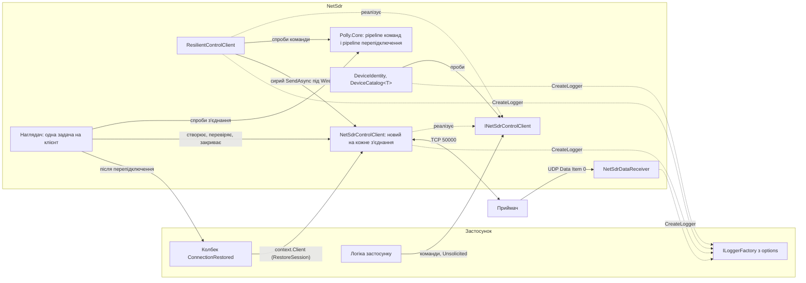
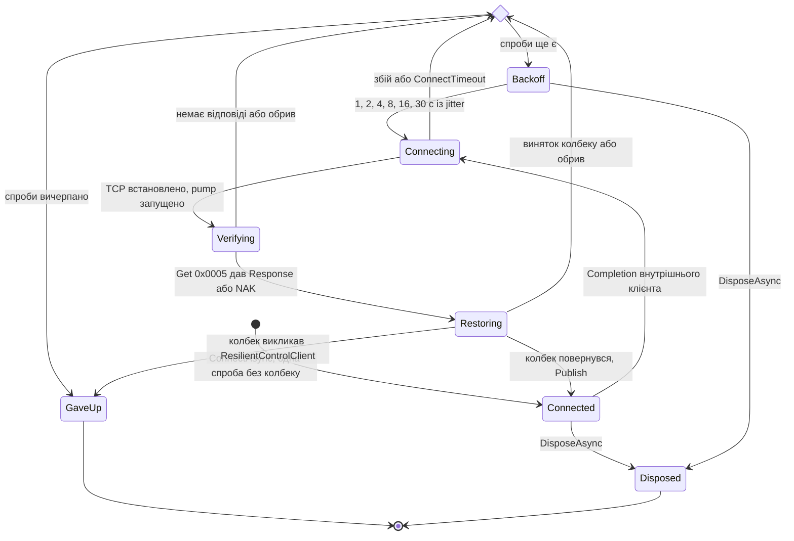
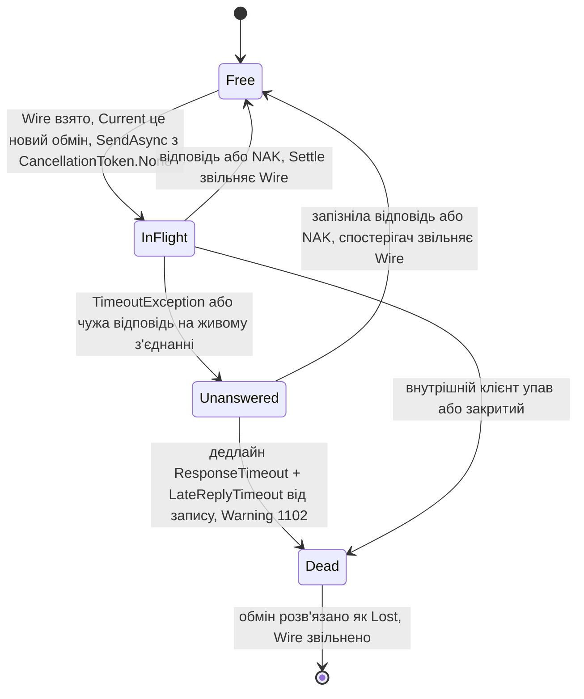
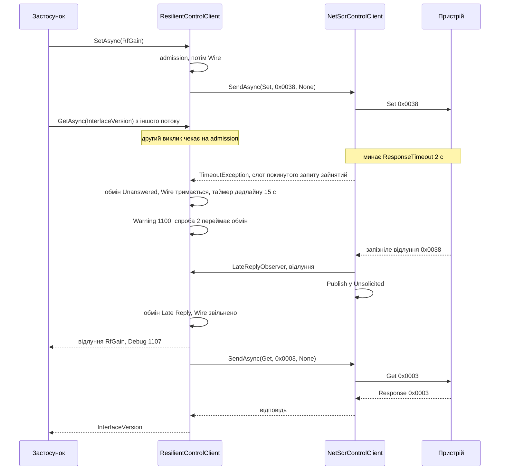
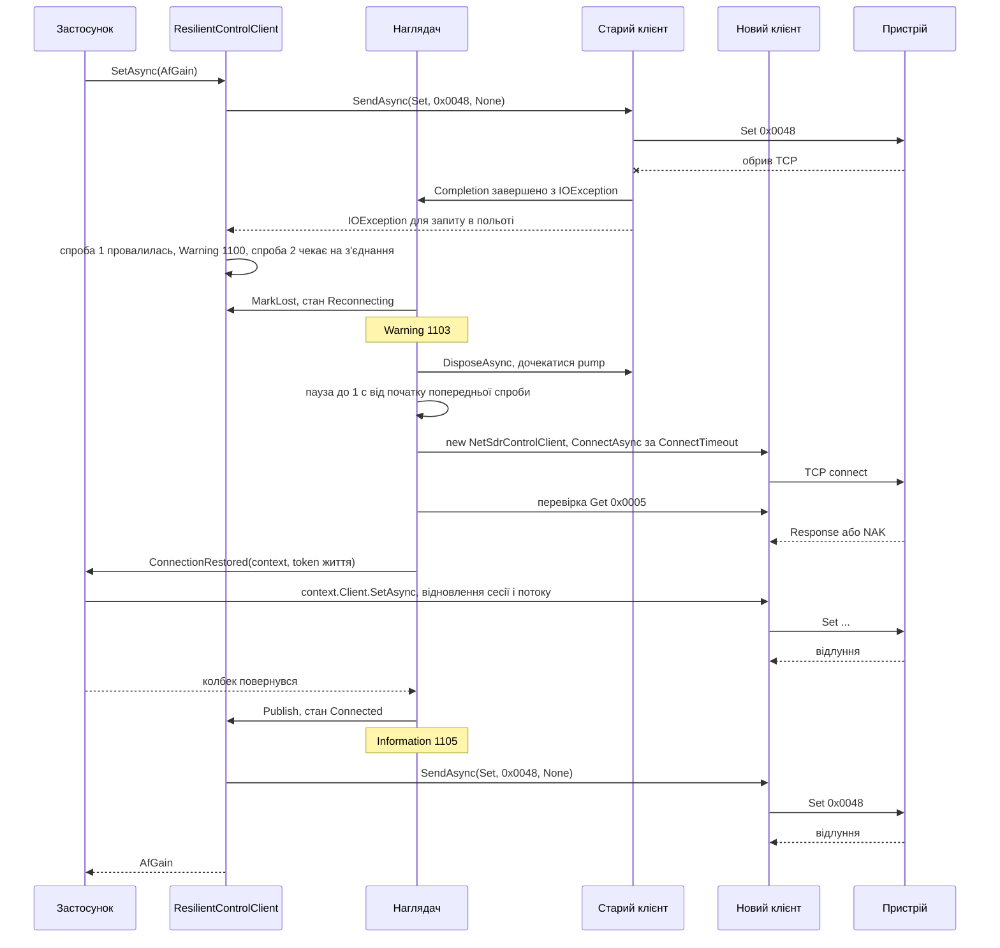

# NetSdr: стійкий клієнт керування і логування

Дата: 2026-10-07
Статус: узгоджено в обговоренні
Базується на: `2026-10-02-netsdr-framework-design.md` (далі "базова спека") і
`2026-10-02-netsdr-device-identification-design.md` (далі "спека ідентифікації")

## 1. Мета і межі

**Мета.** Застосунок, що годинами пише I/Q без нагляду, переживає обрив TCP, висмикнутий
кабель і зайнятий пристрій без власного коду перепідключення. Усе, що відбувається в
бібліотеці, видно в логах застосунку.

**Що входить**
- `ResilientControlClient`: клієнт керування, що сам перепідключається, перевіряє
  з'єднання heartbeat-ом, повторює команди і переймає запізнілі відповіді зайнятого
  пристрою. Стан пристрою після перепідключення відновлює застосунок у колбеку
  `ConnectionRestored`.
- Інтерфейс `INetSdrControlClient`, який реалізують обидва клієнти. Ідентифікація, каталог
  і приклад Vega переходять на нього.
- Логування всієї бібліотеки через `Microsoft.Extensions.Logging`: `NetSdrControlClient`,
  `ResilientControlClient`, `NetSdrDataReceiver`, `DeviceIdentity`, `DeviceCatalog`.
  Стабільні EventId.
- Підсумки статистики UDP у лог без жодного запису про окремий пакет.
- `DataPacketInfo` без часових міток: приймач більше не читає годинник на кожен пакет.

**Що не входить**
- Публічний перелік станів і події зміни стану.
- Типи Polly у публічному API, власні pipeline застосунку, circuit breaker, hedging,
  метрики, `Polly.Extensions`.
- Налаштування на рівні окремого виклику.
- Повтор першого `ConnectAsync`.
- TCP keepalive.
- Стійкі перевантаження `DeviceCatalog.ConnectAsync` і `VegaReceiverBase.ConnectAsync`.
  Застосунок підключається сам і викликає `AttachAsync`.
- Відстеження і повтор стану пристрою. Єдиний гачок відновлення це `ConnectionRestored`.
- Зміни логіки `NetSdrDataReceiver`, крім логування і зникнення часу з `DataPacketInfo`.
  Зокрема немає `ResetSequence`.
- Логування в `NetSdrTestServer`.

Автоматичне перепідключення і keepalive базова спека в розділі 1 відносила до наступних
версій. Цей документ їх вводить.

## 2. Архітектура



### 2.1. Компоненти

| Компонент | Роль |
|---|---|
| `INetSdrControlClient` | Спільний контракт каналу керування. Його бачать ідентифікація, каталог, Vega і застосунок |
| `NetSdrControlClient` | Без змін публічної поведінки. Сам по собі або як внутрішній клієнт стійкого, тоді один екземпляр на одне TCP-з'єднання |
| `ResilientControlClient` | Черга команд, гігієна лінії, повтори, переклад винятків. Публічна поверхня та сама, що в простого клієнта, плюс `ConnectAsync` і опції |
| Наглядач | Задача всередині `ResilientControlClient`. Єдиний, хто створює, перевіряє, публікує і закриває з'єднання, шле heartbeat і викликає колбек |
| `RestoreSession` | Приватний вкладений клас. Це `context.Client` у колбеку: запити йдуть на нове з'єднання, ще не опубліковане для застосунку |
| Polly.Core | Дві стратегії повтору всередині стійкого клієнта, назовні не видно |
| Логування | `ILogger` у кожному компоненті, повідомлення генерує `[LoggerMessage]` |

### 2.2. Файли

```
NetSdr/
  NetSdr.csproj                         + Polly.Core 8.8.0, Microsoft.Extensions.Logging.Abstractions 10.0.12
  Control/
    INetSdrControlClient.cs             новий
    ResilientControlClient.cs           новий: API, шлях команди, Link, Exchange, CommandExecution
    ResilientControlClient.Supervisor.cs  новий: наглядач, heartbeat, перепідключення, відмова, DisposeAsync
    ResilientControlClient.Log.cs       новий: ResilientClientLog (1100-1199)
    ResilientControlClientOptions.cs    новий
    ConnectionRestoredContext.cs        новий
    RestoreSession.cs                   новий: приватний вкладений клас ResilientControlClient.RestoreSession (partial-файл)
    NetSdrControlClient.cs              змінено: інтерфейс, логування, внутрішні гачки (4.2)
    NetSdrControlClient.Log.cs          новий: ControlClientLog (1000-1099)
    NetSdrControlClientOptions.cs       змінено: LoggerFactory, internal TimeProvider і Supervised
    PendingRequest.cs                   змінено: ім'я пункту і мітка початку запису для логів
  Data/
    DataPacketInfo.cs                   змінено: без Timestamp і UtcTime
    DataReceiverOptions.cs              змінено: LoggerFactory, StatisticsLogInterval, internal TimeProvider
    NetSdrDataReceiver.cs               змінено: без годинника на пакет, підсумки, логування
    NetSdrDataReceiver.Log.cs           новий: DataReceiverLog (1200-1299)
  Identification/
    IdentificationOptions.cs            змінено: ProbeAsync приймає INetSdrControlClient, LoggerFactory
    DeviceIdentity.cs, Probes.cs        змінено: INetSdrControlClient, логування проб
    DeviceCatalog.cs                    змінено: INetSdrControlClient у фабриках і AttachAsync, логування
    IdentificationLog.cs                новий: IdentificationLog (1300-1399)
NetSdr.Testing/                         без змін, логування немає
NetSdr.Tests/
  NetSdr.Tests.csproj                   + Microsoft.Extensions.TimeProvider.Testing 10.10.0,
                                          Microsoft.Extensions.Diagnostics.Testing 10.10.0
  FakeLoggerFactory.cs                  новий: ILoggerFactory над FakeLogCollector
  FakeTime.cs                           новий: AdvanceUntilAsync і TimeProvider, що рахує GetTimestamp
  EndToEndTests.cs                      змінено: EndToEnd_StreamResumesAfterReconnect
  Control/PipeDevice.cs                 змінено: static PipeDevice Attach(NetSdrControlClient client,
                                        PipeOptions? toClient = null) приєднує вже створений клієнт
                                        до свіжої пари pipe; Create викликає його
  Identification/DeviceCatalogTests.cs  запис Dev: поле INetSdrControlClient
  Data/PacketCollector.cs               Packets без змін, новий ArrivalTimestamps (4.4)
  Testing/TestServerStreamingTests.cs   тест темпу бере час із PacketCollector.ArrivalTimestamps
  Control/, Data/, Identification/      нові тести (розділ 10)
examples/Vega/
  NetSdr.Examples.Vega/                 VegaReceiverBase.cs, VegaV1Receiver.cs, VegaV2Receiver.cs:
                                        INetSdrControlClient; VegaReceiverBase.ConnectAsync передає
                                        LoggerFactory в IdentificationOptions каталогу
  NetSdr.Examples.Vega.Tests/           Receiver/VegaCatalogTests.cs: запис GenericDevice з полем
                                        INetSdrControlClient; Receiver/VegaResilienceTests.cs (новий):
                                        Catalog_AttachAsync_OverResilientClient,
                                        Vega_ReconnectDuringIdentification,
                                        Vega_WrapperOverContextClient_StartsStream
```

Внутрішні типи стійкого клієнта (`Link`, `Exchange`, `CommandExecution`, `RestoreSession`,
`RestoreScope`, `ReconnectState`, `FatalRestoreException`) вкладені й приватні. Назовні їх
не видно.

### 2.3. Залежності

| Проєкт | Пакет | Навіщо |
|---|---|---|
| `NetSdr` | `Polly.Core` 8.8.0 | Стратегії повтору команд і перепідключення |
| `NetSdr` | `Microsoft.Extensions.Logging.Abstractions` 10.0.12 | `ILogger`, `ILoggerFactory`, `NullLoggerFactory` і генератор `[LoggerMessage]`, що йде в цьому ж пакеті |
| `NetSdr.Tests` | `Microsoft.Extensions.TimeProvider.Testing` 10.10.0 | `FakeTimeProvider` |
| `NetSdr.Tests` | `Microsoft.Extensions.Diagnostics.Testing` 10.10.0 | `FakeLogger`, `FakeLogCollector` |

Інші проєкти нових пакетів не отримують. Приклад Vega бачить абстракції логування
транзитивно через `NetSdr`. `NetSdr.Testing` не логує.

### 2.4. Документи, які треба оновити

- `docs/architecture.md`: вступ (дві динамічні діаграми і посилання на цю спеку); розділ 2
  ("NetSdr не має залежностей поза BCL", підпис контейнера "[Бібліотека, лише BCL]",
  провайдер логування); розділ 3 (компонент `Resilience`, логування, рядки наглядача,
  heartbeat, колбеку, pump і підсумку UDP у таблиці потоків 3.1); розділ 5
  (`INetSdrControlClient` у діаграмі Vega); вступ розділу 6; новий розділ 7 (обрив і
  відновлення).
- Базова спека: розділ 1 (перепідключення і keepalive поза межами), 2.1 ("без
  залежностей поза BCL"), 5.1 (сигнатури, опції), 6.1 (`DataPacketInfo`,
  `DataReceiverOptions`), 8 (таблиця помилок), 10 ("Keepalive і перепідключення на боці
  застосунку"), 11.3 (сигнатури Vega).
- Спека ідентифікації: розділи 2, 3.1, 4.1 (і логування), 4.2, 5.1, 5.2 і 6.3.
- План `2026-10-02-netsdr-framework.md` історичний і не змінюється.

## 3. Логування

### 3.1. Налаштування

Чотири класи опцій отримують `ILoggerFactory LoggerFactory`: `NetSdrControlClientOptions`,
`DataReceiverOptions`, `IdentificationOptions`, `ResilientControlClientOptions`. За
замовчуванням `NullLoggerFactory.Instance`. `null` дає `ArgumentNullException` там, де опції
читаються:

| Опції | Де перевіряється |
|---|---|
| `NetSdrControlClientOptions` | конструктор `NetSdrControlClient` |
| `DataReceiverOptions` | конструктор `NetSdrDataReceiver` |
| `IdentificationOptions` | `DeviceIdentity.ReadAsync` (через задачу) і конструктор `DeviceCatalog<TDevice>` |
| `ResilientControlClientOptions` | `ResilientControlClient.ConnectAsync`, синхронно |

Категорія логера це повне ім'я класу:

| Компонент | Категорія |
|---|---|
| `NetSdrControlClient` | `NetSdr.Control.NetSdrControlClient` |
| `ResilientControlClient` | `NetSdr.Control.ResilientControlClient` |
| `NetSdrDataReceiver` | `NetSdr.Data.NetSdrDataReceiver` |
| `DeviceIdentity.ReadAsync` і проби | `NetSdr.Identification.DeviceIdentity` |
| `DeviceCatalog<TDevice>` | `NetSdr.Identification.DeviceCatalog`, без узагальненого аргументу |

- `DeviceCatalog<TDevice>` бере фабрику логерів з `IdentificationOptions` для власних подій
  і передає ті самі опції в `ReadAsync`. Клієнти, які створює `DeviceCatalog.ConnectAsync`,
  логують через `NetSdrControlClientOptions.LoggerFactory` каталогу.
- `ResilientControlClient` передає свою фабрику кожному внутрішньому клієнту.
- Логер створюється один раз: у конструкторі або в `ConnectAsync`, не на кожне повідомлення.
- Повідомлення це source-generated методи `[LoggerMessage(EventId = n, EventName = "...",
  Level = ..., Message = "...")]` у внутрішніх статичних partial-класах, по одному на
  компонент: `ControlClientLog`, `ResilientClientLog`, `DataReceiverLog`,
  `IdentificationLog`. Публічні типи не стають partial заради логування.
- Рівень зафіксовано в атрибуті. Виняток: події, рівень яких залежить від `Supervised`
  (3.2). Їхні методи не мають `Level` в атрибуті й приймають параметр `LogLevel level`.
  EventId і EventName від цього не змінюються.

**Правила**
- EventId і EventName ніколи не перенумеровуються. Нові події лише додаються в межах
  діапазону компонента.
- Тексти повідомлень англійською.
- Нічого не логується під жодним `_sync`.
- Виняток передається аргументом `Exception`, не текстом у повідомленні.
- Hex кадру будується лише всередині `if (logger.IsEnabled(LogLevel.Trace))`: інакше
  `Convert.ToHexString` виділив би пам'ять ще до перевірки рівня в згенерованому методі.
- У стійкому клієнті немає виклику логера між захопленням Wire (`Wire.WaitAsync` або
  `Wire.Wait(0)`) і передачею його обміну в `StartExchange`. У `Settle`, спостерігачі і
  `Expire` кожен виклик логера стоїть у `try`, чий `finally` виконує `Resolve` і закриття.
  Тож провайдер, що кидає, не залишить лінію зайнятою.
- Тривалість для простого клієнта, приймача і стійкого клієнта міряється їхнім внутрішнім
  `TimeProvider`, для ідентифікації через `TimeProvider.System`.

**Рівні**

| Рівень | Що логується |
|---|---|
| Trace | Hex кадрів керування в обидва боки |
| Debug | Кожна команда і відповідь (тип, код, ім'я пункту для типізованого виклику, розмір, тривалість), NAK, кожне unsolicited-повідомлення, кожен розрив sequence UDP, кожна проба і її результат, чистий періодичний підсумок UDP |
| Information | Підключення, нормальне закриття, старт і зупинка прийому UDP з підсумком, прочитаний паспорт і вибрана реєстрація каталогу, успішне перепідключення |
| Warning | Таймаути, чужі відповіді, повтори команд, спроби перепідключення, пропущений heartbeat, підсумок UDP із втратами, відкинутими датаграмами або помилками обробника за інтервал, нерозпізнаний пристрій |
| Error | Збій простого клієнта, виняток обробника UDP, раптова зупинка прийому UDP, відмова стійкого клієнта перепідключатися |

### 3.2. `NetSdrControlClient`, 1000-1099

Категорія `NetSdr.Control.NetSdrControlClient`. У дужках рівень, коли клієнт належить
`ResilientControlClient` (internal `NetSdrControlClientOptions.Supervised`).

| Id | Рівень | EventName | Повідомлення |
|---|---|---|---|
| 1000 | Information (Debug) | `Connected` | `Connected to {RemoteEndPoint} from {LocalEndPoint}` |
| 1001 | Information (Debug) | `Closed` | `Connection to {RemoteEndPoint} closed` |
| 1002 | Error (Debug) | `Faulted` | `Connection to {RemoteEndPoint} failed` + виняток |
| 1003 | Debug | `RequestSent` | `{RequestType} {Item} 0x{Code:X4} sent, {PayloadLength} bytes` |
| 1004 | Debug | `ReplyReceived` | `{ReplyType} {Item} 0x{Code:X4} received after {Duration}, {PayloadLength} bytes` |
| 1005 | Debug | `NakReceived` | `NAK for {RequestType} {Item} 0x{Code:X4} after {Duration}` |
| 1006 | Warning (Debug) | `RequestTimedOut` | `No reply to {RequestType} {Item} 0x{Code:X4} within {Timeout}; faulting the client: {Faults}` |
| 1007 | Warning | `ForeignReply` | `Expected {ExpectedType} 0x{Code:X4} but received {ReplyType} 0x{ReceivedCode:X4}; the request failed` |
| 1008 | Debug | `RequestAbandoned` | `{RequestType} {Item} 0x{Code:X4} cancelled after it was sent; a late reply goes to Unsolicited` |
| 1009 | Debug | `MessagePublished` | `{ReplyType} 0x{Code:X4}, {PayloadLength} bytes, to Unsolicited ({Reason})` |
| 1010 | Trace | `FrameSent` | `-> {Hex}` |
| 1011 | Trace | `FrameReceived` | `<- {Hex}` |

- `Item` це ім'я структури (`typeof(T).Name`, наприклад `RfGain`) для типізованих викликів
  і `raw` для публічного `SendAsync`. Стійкий клієнт передає ім'я через internal-перевантаження
  `SendAsync` (4.2), тож його типізовані виклики теж названі.
- `Duration` рахується від початку запису до відповіді або NAK. `Register` ставить мітку
  `PendingRequest.WriteStartedAt` під `_sync` перед `WriteAsync`, тож цикл читання завжди
  її бачить. 1003 пишеться після запису, тому 1004 або 1005 може стояти в лозі раніше за
  1003.
- 1000 пишеться після приєднання до сокета або pipe, 1001 при `DisposeAsync` підключеного
  клієнта, що не мав збою. 1002 пишеться один раз, при переході в стан збою: обрив з боку
  пристрою, збій читання чи запису, зламаний заголовок, таймаут при `FaultOnTimeout = true`
  (тоді спершу 1006).
- 1009 `Reason`: `Unsolicited` (кадр типу Unsolicited), `Data` (Data Items і ACK),
  `LateReply` (відповідь, що звільнила слот покинутого запиту), `NoRequest` (відповідь, на
  яку ніхто не чекає), `Foreign` (кадр, що провалив активний запит), `Nak` (кадр із самого
  заголовка, що не відповів жодному запиту: NAK типу `Response` без активного запиту або
  такий кадр іншого типу, який не відповідає на запит ніколи, навіть коли запит у польоті).
- 1010 і 1011 містять увесь кадр із заголовком, `Convert.ToHexString`, без пробілів.
  1003 і 1010 пишуться після успішного запису.
- Чому `Supervised` знижує рівні. Стійкий клієнт сам повідомляє про долю з'єднання:
  1109 і 1105 замість 1000, 1112 замість 1001, 1103 замість 1002, 1100, 1101 і 1104 замість
  1006. Без зниження кожне перепідключення давало б Error у категорії простого клієнта.
  Чужа відповідь (1007) лишається Warning, бо стійкий клієнт її окремо не звітує.

### 3.3. `ResilientControlClient`, 1100-1199

Категорія `NetSdr.Control.ResilientControlClient`.

| Id | Рівень | EventName | Повідомлення |
|---|---|---|---|
| 1100 | Warning | `CommandRetrying` | `{RequestType} {Item} 0x{Code:X4} attempt {Attempt} failed ({Reason}); retrying` + виняток |
| 1101 | Warning | `HeartbeatMissed` | `No reply to the heartbeat within {ResponseTimeout}; waiting up to {LateReplyTimeout} for it` |
| 1102 | Warning | `ConnectionUnresponsive` | `{RequestType} 0x{Code:X4} unanswered for {Elapsed}; closing the connection to {RemoteEndPoint}` |
| 1103 | Warning | `ConnectionLost` | `Connection to {RemoteEndPoint} lost; reconnecting` + причина |
| 1104 | Warning | `ReconnectAttemptFailed` | `Reconnect attempt {Attempt} to {Target} failed in phase {Phase}; next attempt in {Delay}` + виняток |
| 1105 | Information | `Reconnected` | `Reconnected to {RemoteEndPoint} from {LocalEndPoint} after {Attempts} attempt(s), {Downtime} without a connection` |
| 1106 | Error | `ReconnectGaveUp` | `Gave up reconnecting to {Target} after {Attempts} attempt(s): {Reason}` + виняток |
| 1107 | Debug | `LateReplyAdopted` | `{RequestType} {Item} 0x{Code:X4} answered ({Outcome}) {Late} after its response timeout` |
| 1108 | Debug | `LateReplyDrained` | `Late {Outcome} for {RequestType} 0x{Code:X4} that nobody waits for ({Owner})` |
| 1109 | Information | `Connected` | `Connected to {RemoteEndPoint} from {LocalEndPoint}` |
| 1110 | Debug | `RestoreStarted` | `Running ConnectionRestored on {LocalEndPoint}` |
| 1111 | Debug | `RestoreCompleted` | `ConnectionRestored finished in {Duration}` |
| 1112 | Information | `Disposed` | `Client for {Target} disposed` |

- 1100 `Reason`: `NoReplyWaitingForLateReply` або `ConnectionLost`.
- 1104 `Phase`: `Connect`, `Verify`, `Restore`. Пишеться на кожну невдалу спробу, після якої
  буде наступна. Остання невдала спроба переходить в 1106.
- 1106 `Reason`: `attempts exhausted` або `ConnectionRestored called the ResilientControlClient`.
  Пишеться не більше одного разу, тим викликом `GiveUp`, що переміг.
- 1107 і 1108 `Outcome`: `Reply` або `Nak`. 1108 `Owner`: `Heartbeat` або `CancelledCaller`.
- 1102 і 1103 це Warning, бо вони пояснюють перепідключення, що йде слідом.
- `Target` це `host:port` або кінцева точка, як її передали в `ConnectAsync`.
- Окремого Debug на кожну команду стійкий клієнт не пише. Команди, heartbeat, перевірку і
  запити колбеку видно через 1003-1005 внутрішнього клієнта в його категорії.

### 3.4. `NetSdrDataReceiver`, 1200-1299

Категорія `NetSdr.Data.NetSdrDataReceiver`.

| Id | Рівень | EventName | Повідомлення |
|---|---|---|---|
| 1200 | Information | `ReceiveStarted` | `Receiving data on {LocalEndPoint}, receive buffer {ReceiveBufferBytes} bytes` |
| 1201 | Debug | `IntervalSummary` | `{Received} packets, {Bytes} bytes in {Elapsed}; nothing lost or rejected` |
| 1202 | Warning | `IntervalSummaryWithLoss` | `{Received} packets, {Bytes} bytes in {Elapsed}; {Lost} lost, {Rejected} rejected, {HandlerErrors} handler errors` |
| 1203 | Information | `ReceiveStopped` | `Stopped receiving on {LocalEndPoint} after {Elapsed}: {Received} packets, {Bytes} bytes, {Lost} lost, {Rejected} rejected, {HandlerErrors} handler errors` |
| 1204 | Debug | `SequenceGap` | `{Gap} packets lost before sequence {Sequence}` |
| 1205 | Error | `HandlerFailed` | `The data handler threw at sequence {Sequence}; later handler errors in this interval are only counted` + виняток |
| 1206 | Error | `ReceiveFailed` | `Receiving on {LocalEndPoint} stopped` + виняток |

- 1201 і 1202 містять прирости за інтервал, 1203 підсумки від `Start`.
- 1203 пише `Dispose` запущеного приймача. 1206 пише потік прийому, коли `ReceiveFrom`
  кидає `SocketException` не через `Dispose`. `ConnectionReset` на Windows, як і раніше,
  пропускається мовчки.
- Правила частоти в 3.6.

### 3.5. Ідентифікація, 1300-1399

Категорія `NetSdr.Identification.DeviceIdentity`:

| Id | Рівень | EventName | Повідомлення |
|---|---|---|---|
| 1300 | Debug | `ProbeAnswered` | `Standard probe {Item} 0x{Code:X4} answered: {Value}` |
| 1301 | Debug | `ProbeUnsupported` | `Standard probe {Item} 0x{Code:X4} rejected with a NAK` |
| 1302 | Debug | `ProbeCompleted` | `Probe {Index} of {Count} finished in {Duration}; new facts: {Facts}; new unsupported codes: {Unsupported}` |
| 1303 | Debug | `IdentificationFailed` | `Identification failed at {Step} after {Duration}` + виняток |
| 1304 | Information | `IdentityRead` | `Identified {Name} ({Model}), serial {SerialNumber}, firmware {FirmwareVersion}, product {ProductId}, in {Duration}; unsupported: {Unsupported}; facts: {Facts}` |

Категорія `NetSdr.Identification.DeviceCatalog`:

| Id | Рівень | EventName | Повідомлення |
|---|---|---|---|
| 1310 | Information | `DeviceMatched` | `{Name} ({Model}) matched registration "{Registration}"` |
| 1311 | Warning | `DeviceNotRecognized` | `No registration matched {Name} ({Model}, product {ProductId}); candidates: {Candidates}` |
| 1312 | Debug | `AttachFailed` | `Identifying or creating the device failed; {ClientFate}` + виняток |

- 1300 і 1301 пишуться на кожен запит стандартної проби. Для 0x0004 `Item` містить ID
  компонента, наприклад `FirmwareVersion id 1`, бо запитів чотири.
- 1302 пишеться на кожну пробу застосунку, включно з `Probes.Item<T>`. Нові факти і нові
  коди `Unsupported` це різниця стану `DeviceIdentityBuilder` до і після проби.
- 1303 `Step`: ім'я стандартного пункту або `probe {Index} of {Count}`. Виняток однаково
  летить назовні, тому рівень Debug.
- 1310 `Registration`: ім'я `Register` або `default`.
- 1312 `ClientFate`: `the client is closed` для `ConnectAsync`, `the caller keeps the client`
  для `AttachAsync`. Для `DeviceNotRecognizedException` 1312 не пишеться, її вже описала 1311.

### 3.6. Частота логів UDP

- Жодного запису про окремий пакет на жодному рівні, навіть на Trace.
- `DataReceiverOptions.StatisticsLogInterval`: за замовчуванням 10 с.
  `Timeout.InfiniteTimeSpan` вимикає періодичні підсумки. Інше значення має бути додатним,
  не більше `int.MaxValue` мілісекунд, інакше конструктор кидає
  `ArgumentOutOfRangeException`.
- Таймера немає. Потік прийому рахує датаграми, прийняті й відкинуті. На кожній 256-й він
  один раз читає `TimeProvider.GetTimestamp()` і вирішує, чи настав підсумок. Перевірка
  йде наприкінці обробки датаграми, коли її вже пораховано і обробник уже відпрацював, тож
  256-та датаграма входить у підсумок свого інтервалу.
- Підсумок настав, коли від попереднього минуло не менше `StatisticsLogInterval`. Потік
  рахує прирости `Received`, `Bytes`, `Lost`, `Rejected`, `HandlerErrors` від попереднього
  підсумку. Якщо виріс `Lost`, `Rejected` або `HandlerErrors`, це Warning 1202, інакше Debug
  1201. Потім запам'ятовує нову базу і час і скидає прапорець помилки обробника.
- Наслідки. Без датаграм підсумків немає: тишу видно з їхньої відсутності і зі
  `Statistics`. Крок перевірки 256 датаграм: при 7,8 тисячі пакетів на секунду це 33 мс,
  при 100 пакетах на секунду близько 2,6 с.
- Виняток обробника. Перший в інтервалі дає Error 1205 зі стеком. Решта лише збільшують
  `HandlerErrors` і потрапляють у підсумок.
- При вимкнених підсумках потік прийому не читає годинник зовсім. Прапорець помилки
  обробника тоді не скидається, тож Error 1205 буде лише для першого винятку за життя
  приймача.
- Розрив sequence: Debug 1204 на кожен пакет із `GapBefore > 0`. Це подія розриву, а не
  запис про пакет. Згенерований метод спершу перевіряє `IsEnabled`, тож при вимкненому
  Debug ціна це один виклик інтерфейсу на розрив. Ціна при ввімкненому Debug: на лінії з
  великими втратами рядок на кожен розрив.
- `Start` і `Dispose` читають годинник по одному разу: для початку першого інтервалу і для
  `Elapsed` у 1203.

## 4. Інтерфейс `INetSdrControlClient` і зміни в ядрі

### 4.1. Інтерфейс

```csharp
namespace NetSdr.Control;

// Канал керування NetSDR. Один запит у польоті, відповіді приходять у порядку викликів.
// Реалізують NetSdrControlClient і ResilientControlClient.
public interface INetSdrControlClient : IAsyncDisposable
{
    Task<T> SetAsync<T>(T item, CancellationToken ct = default) where T : struct, IControlItem<T>;
    Task<T> GetAsync<T>(CancellationToken ct = default) where T : struct, IControlItem<T>;
    Task<T> GetAsync<T, TKey>(TKey key, CancellationToken ct = default)
        where T : struct, IControlItem<T> where TKey : unmanaged;
    Task<T> GetRangeAsync<T, TKey>(TKey key, CancellationToken ct = default)
        where T : struct, IControlItem<T> where TKey : unmanaged;
    Task<ControlItemMessage> SendAsync(RequestType type, ushort code, ReadOnlyMemory<byte> payload,
        CancellationToken ct = default);

    // Усе, що пристрій надсилає не у відповідь на запит. Завершується без помилки лише тоді,
    // коли клієнт непридатний назавжди, і вже після того, як Completion має результат.
    ChannelReader<ControlItemMessage> Unsolicited { get; }

    // Успіх після DisposeAsync. Причина, коли клієнт непридатний назавжди:
    // простий клієнт мав збій, стійкий відмовився перепідключатися.
    Task Completion { get; }

    bool IsConnected { get; }               // чи є зараз живе придатне з'єднання
    IPEndPoint? LocalEndPoint { get; }      // кінці поточного з'єднання або останнього,
    IPEndPoint? RemoteEndPoint { get; }     // поки нового немає
}
```

`ConnectAsync` лишається членом класів і в інтерфейс не входить: простий клієнт
підключається методом екземпляра, стійкий статичною фабрикою.

### 4.2. `NetSdrControlClient`

`public sealed class NetSdrControlClient : INetSdrControlClient`. Публічна поведінка не
змінюється, наявні `ControlClientLifecycleTests` і `ControlClientProtocolTests` лишаються
як є. Нове:

- Логування з 3.2.
- `ResponseTimeout` іде через внутрішній `TimeProvider`:
  `reply.WaitAsync(_responseTimeout, _timeProvider, ct)` замість
  `reply.WaitAsync(_responseTimeout, ct)`.
- `internal const int MaxPayloadSize` і внутрішня статична перевірка розміру. Стійкий
  клієнт кидає той самий `ArgumentOutOfRangeException` із тим самим текстом.
- `internal Action<ControlItemMessage, bool>? LateReplyObserver { get; set; }`. Ставиться
  до підключення. Виконується в циклі читання після звільнення внутрішнього `_sync` і до
  `Publish`, у двох місцях:
  - `HandleReply`, гілка "запізніла відповідь запиту, на який ніхто не чекає" (слот
    покинутого запиту звільнився);
  - `HandleNak`, коли активного запиту немає, а слот був зайнятий; `isNak = true`,
    повідомлення `(Response, 0, empty)`. Стан слота читається до очищення.

  Кожне місце ставить прапорець під `_sync` і викликає спостерігача вже без замка.
  Повідомлення будується один раз і спільне з `Publish`. Без спостерігача поведінка
  побайтово та сама.
- `internal Task<ControlItemMessage> SendAsync(RequestType type, ushort code,
  ReadOnlyMemory<byte> payload, string? item, CancellationToken ct)`: сирий шлях з іменем
  пункту для логів. Публічний `SendAsync` викликає його з `item = null`, що в логах стає
  `raw`.
- `PendingRequest` зберігає ім'я пункту і мітку часу, яку ставить `Register`
  (`WriteStartedAt`, 3.2), для 1004 і 1005.

Порядок замків завжди такий: внутрішній `_sync`, його звільнення, лише потім код стійкого
клієнта. Стійкий клієнт ніколи не викликає внутрішній, тримаючи власний `_sync`.

### 4.3. Опції

```csharp
public sealed class NetSdrControlClientOptions
{
    public TimeSpan ResponseTimeout { get; set; } = TimeSpan.FromSeconds(2);   // без змін
    public int UnsolicitedCapacity { get; set; } = 256;                       // без змін
    public bool FaultOnTimeout { get; set; } = true;                          // без змін
    public ILoggerFactory LoggerFactory { get; set; } = NullLoggerFactory.Instance;
    internal TimeProvider TimeProvider { get; set; } = TimeProvider.System;   // ResponseTimeout і тривалості в логах
    internal bool Supervised { get; set; }                                    // ставить ResilientControlClient (3.2)
}

public sealed class DataReceiverOptions
{
    // ValidateLength, RemoteAddress, InitialReceiveBufferBytes, ThreadPriority без змін
    public ILoggerFactory LoggerFactory { get; set; } = NullLoggerFactory.Instance;
    public TimeSpan StatisticsLogInterval { get; set; } = TimeSpan.FromSeconds(10);  // InfiniteTimeSpan вимикає
    internal TimeProvider TimeProvider { get; set; } = TimeProvider.System;          // лише для підсумків
}

public sealed class IdentificationOptions
{
    public bool IncludeStandardProbes { get; set; } = true;                  // без змін
    public IList<ProbeAsync> Probes { get; } = new List<ProbeAsync>();       // без змін
    public ILoggerFactory LoggerFactory { get; set; } = NullLoggerFactory.Instance;
}
```

Кожна опція `TimeProvider` internal: `NetSdrControlClientOptions.TimeProvider`,
`DataReceiverOptions.TimeProvider`, `ResilientControlClientOptions.TimeProvider`. Їх ставлять
лише тести (`InternalsVisibleTo NetSdr.Tests` уже є). `null` у внутрішньому `TimeProvider`
дає `ArgumentNullException` там само, де перевіряється `LoggerFactory`.

### 4.4. `DataPacketInfo` і приймач

```csharp
public readonly struct DataPacketInfo
{
    public ushort Sequence { get; }
    public int GapBefore { get; }
    public bool IsCaptureStart { get; }   // Sequence == 0
    public SampleFormat Format { get; }
}
```

- `Timestamp` і `UtcTime` прибрано. Приймач більше не викликає `Stopwatch.GetTimestamp` і
  `DateTime.UtcNow` на кожен пакет. Internal-конструктор приймає лише sequence, розрив і
  формат.
- Застосунок відновлює час із семплів (індекс семпла поділити на sample rate) або з
  sequence. Кому потрібен настінний час, той ставить мітку сам: раз на файл або у своєму
  обробнику, за власний рахунок.
- `PacketCollector` у тестах сам записує час прибуття кожного пакета. `Packets`
  лишається без змін (`ConcurrentQueue<(DataPacketInfo Info, byte[] Samples)>`), тож
  деконструкція в `DataReceiverTests` компілюється як є. Нова властивість
  `public ConcurrentQueue<long> ArrivalTimestamps { get; }`: `Collect` кладе туди
  `Stopwatch.GetTimestamp()` перед `Packets.Enqueue`, тож запис i належить пакету i. Тест
  `RealTimePacing_ChannelsShareTheSampleRate` рахує темп як
  `Stopwatch.GetElapsedTime(arrivals[0], arrivals[9])`.
- Решта змін приймача: логування з 3.4 і правила 3.6. Логіка sequence, вікна
  переставляння, статистики і потоку не змінюється.

### 4.5. Сигнатури, що переходять на інтерфейс

```csharp
public delegate Task ProbeAsync(INetSdrControlClient client, DeviceIdentityBuilder builder,
    CancellationToken ct);

public sealed record DeviceIdentity
{
    public static Task<DeviceIdentity> ReadAsync(INetSdrControlClient client,
        IdentificationOptions? options = null, CancellationToken ct = default);
}

// Probes.TryGetAsync і StandardProbes.RunAsync (internal) і StandardProbes.ReadFirmwareAsync (private)
// приймають INetSdrControlClient

public sealed class DeviceCatalog<TDevice> where TDevice : class
{
    public DeviceCatalog<TDevice> Register(string name, Func<DeviceIdentity, bool> matches,
        Func<INetSdrControlClient, DeviceIdentity, TDevice> create);
    public DeviceCatalog<TDevice> Register(string name, Func<DeviceIdentity, bool> matches,
        Func<INetSdrControlClient, DeviceIdentity, CancellationToken, Task<TDevice>> createAsync);
    public DeviceCatalog<TDevice> Default(Func<INetSdrControlClient, DeviceIdentity, TDevice> create);
    public DeviceCatalog<TDevice> Default(
        Func<INetSdrControlClient, DeviceIdentity, CancellationToken, Task<TDevice>> createAsync);
    public Task<TDevice> AttachAsync(INetSdrControlClient client, CancellationToken ct = default);
    // ConnectAsync без змін: створює простий NetSdrControlClient
}

public abstract class VegaReceiverBase : IAsyncDisposable
{
    protected VegaReceiverBase(INetSdrControlClient control, DeviceIdentity identity);
    public INetSdrControlClient Control { get; }
    // ConnectAsync без змін: створює простий клієнт через каталог
}

public sealed class VegaV1Receiver : VegaReceiverBase
{
    public VegaV1Receiver(INetSdrControlClient control, DeviceIdentity identity);
}

public sealed class VegaV2Receiver : VegaReceiverBase
{
    public VegaV2Receiver(INetSdrControlClient control, DeviceIdentity identity);
}
```

`VegaReceiverBase.ConnectAsync` передає `options.LoggerFactory` (або `NullLoggerFactory`) і
в `IdentificationOptions` свого каталогу, щоб проби Vega логувалися туди ж, куди клієнт.

### 4.6. Сумісність

Зміна ламає сумісність, і це прийнято: версія до 1.0, споживач один. Прокладок немає.

| Що | Чи компілюється |
|---|---|
| Лямбди в `Register`, `Default`, `ProbeAsync` | Так, тип параметра виводиться |
| Код, що явно називає `NetSdrControlClient` у цих делегатах (записи `Dev` і `GenericDevice` у тестах) | Ні, поле стає `INetSdrControlClient` |
| `VegaReceiverBase.Control` як `NetSdrControlClient` | Ні, тепер `INetSdrControlClient` |
| `info.Timestamp`, `info.UtcTime` | Ні, властивостей немає |

## 5. `ResilientControlClient`

### 5.1. API

```csharp
namespace NetSdr.Control;

public sealed partial class ResilientControlClient : INetSdrControlClient
{
    public static Task<ResilientControlClient> ConnectAsync(string host, int port = 50000,
        ResilientControlClientOptions? options = null, CancellationToken ct = default);
    public static Task<ResilientControlClient> ConnectAsync(IPEndPoint endPoint,
        ResilientControlClientOptions? options = null, CancellationToken ct = default);

    // Члени INetSdrControlClient із сигнатурами з 4.1.
    public ValueTask DisposeAsync();   // ідемпотентний, ніколи не кидає

    // Тестовий шов (InternalsVisibleTo NetSdr.Tests): connect приєднує кожен новий внутрішній
    // клієнт, наприклад через PipeDevice.Attach, або одразу кидає.
    internal static Task<ResilientControlClient> ConnectAsync(
        Func<NetSdrControlClient, CancellationToken, Task> connect,
        string target, ResilientControlClientOptions? options, CancellationToken ct);
}
```

`ConnectAsync` робить рівно одну спробу: TCP за `ConnectTimeout`, потім перевірочний
`Get 0x0005` (`StatusCodes`), який проходить і на Response, і на NAK. Повтору немає,
`ConnectionRestored` не викликається. При невдачі нічого не лишається працювати, а виняток
летить назовні: `SocketException`, `TimeoutException`, `OperationCanceledException` або
`IOException`. Ім'я хоста резолвиться заново на кожному перепідключенні, тож пристрій зі
зміненою DHCP-адресою знайдеться. Некоректні опції кидають синхронно, ще до першого `await`.
Успіх пише Information 1109 і запускає наглядача.

Аргументи команд перевіряються і payload кодується синхронно, як у простому клієнті:
завеликий payload або ключ, виняток `T.Write`, тип `SendAsync` не з `Set`, `Get`,
`GetRange`. Нічого при цьому не стає в чергу і не надсилається.

Публічного переліку станів, подій, нових типів винятків і типів Polly немає.

### 5.2. Опції

```csharp
public sealed class ResilientControlClientOptions
{
    public TimeSpan ResponseTimeout { get; set; } = TimeSpan.FromSeconds(2);
    public TimeSpan LateReplyTimeout { get; set; } = TimeSpan.FromSeconds(13);
    public TimeSpan CommandTimeout { get; set; } = TimeSpan.FromSeconds(30);
    public TimeSpan HeartbeatInterval { get; set; } = TimeSpan.FromSeconds(5);
    public TimeSpan ConnectTimeout { get; set; } = TimeSpan.FromSeconds(5);
    public int ReconnectAttempts { get; set; } = int.MaxValue;
    public int UnsolicitedCapacity { get; set; } = 256;
    public Func<ConnectionRestoredContext, CancellationToken, Task>? ConnectionRestored { get; set; }
    public ILoggerFactory LoggerFactory { get; set; } = NullLoggerFactory.Instance;
    internal TimeProvider TimeProvider { get; set; } = TimeProvider.System;   // лише тести
    internal bool UseJitter { get; set; } = true;                             // лише тести
}
```

| Опція | За замовчуванням | Допустимо | Сенс |
|---|---|---|---|
| `ResponseTimeout` | 2 с | додатна, скінченна | Скільки чекати відповіді на один запит. Задає і "зайнятий", і "мертвий" |
| `LateReplyTimeout` | 13 с | додатна, скінченна | Додаткове очікування запізнілої відповіді, після якого з'єднання визнається мертвим |
| `CommandTimeout` | 30 с | додатна або `Infinite` | Увесь виклик: черга, спроби, очікування перепідключення |
| `HeartbeatInterval` | 5 с | додатна або `Infinite` (вимкнено) | Тиша, після якої наглядач шле `Get 0x0005` |
| `ConnectTimeout` | 5 с | додатна або `Infinite` | Одне TCP-підключення |
| `ReconnectAttempts` | `int.MaxValue` | не менше 1 | Спроб з'єднання на одну втрату. `int.MaxValue` означає "ніколи не здаватися" |
| `UnsolicitedCapacity` | 256 | не менше 1 | Ємність каналу `Unsolicited`, при переповненні викидається найстаріше |
| `ConnectionRestored` | `null` | будь-що | Колбек відновлення (5.3, 7.5) |
| `LoggerFactory` | `NullLoggerFactory.Instance` | не `null` | Логи стійкого і внутрішніх клієнтів |

- Додатна тривалість не більша за `int.MaxValue` мілісекунд. Сума
  `ResponseTimeout + LateReplyTimeout` теж.
- `ConnectAsync` копіює опції. Значення поза межами дає `ArgumentOutOfRangeException`,
  `LoggerFactory = null` дає `ArgumentNullException`. Обидва синхронно.
- Колбек `ConnectionRestored` виконується після кожного перепідключення (не після
  `ConnectAsync`) на новому перевіреному з'єднанні, ще до того, як туди дійде будь-яка
  команда застосунку. Запити відновлення шлються через `context.Client`, ніколи через
  `ResilientControlClient`. Виклик `ResilientControlClient` з колбеку змушує клієнт
  відмовитися перепідключатися. Будь-який інший виняток, зокрема `NetSdrNakException`,
  провалює лише цю спробу: з'єднання закривається, і після backoff пробується нове. Токен
  колбеку скасовує `DisposeAsync`.

### 5.3. `ConnectionRestoredContext`

```csharp
public sealed class ConnectionRestoredContext
{
    public INetSdrControlClient Client { get; }   // нове з'єднання, дійсне до завершення задачі колбеку
    public Exception Cause { get; }               // чому попереднє з'єднання визнано втраченим
    public DateTimeOffset LostAt { get; }         // TimeProvider.GetUtcNow() у момент виявлення втрати
}
```

- `Client` це `RestoreSession`. Його запити мають ту саму гігієну лінії і перейняття
  запізнілої відповіді, але втрата з'єднання провалює їх одразу `IOException`: на інше
  з'єднання вони не переходять.
- Після завершення задачі колбеку будь-який виклик `Client` кидає
  `InvalidOperationException`. Під час `DisposeAsync` кидає `ObjectDisposedException`.
- `Client.Unsolicited` і `Client.Completion` належать `ResilientControlClient`. Колбек, що
  читає `Unsolicited`, забирає повідомлення в застосунку.
- `Client.DisposeAsync` нічого не робить. Тому пристрій-обгортка над `context.Client`,
  наприклад `new VegaV2Receiver(ctx.Client, device.Identity)`, безпечно використовується і
  закривається всередині колбеку.
- `LostAt` позначає розрив I/Q для застосунку.

### 5.4. Unsolicited, Completion, IsConnected, кінці з'єднання

**Unsolicited**
- Один `Channel.CreateBounded<ControlItemMessage>(UnsolicitedCapacity)` з
  `FullMode = DropOldest`, створений один раз і виставлений одним `ChannelReader` на все
  життя клієнта.
- Кожне з'єднання має pump (6.8). Повідомлення з'єднання N приходять раніше за повідомлення
  з'єднання N+1, у порядку прибуття.
- Вміст той самий, що публікує простий клієнт: кадри Unsolicited, Data Items і ACK,
  запізнілі відповіді (зокрема перейняті командою і запізнілі відповіді heartbeat, тобто
  Response 0x0005), чужі кадри, NAK без активного запиту як `(Response, 0, empty)`.
  Споживач фільтрує за `Type`. `VegaReceiverBase.ReadEventsAsync` уже пропускає все, що не
  `ReplyType.Unsolicited`.
- Втрата з'єднання потік не завершує. `ReadEventsAsync` над стійким `Control` працює крізь
  перепідключення і закінчується лише при `DisposeAsync` або відмові. Його коментар
  ("закінчується, коли клієнт керування закрито або він упав") лишається правдивим за
  новим значенням `Completion`.
- Кадри, які пристрій не зміг надіслати під час обриву, просто відсутні. Маркера
  перепідключення в потоці немає.
- Канал завершується без помилки лише в стані Closed, після того як `Completion` має
  результат. Це те саме правило, що в `NetSdrControlClient.Finish`.

**Completion**
- `TaskCompletionSource` з `RunContinuationsAsynchronously`. Втрата і перепідключення його
  не завершують.
- `DisposeAsync` завершує успіхом. Пізніший `DisposeAsync` після відмови зберігає помилку,
  як `Dispose_AfterFault_KeepsCompletionFaulted` у простому клієнті.
- Відмова завершує його `IOException` відмови. Внутрішній виняток це збій останньої спроби
  або виняток повторного входу. Помилка позначена як спостережена.
- Команди, що чекали в цей момент, отримують той самий екземпляр винятку.

**IsConnected** це `state == Connected && _link.Client.IsConnected`, читається без замка:
обидва поля і внутрішній `_state` volatile. `false` під час перепідключення, під час
колбеку і після Closed.

**LocalEndPoint і RemoteEndPoint**
- Беруться з останнього опублікованого з'єднання. Під час перепідключення показують
  втрачене: простий клієнт теж зберігає кінці після відключення.
- З'єднання, що відновлюється, видно лише через `context.Client.LocalEndPoint` і
  `context.Client.RemoteEndPoint`.
- `LocalEndPoint` отримує новий порт на кожному перепідключенні, а адреса може змінитися
  разом із маршрутом або DHCP. Тому колбек будує `DataOutputUdpAddress` з
  `context.Client.LocalEndPoint.Address` і порту приймача даних. IPv4-mapped адреси
  внутрішній клієнт уже перетворює на IPv4.

**NetSdrDataReceiver**
- Не знає про перепідключення, тримає сокет і порт.
- Після `ReceiverState` Start пристрій починає sequence з 0. Приймач вважає 0 новим
  захопленням (`_hasExpected && sequence != 0`), тож розрив 0 і `Lost` не росте. Обрив у
  `Statistics.Lost` не потрапляє, застосунок позначає його за `context.LostAt`.
- Відоме обмеження з базової спеки, 6.2: якщо пакет 0 нового захоплення загубився, наступні
  пакети порівнюються зі старим очікуванням.

### 5.5. Приклад: запис, що відновлює потік

```csharp
using var receiver = new NetSdrDataReceiver(OnSamples,
    new DataReceiverOptions { LoggerFactory = loggerFactory });
receiver.Bind(0);
receiver.Start();

StreamSettings? streaming = null;   // бажаний стан; застосунок записує його до того, як надіслати
VegaReceiverBase? device = null;    // для колбеку; null, поки AttachAsync не повернувся

await using var control = await ResilientControlClient.ConnectAsync(host, 50000,
    new ResilientControlClientOptions
    {
        LoggerFactory = loggerFactory,
        ConnectionRestored = async (ctx, ct) =>
        {
            var c = ctx.Client;                               // нове з'єднання; тут ніколи не control
            await c.SetAsync(new VendorUnlock(key), ct);      // стан сесії: завжди, навіть якщо
                                                              // AttachAsync ще ідентифікує пристрій
            if (streaming is { } s)
            {
                await c.SetAsync(new OutputSampleRate(0, s.Rate), ct);
                await c.SetAsync(new ReceiverFrequency(ReceiverFrequency.Channel1, s.Hz), ct);
                await c.SetAsync(DataOutputUdpAddress.For(
                    new IPEndPoint(c.LocalEndPoint!.Address, receiver.LocalEndPoint.Port)), ct);
                await c.SetAsync(ReceiverState.Start(complex: true, bits24: false), ct);
                recorder.MarkGap(ctx.LostAt);
            }
        },
    }, ct);

var catalog = new DeviceCatalog<VegaReceiverBase>(new IdentificationOptions
    {
        LoggerFactory = loggerFactory,
        Probes = { VegaProbes.Identify(key) },
    })
    .Register("Vega v2", IsVegaV2, (client, id) => new VegaV2Receiver(client, id))
    .Register("Vega v1", IsVega, (client, id) => new VegaV1Receiver(client, id));

// Пристрій володіє клієнтом; DisposeAsync ідемпотентний, тож подвійне закриття безпечне.
await using VegaReceiverBase attached = await catalog.AttachAsync(control, ct);
device = attached;

streaming = new StreamSettings(Rate: 200_000, Hz: 7_100_000);
await attached.StartStreamAsync(
    new IPEndPoint(control.LocalEndPoint!.Address, receiver.LocalEndPoint.Port), streaming.Hz, streaming.Rate, ct);
```

- `StreamSettings`, `recorder`, `IsVegaV2` і `IsVega` належать застосунку.
- Колбек може виконатися ще до повернення `AttachAsync`, якщо з'єднання впаде під час
  ідентифікації. Тому стан сесії (`VendorUnlock`) відновлюється безумовно, а об'єкт
  пристрою там ще може бути `null`.
- Наявні помічники пристрою працюють через обгортку над `context.Client`. Для цього
  застосунок тримає `VegaReceiverBase? device`, оголошений до `ConnectAsync`, і в колбеку
  пише
  `if (device is { } d) await new VegaV2Receiver(ctx.Client, d.Identity).StartStreamAsync(target, s.Hz, s.Rate, ct);`.
- Фреймворк не ідентифікує пристрій заново. Колбек може викликати
  `DeviceIdentity.ReadAsync(ctx.Client)` і кинути виняток, якщо змінився серійний номер.

## 6. Внутрішня будова

### 6.1. Стан клієнта

Два рівні стану, обидва internal. Обидва охороняє один замок клієнта `_sync`.



- `Connecting`, `Verifying`, `Restoring` і `Backoff` разом це стан `Reconnecting`.
  `GaveUp` і `Disposed` це стан `Closed` з різною причиною.
- `DisposeAsync` веде в `Disposed` з будь-якого стану, крім `GaveUp`. Після відмови він лише
  ставить прапорець, причина лишається `GaveUp`.
- `Connected` переходить у `Reconnecting`, коли завершився `Completion` внутрішнього
  клієнта: пристрій закрив з'єднання, збій читання чи запису, зламаний заголовок, або
  стійкий клієнт сам закрив з'єднання, бо запит лишився без відповіді
  `ResponseTimeout + LateReplyTimeout`.
- Перша спроба після втрати починається одразу, але не раніше ніж через 1 с після початку
  попередньої.

**Переходи і хто їх робить.** Кожен виконується під `_sync` і перевіряє вихідний стан.
Closed відхиляє всі пізніші переходи.

| Перехід | Хто | Що робить |
|---|---|---|
| `MarkLost(link)` | лише наглядач | Діє лише при `Connected` і `_link == link`. Записує `_lastLoss` і `LostAt`, розв'язує поточний обмін цього Link як `Lost`, що звільняє Wire |
| `Publish(link)` | лише наглядач | Очищає `_restoring`. При Closed закриває Link (поза замком) і повертає `false`. Інакше `_link = link`, стан `Connected` |
| `GiveUp(cause)` | лише наглядач, лише не в Closed | Перший перемагає. Closed з причиною `GaveUp`, `_failure`, `Completion` з позначеною спостереженою помилкою. Error 1106 пише лише переможець |
| `Dispose` | будь-який потік, лише перший виклик | Closed з причиною `Disposed`. Після відмови лише прапорець |

**Сигнал зміни стану.** Хто чекає, читає стан і захоплює `TaskCompletionSource _changed` в
одній критичній секції. Кожен перехід підміняє `_changed` і завершує старий успіхом, поза
замком. Жодна задача стану не завершується помилкою, тож жоден виняток не лишається
неспостереженим, і жодне пробудження не губиться.

### 6.2. Admission

- `SemaphoreSlim _admission` (1, 1), FIFO для всього клієнта.
- Команда застосунку займає його перед першою спробою і звільняє після результату. Тому
  команди виконуються і завершуються в порядку викликів, і повтор ніколи не обганяють.
- Запити `RestoreSession` admission не займають. Його може тримати команда застосунку, що
  чекає саме на це відновлення.
- Heartbeat і перевірка admission не займають. Їм достатньо Wire.

### 6.3. Link, Wire і обмін

**Link** це одне TCP-з'єднання, тобто один внутрішній `NetSdrControlClient`. Поля: `Client`,
`Wire` (`SemaphoreSlim` (1, 1)), `Current` (поточний обмін), `LastHeard`, `LossCause`,
`Pump`.

**Exchange** це один записаний запит: тип, код, ім'я пункту, `SentAt`, `Request` (задача
внутрішнього `SendAsync`), `Late` (`TaskCompletionSource` з результатом `Reply`, `Nak` або
`Lost`), стан і таймер дедлайну.

**Wire** тримається від запису запиту до його розв'язання: відповідь, NAK, запізніла
відповідь або втрата з'єднання. Запит, що отримав таймаут, Wire не віддає. Тому поки його
відповідь ще може прийти, на лінію нічого не пишеться: ні команда, ні heartbeat, ні запит
колбеку.



- Обмін розв'язується рівно один раз: `Answered`, `Late` (відповідь або NAK) або `Lost`.
  Wire звільняє лише той, хто розв'язав. `Resolve(e, outcome)` ставить стан під `_sync`, а
  `Late` завершує і Wire звільняє вже поза замком.
- Обміни створюються лише на вільній лінії. Тому слот покинутого запиту внутрішнього
  клієнта зайнятий лише тоді, коли обмін на лінії ще не розв'язаний.
- Продовження на `Completion` кожного внутрішнього клієнта розв'язує поточний обмін його
  Link як `Lost` з причиною `LossCause` або винятком `Completion`. Для опублікованого Link
  те саме робить `MarkLost`. Хто перший, той і розв'язує. Так обміни Link, що
  відновлюється, теж провалюються одразу при обриві.

### 6.4. Гігієна лінії і перейняття запізнілої відповіді

Вона робить `FaultOnTimeout = false` безпечним для внутрішніх клієнтів. Їхній єдиний слот
покинутого запиту завжди описує той один запит, що лишився без відповіді. Обидві
задокументовані в базовій спеці небезпеки (5.2) неможливі: застаріла відповідь не відповість
на наступний запит того самого пункту, а запізнілий NAK не провалить наступний запит.

**Зайнятий пристрій.** Повтор після таймауту переймає запізнілу відповідь, а не шле запит
знову. Запізніла відповідь буває значенням, відлунням або NAK. Якщо її немає протягом
`ResponseTimeout + LateReplyTimeout` (за замовчуванням 2 + 13 = 15 с) від запису,
з'єднання визнається мертвим і замінюється.

**Чужа відповідь** (відповідь на інший пункт або іншого типу) провалює запит
`NetSdrProtocolException`, як у простому клієнті, і не повторюється. Лінія лишається
`Unanswered`, доки не прийде справжня відповідь або не мине той самий дедлайн. Інакше
з'єднання замінюється.

**Втрачене з'єднання.** Команди чекають на перепідключення і на повернення колбеку, потім
надсилаються знову.

### 6.5. Шлях команди

Шлях `SetAsync<T>(item, ct)`. `GetAsync`, `GetAsync` із ключем, `GetRangeAsync` і
`SendAsync` відрізняються лише payload. Усі йдуть сирим шляхом внутрішнього клієнта.

**0. Синхронна частина в потоці виклику.** Якщо тут щось кидає, нічого не стає в чергу.
- Захист від повторного входу. Якщо `_restoreScope.Value` це `{ Owner: this, Active: true }`,
  то створити `ex = new InvalidOperationException("Inside ConnectionRestored send requests
  through context.Client; the ResilientControlClient is waiting for this callback.")`,
  записати його в `scope.Reentered`, якщо там ще нічого немає (`scope.Reentered ??= ex`:
  відмову пояснює перший повторний вхід), і кинути `ex`.
- Closed через `DisposeAsync`: `ObjectDisposedException`.
- Closed через відмову: `InvalidOperationException("The client gave up reconnecting;
  create a new client.")` із внутрішнім `IOException` відмови. Тип винятку той самий, що в
  простого клієнта у стані збою (`InvalidOperationException` із причиною всередині), але
  простий клієнт кидає його через задачу, а стійкий синхронно.
- Кодування:
  - `T.GetSize(in item)` порівнюється з `NetSdrControlClient.MaxPayloadSize`, той самий
    `ArgumentOutOfRangeException`;
  - пункт пишеться в новий обнулений `byte[]` через `T.Write`; що б той не кинув, дістається
    викликачу (`StatusCodes` кидає `ArgumentException`);
  - `GetAsync` із ключем копіює `MemoryMarshal.AsBytes(key)`;
  - `SendAsync` перевіряє тип (`Set`, `Get`, `GetRange`), потім розмір, потім копіює payload.
- Токен уже скасовано: скасована задача, нічого не надіслано.

**1. Дедлайн і токен.** `deadline = new CancellationTokenSource(CommandTimeout,
timeProvider)`, для `Infinite` не створюється. `token = linked(ct, deadline, _lifetime)`.

**2. Admission.** `await _admission.WaitAsync(token)`. Для запитів сесії крок пропускається
(6.2).

**3. Pipeline.**
- `exec = new CommandExecution(type, code, payload, item)`.
- `ctx = ResilienceContextPool.Shared.Get(token)`, `ctx.Properties.Set(ExecKey, exec)`.
- `msg = await _commandPipeline.ExecuteAsync(static (c, e) => e.Owner.AttemptAsync(c, e), ctx, exec)`.

**4. `AttemptAsync(ctx, exec)`.** Використовує лише `ctx.CancellationToken`, далі `t`.

a. Перейняття. Якщо `exec.Outstanding is { } e`: `exec.Outstanding = null` і
   `await e.Late.Task.WaitAsync(t)`. Результат живе на виконанні, тож запізніла відповідь,
   що прийшла між спробами, не губиться.
   - `Reply(m)`: Debug 1107 (`Outcome = Reply`), повернути `m`. Нічого не надсилається вдруге.
   - `Nak`: Debug 1107 (`Outcome = Nak`), потім `throw new NetSdrNakException(code, type)`.
     Ніколи не повторюється.
   - `Lost(cause)`: `IOException("The connection to {target} was lost before {type}
     0x{code:X4} was answered.", cause)`. Повторюється на наступному з'єднанні.
   - `OperationCanceledException` від `t` під час очікування: та сама передача, що в 4e.
     Запит лишається на лінії й тримає Wire, а продовження на `e.Late` пише Debug 1108
     (`CancelledCaller`), якщо обмін закінчиться запізнілою відповіддю.

b. Link. `link = await WaitForLinkAsync(t)`:
   - `Connected` і `_link.Client.IsConnected`: повернути `_link`;
   - `Reconnecting` або `Connected` з мертвим внутрішнім клієнтом: чекати захоплений
     `_changed` і пробувати знову. Мертвий внутрішній клієнт завжди завершує `Completion`,
     і наглядач робить перехід;
   - Closed: `ObjectDisposedException` або `IOException` відмови;
   - виконання сесії прив'язане до свого Link і бере його. Перевірки йдуть у такому порядку:
     завершена сесія дає `InvalidOperationException`, Closed дає кінцевий виняток
     (`ObjectDisposedException` або `IOException` відмови), мертвий Link дає `IOException`.

c. Лінія. `await link.Wire.WaitAsync(t)`.
   - Wire тримається, поки будь-який попередній обмін у польоті або без відповіді, тож
     отримати його означає, що лінія чиста.
   - Якщо `!link.Client.IsConnected`: звільнити Wire і кинути `IOException`. Нічого не
     надіслано, спроба повториться.

d. Надсилання.
   - Під `_sync`: `link.Current = e = new Exchange(type, code, item, sentAt)`.
   - Потім `e.Request = link.Client.SendAsync(type, code, payload, item, CancellationToken.None)`
     із продовженням `Settle(link, e)`.
   - З цього моменту Wire належить обміну.
   - Внутрішній клієнт ніколи не отримує токен, що скасовується, тож через скасування він
     запит не покидає.

e. `await e.Request.WaitAsync(t)`:
   - відповідь: повернути повідомлення;
   - `NetSdrNakException`: кинути, ніколи не повторюється;
   - `TimeoutException` на живому з'єднанні (зайнятий пристрій): `exec.Outstanding = e` і
     кинути. Повторюється, наступна спроба переймає запізнілу відповідь;
   - `NetSdrProtocolException` на живому з'єднанні (чужа відповідь): кинути як є, без
     повтору. Лінія лишається `Unanswered` до справжньої відповіді або дедлайну;
   - будь-який виняток при `!link.Client.IsConnected`: у стані Closed кинути кінцевий
     виняток, інакше `IOException("The connection to {target} was lost.", ex)`, що
     повторюється;
   - `OperationCanceledException` від `t` летить далі без повтору. Це передача: запит
     лишається на дроті й тримає Wire, доки його не розв'яже `Settle` або спостерігач. Тому
     його запізніла відповідь ніколи не відповість на пізніший запит. Гілка скасування
     ставить продовження на `e.Late`, яке пише Debug 1108 (`CancelledCaller`), якщо обмін
     закінчиться запізнілою відповіддю.

**5. Рішення про повтор.** `ShouldHandle` повторює, лише коли виконано все:
- результат це `IOException`, що не прив'язаний до сесії, або `TimeoutException` при
  `exec.Outstanding != null`;
- клієнт не в Closed;
- `ctx.CancellationToken` не скасовано.

Повтор без затримки, не більше 3 повторів (4 спроби). Спроба ніколи не крутиться вхолосту:
вона або чекає запізнілу відповідь, або чекає інше з'єднання. `OnRetry` записує
`exec.LastError` і пише Warning 1100.

**6. Декодування.** Після pipeline типізований результат читає
`ControlItemMessage.ReadItem<T>`. Збій дає `NetSdrProtocolException` без повтору; лінія вже
вільна, з'єднання живе.

**7. Переклад винятків.**
- `OperationCanceledException` при скасованому `ct`: як є.
- `OperationCanceledException` від дедлайну: `TimeoutException("{type} of item 0x{code:X4}
  did not complete within {CommandTimeout}.", exec.LastError ?? _lastLoss)`. Це покриває і
  час у черзі, і час за запитом без відповіді, і очікування перепідключення.
- `OperationCanceledException` від `_lifetime`: `ObjectDisposedException` або `IOException`
  відмови.
- Отже, `OperationCanceledException` викликач бачить лише тоді, коли скасовано його власний
  токен.

**8. `finally`.** Звільнити admission, повернути `ctx` у пул, звільнити CTS.

### 6.6. `Settle`, спостерігач і `Expire`

**`Settle(link, e)`** виконується в пулі, коли внутрішній запит завершився. Завжди
спостерігає виняток і звільняє Wire через `Resolve` у `finally`.
- Відповідь або NAK: `Heard()`, потім `Resolve(e, Answered)`.
- `TimeoutException` або `NetSdrProtocolException` на живому з'єднанні: для чужої
  відповіді `Heard()`. Під `_sync`, якщо `e` ще не розв'язаний, позначити його `Unanswered`
  і запустити `timeProvider.CreateTimer(Expire, e, deadline - now, Infinite)`, де
  `deadline = e.SentAt + ResponseTimeout + LateReplyTimeout`.
- Link мертвий: `Resolve(e, Lost(cause))`.

**Спостерігач `OnLateReply(link, msg, isNak)`** виконується в циклі читання без внутрішнього
замка і до `Publish`. Під `_sync` бере `e = link.Current`. Якщо `e` не розв'язаний,
`Resolve(e, isNak ? Nak : Reply(msg))`, потім `Heard()`. Ніколи не блокує і не кидає: лише
завершує `TaskCompletionSource` з `RunContinuationsAsynchronously` і звільняє `SemaphoreSlim`,
чиї асинхронні очікувачі теж продовжуються асинхронно. Запізніла відповідь може прийти ще до
того, як `Settle` позначив обмін `Unanswered`. Спостерігач тоді розв'язує обмін сам, а
`Settle` бачить, що робити нічого.

**`Expire(e)`.** Якщо `e` досі `Unanswered`, а його Link живий:
1. `link.LossCause = TimeoutException("No reply to {type} 0x{code:X4} within
   {ResponseTimeout + LateReplyTimeout}.")`.
2. Warning 1102 у `try`.
3. У `finally`: почати `link.Client.DisposeAsync()`. Його синхронна частина одразу робить
   `IsConnected = false`.
4. У тому ж `finally`: `Resolve(e, Lost)`.

Після розв'язання обміну або в стані Closed `Expire` нічого не робить. Таймер звільняється
при розв'язанні.

### 6.7. Внутрішній клієнт

Один об'єкт опцій будується один раз зі скопійованих опцій стійкого клієнта і служить
кожному з'єднанню:

```csharp
_innerOptions = new NetSdrControlClientOptions
{
    ResponseTimeout = o.ResponseTimeout,          // скінченний: задає і "зайнятий", і "мертвий"
    UnsolicitedCapacity = o.UnsolicitedCapacity,  // pump вичерпує канал безперервно
    FaultOnTimeout = false,
    LoggerFactory = o.LoggerFactory,
    TimeProvider = o.TimeProvider,                // ResponseTimeout на тому самому годиннику
    Supervised = true,                            // рівні 3.2
};
```

- Кожна спроба з'єднання створює новий `NetSdrControlClient`. Клієнт після збою чи закриття
  кінцевий (`ThrowIfCannotAttach`), тому екземпляри не перевикористовуються.
- `LateReplyObserver` ставиться до підключення.
- Підключення робить `_connect`: `inner.ConnectAsync(host, port, ct)` (DNS заново на кожній
  спробі), `inner.ConnectAsync(endPoint, ct)` або тестовий шов.
- Попередній внутрішній клієнт завжди закритий, а його pump завершений, до створення
  наступного. Отже, з'єднання одночасно не більше одного. Пристрої і `NetSdrTestServer`
  обслуговують одного клієнта за раз.
- Кожен запит іде через сирий `SendAsync(type, code, payload, item, CancellationToken.None)`
  під Wire стійкого клієнта. Тому внутрішній `_gate` ніколи не має черги.
- `PendingRawRequest` не декодує, отже ніколи не провалюється на декодуванні.
  `NetSdrProtocolException` від живого внутрішнього клієнта завжди означає "відповідь на
  інший пункт або іншого типу, запит покинуто".
- Внутрішній клієнт покидає запит лише на таймауті (`TryAbandon` з `remember = true`) і на
  чужій відповіді (третя гілка `HandleReply`). Обидва випадки однозначні: запит записано, і
  його відповідь ще може прийти.

**Чому `FaultOnTimeout = false`.**
1. При `true` кожна повільна відповідь робила б збій клієнта і закривала TCP
   (`AwaitReplyAsync` викликає `Fault`). На NetSDR це зупиняє потік UDP, і
   `NetSdrTestServer` повторює це через `EndStreamOfAsync`. Одна повільна відповідь
   коштувала б перепідключення, колбек, `ReceiverState` Start і перезапуск I/Q з sequence 0.
2. При `false` з гігієною лінії задокументовані ціни з `NetSdrControlClientOptions`
   неможливі: застаріла відповідь для того самого пункту, цикли "на одну відповідь позаду",
   запізнілий NAK на наступний запит. Поки покинутий запит без відповіді, нічого не
   пишеться. Тому на з'єднанні покинутий щонайбільше один запит, якраз стільки, скільки
   вміщує слот `_abandoned`. Його запізніла відповідь або NAK завжди приходить, коли
   активного запиту немає. Внутрішній клієнт публікує її, спостерігач розв'язує обмін, і
   відповідь ніколи не приписується іншому запиту.
3. Warning на кожен пропущений heartbeat має сенс, лише коли пропуск не вбиває з'єднання
   одразу.

### 6.8. Pump

- Кожен Link має pump:
  `await foreach (var m in inner.Unsolicited.ReadAllAsync(CancellationToken.None)) { link.Heard(); _unsolicited.Writer.TryWrite(m); }`.
- Pump стартує одразу після TCP-підключення, тож кадри під час перевірки й колбеку теж
  доходять до застосунку.
- Закінчується, коли внутрішній клієнт завершує свій канал (`Finish` при збої або закритті).
- Наглядач чекає на старий pump, перш ніж створити наступне з'єднання.

### 6.9. Зайнятий пристрій

Команда, на яку пристрій відповів пізніше за `ResponseTimeout`, і наступна команда іншого
пункту.



`Set 0x0038` записано один раз. Відповідь на `Get 0x0003` не може бути застарілим
відлунням, бо до звільнення Wire на лінію нічого не писалося.

### 6.10. Інваріанти

1. Гігієна лінії. На кожному з'єднанні запит пише лише той, хто тримає Wire цього
   з'єднання. Wire звільняється лише при розв'язанні запиту: відповідь, NAK, запізніла
   відповідь або втрата з'єднання. Це стосується команд, heartbeat, перевірки й запитів
   колбеку, і діє навіть після скасування викликачем. Тому на з'єднанні щонайбільше один
   запит без обліку, і поки він є, нічого не пишеться.
2. Кожна відповідь і кожен NAK приписуються запиту, що їх спричинив, якщо пристрій відповідає
   по порядку. Застаріла відповідь ніколи не відповідає пізнішому запиту, запізнілий NAK
   ніколи не провалює інший запит. Слот покинутого запиту внутрішнього клієнта зайнятий лише
   тоді, коли обмін на лінії не розв'язаний.
3. Запит із таймаутом ніколи не надсилається вдруге на тому самому з'єднанні: повтор
   переймає його запізнілу відповідь. Удруге запит пишеться лише на новому з'єднанні, після
   повернення `ConnectionRestored`.
4. Внутрішній `NetSdrControlClient` завжди має `FaultOnTimeout = false` і скінченний
   `ResponseTimeout` і отримує лише `CancellationToken.None`. Тому запит він покидає лише на
   таймауті або чужій відповіді.
5. NAK ніколи не повторюється: ні на команду, ні на запит колбеку, ні запізнілий. NAK на
   heartbeat або перевірку доводить, що пристрій живий. NAK у колбеку провалює лише
   поточну спробу перепідключення.
6. Повторюються лише `IOException` (втрата з'єднання) і `TimeoutException` з очікуваним
   перейняттям, лише поки клієнт не в Closed і токен контексту не скасовано, щонайбільше
   4 спроби. Запити сесії на інше з'єднання не переходять.
7. Одночасно виконується щонайбільше одна команда застосунку. Вона тримає FIFO admission
   від першої спроби до результату, тож команди пишуться і завершуються в порядку викликів.
8. Жодна команда застосунку не дістається з'єднання, доки воно не перевірене й
   `ConnectionRestored` не повернувся. Команди отримують з'єднання лише через `Publish`,
   який іде після колбеку. Heartbeat працює лише на опублікованому з'єднанні.
9. Лише наглядач створює, перевіряє, публікує і закриває з'єднання, шле heartbeat і викликає
   колбек. Колбек ніколи не виконується паралельно сам із собою чи з heartbeat, і наглядач
   завжди чекає його повернення.
10. Внутрішній клієнт одночасно щонайбільше один. Попередній закритий, а його pump
    завершений, до створення наступного. Коли `DisposeAsync` завершився, закриті всі.
11. Запит без відповіді `ResponseTimeout + LateReplyTimeout` від запису завжди веде до
    заміни з'єднання. Мертве простоююче з'єднання виявляється за
    `HeartbeatInterval + ResponseTimeout + LateReplyTimeout`.
12. Порядок замків завжди `_admission`, потім Wire, потім `_sync` стійкого клієнта.
    Внутрішній `_sync` ніколи не тримається, поки виконується код стійкого клієнта. Під
    `_sync` нічого не чекає, не логує, не скасовує CTS, не завершує `TaskCompletionSource`,
    не закриває, не викликає внутрішній клієнт і не виконує код користувача. Кожен
    `TaskCompletionSource` має `RunContinuationsAsynchronously`.
13. Хто чекає, читає стан і захоплює `_changed` в одній критичній секції. Кожен перехід
    завершує `_changed` успіхом, тож жодне пробудження не губиться і жодна внутрішня задача
    не лишається з неспостереженою помилкою.
14. Closed кінцевий. Відмова і `DisposeAsync` перемагають, лише якщо прийшли першими, і обидва
    відхиляють усі пізніші переходи. `DisposeAsync` ніколи не звітується як відмова, Error
    1106 пишеться не більше одного разу.
15. `OperationCanceledException` викликач отримує лише при скасуванні власного токена.
    Дедлайн стає `TimeoutException`, кінець життя стає `ObjectDisposedException` або
    `IOException` відмови.
16. Виклик команди закінчується за `CommandTimeout`, якщо той не `Infinite`. Він також
    закінчується з токеном викликача, при `DisposeAsync` і при відмові.
17. `Unsolicited` один канал на все життя клієнта, повідомлення в порядку з'єднань.
    Завершується лише в Closed і лише після того, як `Completion` має результат.
    `Completion` завершується рівно один раз: успіх при `DisposeAsync`, `IOException` при
    відмові. Втрата його ніколи не завершує.
18. `IsConnected` істинний лише поки живе опубліковане з'єднання і хибний, поки виконується
    колбек.
19. Кожен годинник іде через один `TimeProvider`: Polly, внутрішній `ResponseTimeout`,
    дедлайни обмінів, heartbeat, `CommandTimeout`, `ConnectTimeout`, підлога 1 с, `LostAt` і
    тривалість простою. Спроби з'єднання починаються щонайменше через 1 с одна після одної.
20. Фреймворк ніколи не зберігає і не повторює стан пристрою. `ConnectionRestored` єдиний
    гачок відновлення. Публічна поведінка `NetSdrControlClient` не змінюється: він отримує
    лише інтерфейс, логування і внутрішні гачки, що без налаштування нічого не роблять.

## 7. Наглядач

### 7.1. Цикл

Одна задача на клієнт. `ConnectAsync` запускає її, щойно перше з'єднання перевірене. Лише
наглядач створює, перевіряє, публікує і закриває з'єднання, шле heartbeat і викликає
`ConnectionRestored`.

```
SuperviseAsync(Link link):
  try {
    while (true) {
      await WatchAsync(link);                              // повертається, коли завершився link.Client.Completion
      cause = link.LossCause ?? link.Client.Completion.Exception?.InnerException
              ?? new IOException("Connection closed.");
      lostAt = tp.GetUtcNow(); MarkLost(link, cause);      // Reconnecting; обмін стає Lost
      Log.ConnectionLost(1103, link.RemoteEndPoint, cause);
      await link.Client.DisposeAsync(); await link.Pump;   // старе з'єднання повністю вичерпано
      state = new ReconnectState(cause, lostAt);           // TState і ctx.Properties[ReconnectKey] (розділ 8)
      link = await _reconnect.ExecuteAsync(ReconnectOnceAsync, ctx(_lifetime.Token, state), state);
      if (!Publish(link)) return;
      Log.Reconnected(1105, remote, local, state.Attempt, now - lostAt);
    }
  }
  catch (Exception) when (_lifetime.IsCancellationRequested) { }   // DisposeAsync, ніколи не відмова
  catch (Exception ex) { GiveUp(ex); }                             // pipeline здався або повторний вхід
```

Наглядач ніколи не кидає. Кожне його очікування має токен життя або закінчується при
закритті внутрішнього клієнта.

### 7.2. Виявлення втрати

Сигнал один: `Completion` внутрішнього клієнта.
- Простий клієнт сам переходить у збій при збої читання, закритті з боку пристрою,
  зламаному заголовку (`ReadLoopAsync` викликає `Fault`) і збої запису (`SendFrameAsync`
  викликає `Fault`).
- Власний вердикт стійкого клієнта, запит без відповіді після дедлайну, виражається
  закриттям внутрішнього клієнта (`Expire`). Це теж завершує `Completion`.
- Спроби команд втрату не оголошують. Вони лише бачать мертвий внутрішній клієнт і чекають
  наглядача.

### 7.3. Heartbeat: `WatchAsync(link)`

Повторюється, поки `!link.Client.Completion.IsCompleted`:
- `HeartbeatInterval` це `Infinite`: чекати `Completion` і повернутися.
- `due = link.LastHeard + HeartbeatInterval`. `LastHeard` оновлюють кожна відповідь, NAK і
  чужа відповідь (`Settle`), кожне повідомлення, яке передав pump, і спостерігач.
  - `now < due`: `await WhenAny(Completion, Task.Delay(due - now, tp, lifetime))`, далі цикл.
- `if (!link.Wire.Wait(0))`: на лінії запит у польоті або без відповіді, і саме він є
  пробою. `await WhenAny(Completion, Delay(HeartbeatInterval))`, далі цикл.
  - Неблокуюча спроба не обганяє команду в черзі: `SemaphoreSlim` під власним замком віддає
    звільнене місце першому асинхронному очікувачу.
  - Вона також не спрацює, поки запит без відповіді, бо Wire тримається. Перевірка і
    захоплення лінії це одна атомарна операція, гонки "перевірив, потім зробив" немає.
- `e = StartExchange(link, Get, 0x0005, empty)`: Wire переходить до обміну. Потім
  `await e.Request` з межею `ResponseTimeout`:
  - Response або NAK означає "живий". Голий `NetSdrTestServer` відповідає на цей Get NAK.
  - `TimeoutException` на живому з'єднанні: Warning 1101. Обмін тепер `Unanswered`.
    Запізніла відповідь його розв'яже, і наглядач напише Debug 1108 (`Heartbeat`). Інакше
    `Expire` закриє з'єднання через `ResponseTimeout + LateReplyTimeout` (Warning 1102).
  - Чужа відповідь лишає обмін `Unanswered` з тим самим дедлайном.
  - Решта означає мертве з'єднання, про це скаже `Completion`.
- Новий heartbeat не надсилається, поки попередній без відповіді. Кадри `StatusCodes`, що
  приходять самі, мають `ReplyType.Unsolicited` і на heartbeat не відповідають.
- Виявлення мертвого з'єднання з типовими значеннями: на простої 5 + 2 + 13 = 20 с, під
  час команди 15 с від запису запиту.

### 7.4. Спроба перепідключення: `ReconnectOnceAsync(ctx, state)`

Спроби веде pipeline перепідключення Polly (розділ 8).

1. `state.Attempt++` (`ReconnectState`, розділ 8). Почекати залишок 1 с від `_lastAttemptStart` через `TimeProvider` і
   `ctx.CancellationToken`. Підлога діє на початку кожної спроби, бо jitter Polly може дати
   затримку майже 0. Потім `_lastAttemptStart = now`. Очікування стоїть усередині `try`.
2. `inner = new NetSdrControlClient(_innerOptions)`, `link = new Link(inner)`,
   `inner.LateReplyObserver = (m, nak) => OnLateReply(link, m, nak)`.
3. Фаза `Connect`. `timer = new CancellationTokenSource(ConnectTimeout, tp)`, зв'язаний із
   `ctx.CancellationToken`; зв'язаний CTS звільняється в кінці спроби, тож реєстрації на
   токені життя не накопичуються. `await _connect(inner, linked.Token)`.
   `OperationCanceledException` від таймера стає `TimeoutException("No TCP connection to
   {target} within {ConnectTimeout}.")`.
4. `link.Pump = PumpAsync(link)`. Під `_sync`: у Closed кинути `ObjectDisposedException`,
   інакше `_restoring = link`, і тепер його бачить `DisposeAsync`.
5. Фаза `Verify`. Один обмін `Get 0x0005`: Response або NAK проходить, таймаут або втрата
   провалює спробу. Так виявляється пристрій на одного клієнта, що ще тримає напіввідкрите
   старе з'єднання: TCP приймає, але не обслуговує.
6. Фаза `Restore`, якщо `ConnectionRestored` задано:
   - `_restoreScope.Value = scope = new RestoreScope(this) { Active = true }`;
   - `session = new RestoreSession(this, link)`;
   - Debug 1110;
   - виклик колбеку з `new ConnectionRestoredContext(session, cause, lostAt)` і токеном
     життя. Синхронний виняток або `null` замість задачі стають проваленою задачею. Чекати її;
   - `finally`: `scope.Active = false`, `session.End()`, очистити `AsyncLocal`. Debug 1111
     при успіху;
   - якщо `scope.Reentered is { } ex`, спроба фатальна: `throw new FatalRestoreException(ex)`,
     хоч би як завершився колбек. `InnerException` відмови (7.6, крок 1) це цей `ex`. Колбек,
     що зловив `InvalidOperationException` повторного входу і повернувся нормально, все одно
     змушує клієнт відмовитися.
7. Якщо `!inner.IsConnected`: `IOException("The connection was lost while it was being
   restored.", LossCauseOf(link))`. `LossCauseOf(link)` це `link.LossCause`, а якщо його
   немає, помилка, з якою завершився `Completion` внутрішнього клієнта (інакше `null`). Тож
   причина є і тоді, коли з'єднання закрив пристрій, а не `Expire`.
8. Повернути `link`.
9. На будь-який виняток: під `_sync` очистити `_restoring`, якщо це цей Link,
   `await inner.DisposeAsync()`, `await link.Pump`, кинути далі. Поточна фаза лежить у
   `ReconnectState.Phase` (розділ 8), звідти її бере Warning 1104.

Перший `ConnectAsync` проходить кроки 2-5 з токеном викликача, без очікування підлоги 1 с і
без колбеку, але перед кроком 2 записує `_lastAttemptStart = now`. Тому перша спроба після
ранньої втрати теж чекає залишок 1 с. Потім `Publish`, запуск наглядача, Information 1109.
При невдачі внутрішній клієнт закривається, pump дочікується, виняток летить назовні.

### 7.5. Колбек `ConnectionRestored`

**Правила**
- Виконується на перевіреному з'єднанні через `RestoreSession` (5.3). Запити сесії не
  займають admission (6.2), але займають Wire.
- Повторний вхід заборонений. Виклик `ResilientControlClient` з колбеку кидає
  `InvalidOperationException` синхронно і записує перший такий виняток у `scope.Reentered`. Після повернення
  колбеку клієнт відмовляється перепідключатися з повідомленням, що називає помилку. Без
  цього колбек, що викликає клієнт, крутився б безкінечно: з'єднання, збій, backoff.
- `scope` змінний об'єкт, а не значення. Задача, запущена в колбеку без очікування, може
  нормально користуватися клієнтом після повернення колбеку: `Active` уже `false`. Така
  задача, що викликає клієнт ще до повернення колбеку, теж вважається повторним входом.
- `DisposeAsync` з колбеку бачить активний `scope`. Він запускає закриття і повертається, не
  чекаючи наглядача, тож взаємного блокування немає. Коли колбек повернеться, `Publish`
  відхилить Link.

**Збої колбеку**

| Що сталося | Наслідок |
|---|---|
| Будь-який виняток колбеку, зокрема `NetSdrNakException` будь-де в ланцюжку `InnerException` | Спроба провалюється: Warning 1104 з `Phase = Restore`, з'єднання закривається, нове після backoff |
| Втрата з'єднання під час колбеку | Запити сесії одразу кидають `IOException`, спроба провалюється так само |
| Запит сесії без відповіді понад `ResponseTimeout + LateReplyTimeout` | `Expire` закриває з'єднання, спроба провалюється так само |
| Повторний вхід (`scope.Reentered`) | `FatalRestoreException`. Polly її не повторює, клієнт одразу відмовляється (Error 1106) |

**Що застосунок має знати**
- Колбек може виконатися ще до повернення `catalog.AttachAsync`, якщо з'єднання впаде під час
  ідентифікації. Стан сесії (`VendorUnlock`) відновлюється безумовно, об'єкт пристрою там
  може бути ще `null`.
- Пристрій, прив'язаний до зовнішнього клієнта, у колбеку не використовується напряму.
  Застосунок загортає `context.Client` у короткоживучий об'єкт пристрою.
- `RestoreTimeout` немає. Кожен запит сесії обмежений `ResponseTimeout + LateReplyTimeout`,
  втрата провалює його одразу, `DisposeAsync` скасовує токен колбеку. Колбек, що вічно чекає
  на щось стороннє, блокує перепідключення до `DisposeAsync`. Це помилка застосунку.
- Замок застосунку, який тримає потік, що чекає на команду, і який потрібен колбеку,
  блокує обох до `CommandTimeout`. Це треба явно написати в XML-документації властивості
  `ResilientControlClientOptions.ConnectionRestored`.
- Постійний NAK у колбеку (неправильний ключ розблокування, помилка в колбеку) дає
  безкінечні спроби з backoff до 30 с і Warning 1104 на кожну. Застосунок, що хоче
  зупинитися, обмежує `ReconnectAttempts` або викликає `DisposeAsync`.

### 7.6. Відмова: `GiveUp(ex)`

1. `cause = (ex as FatalRestoreException)?.InnerException ?? ex`.
2. `failure = new IOException("Gave up reconnecting to {target} after {attempts}
   attempt(s).", cause)`. Для повторного входу повідомлення називає саму помилку:
   `"Gave up reconnecting to {target}: ConnectionRestored called the ResilientControlClient
   instead of context.Client."`.
3. Під `_sync`: у Closed повернутися. Інакше Closed з причиною `GaveUp`, `_failure =
   failure`, підмінити `_changed`.
4. Поза замком:
   - `_completion.TrySetException(failure)` і прочитати `.Exception`, щоб помилка
     вважалася спостереженою;
   - Error 1106;
   - `_lifetime.Cancel()`: команди в черзі прокидаються і провалюються з цим `failure`;
   - завершити writer `Unsolicited`.
5. З типовим `ReconnectAttempts = int.MaxValue` клієнт відмовляється лише через повторний
   вхід.

### 7.7. `DisposeAsync`

Ідемпотентний: пізніші виклики повертають задачу першого.
1. Під `_sync`: прапорець disposed. Якщо не `GaveUp`, причина стає `Disposed`. Захопити
   `_link` і `_restoring`, підмінити `_changed`.
2. `_lifetime.Cancel()` поза замком. Це зупиняє затримку heartbeat, backoff, підключення,
   підлогу 1 с, скасовує токен колбеку, а команди в очікуванні кидають
   `ObjectDisposedException`.
3. Закрити обидва внутрішні клієнти: опублікований і той, що відновлюється. Запит у польоті
   провалюється, і викликач бачить `ObjectDisposedException`.
4. Якщо виклик не з колбеку, дочекатися наглядача, який ніколи не кидає. Після цього всі
   pump завершені, і жоден таймер нічого не робить.
5. `_completion.TrySetResult()`. Помилка відмови зберігається.
6. Information 1112.
7. Завершити writer `Unsolicited`, після `Completion`.

### 7.8. Обрив під час команди



## 8. Polly

**Пакет і будівники**
- Лише `Polly.Core` 8.8.0. Без `Polly.Extensions` і `ConfigureTelemetry`. `TelemetryListener`
  будівника не задається.
- Обидва pipeline негенеричні `ResiliencePipeline`, будуються один раз на клієнт:
  `new ResiliencePipelineBuilder { TimeProvider = options.TimeProvider }`. `TimeProvider` це
  публічна властивість `ResiliencePipelineBuilderBase`.

**Pipeline команд**, одна стратегія повтору:

```csharp
.AddRetry(new RetryStrategyOptions
{
    MaxRetryAttempts = 3,                      // 4 спроби; додатково обмежує CommandTimeout
    Delay = TimeSpan.Zero, BackoffType = DelayBackoffType.Constant, UseJitter = false,
    ShouldHandle = static a => ValueTask.FromResult(ShouldRetryCommand(a.Context, a.Outcome.Exception)),
    OnRetry = static a =>
    {
        var exec = a.Context.Properties.GetValue(ExecKey, null!);
        exec.LastError = a.Outcome.Exception;
        exec.Owner.LogCommandRetrying(exec, a.AttemptNumber + 1, a.Outcome.Exception);
        return default;
    },
})
```

`ShouldRetryCommand` повертає `true`, лише коли виконано все:
- `!ctx.CancellationToken.IsCancellationRequested`. Polly викликає `ShouldHandle` раніше за
  власну перевірку скасування і раніше за `OnRetry`, тож без цієї умови при скасуванні
  з'явився б оманливий Warning про повтор.
- Клієнт не в Closed.
- Виняток це `IOException`, не прив'язаний до сесії, або `TimeoutException` при
  `exec.Outstanding != null`.

Затримка нульова, бо кожен повтор і так чекає потрібного: запізнілої відповіді того самого
обміну або іншого з'єднання, створення якого має власний backoff. Типові послідовності:
- [запис, таймаут] [перейняття, успіх]
- [запис, `IOException`] [очікування з'єднання, запис, успіх]
- [запис, таймаут] [перейняття, `Lost`] [запис на новому з'єднанні, успіх]

**Pipeline перепідключення.** Polly вимагає `MaxRetryAttempts` у межах [1, `int.MaxValue`],
тому стратегія додається лише при `ReconnectAttempts > 1`:

```csharp
.AddRetry(new RetryStrategyOptions
{
    MaxRetryAttempts = options.ReconnectAttempts - 1,
    BackoffType = DelayBackoffType.Exponential, Delay = TimeSpan.FromSeconds(1), MaxDelay = TimeSpan.FromSeconds(30),
    UseJitter = options.UseJitter,             // internal; тести ставлять false
    ShouldHandle = a => ValueTask.FromResult(a.Outcome.Exception is { } e && e is not FatalRestoreException
                                             && !a.Context.CancellationToken.IsCancellationRequested),
    OnRetry = a =>
    {
        var s = a.Context.Properties.GetValue(ReconnectKey, null!);   // OnRetry не отримує TState
        LogReconnectAttemptFailed(s.Attempt, s.Phase, a.RetryDelay, a.Outcome.Exception);
        return default;
    },
})
```

- Перша спроба починається одразу. Далі приблизно через 1, 2, 4, 8, 16, 30, 30 ... с.
- Мінімум 1 с між початками спроб забезпечує сама спроба (7.4, крок 1), бо decorrelated
  jitter може зробити першу затримку майже нульовою.
- `NetSdrNakException` з колбеку звичайний виняток спроби і повторюється.
  `FatalRestoreException` (лише повторний вхід) не повторюється.
- Скасування під час затримки Polly стає винятком-результатом. Наглядач трактує його як
  `DisposeAsync` (`catch when _lifetime.IsCancellationRequested`), ніколи як відмову.
- При `ReconnectAttempts = 1` pipeline порожній: одна спроба, її збій одразу веде до відмови.

**ResilienceContext**
- Команди: `ResilienceContextPool.Shared.Get(token)`, де `token` це токен викликача,
  зв'язаний із дедлайном і токеном життя. Повертається в пул у `finally`.
  - Одна внутрішня властивість:
    `static readonly ResiliencePropertyKey<CommandExecution> ExecKey = new("NetSdr.Command")`.
    `CommandExecution` несе тип, код, payload, ім'я пункту, `Outstanding`, `LastError`,
    прив'язаний Link і `Owner`, тож `ShouldHandle` і `OnRetry` до нього дістаються.
  - Те саме виконання йде як `TState` у `ExecuteAsync<ControlItemMessage, CommandExecution>`
    зі статичною лямбдою, тож замикання не виділяється.
  - Спроби використовують лише `ResilienceContext.CancellationToken`.
- Перепідключення: один контекст на одну втрату, `Get(_lifetime.Token)`. Стан спроб це
  об'єкт `ReconnectState`: причина, `lostAt`, лічильник `Attempt` і фаза `Phase`. Він іде в
  `TState` і в `ctx.Properties` під внутрішнім ключем
  `static readonly ResiliencePropertyKey<ReconnectState> ReconnectKey = new("NetSdr.Reconnect")`,
  бо `OnRetryArguments` несе лише `Context`, `Outcome`, `AttemptNumber`, `RetryDelay` і
  `Duration`, без `TState`. `OnRetry` бере лічильник і фазу з `ctx.Properties`, тож Warning
  1104 називає ту саму спробу, що й 1105 і 1106.

**Таймаути не є стратегіями Polly**
- `CommandTimeout` це `new CancellationTokenSource(CommandTimeout, timeProvider)`, бо він має
  покривати й чергу admission, яка лежить поза pipeline повторів.
- Таймаут одного запиту лишається у внутрішньому клієнті, щоб облік покинутого запиту його
  бачив.
- `ConnectTimeout` це CTS, створений із `TimeProvider` і потім зв'язаний. `CancelAfter` на
  зв'язаному CTS пішов би за системним годинником.

**Телеметрія.** Polly.Core звітує лише в `TelemetryListener`, який не використовується. Кожну
подію стійкості логують наші `OnRetry` і наш код через `[LoggerMessage]` зі стабільними
EventId (3.3).

**TimeProvider.** Один внутрішній `options.TimeProvider` (`TimeProvider.System` за
замовчуванням) веде: обидва будівники Polly (затримки повторів), внутрішній
`ResponseTimeout` через `NetSdrControlClientOptions.TimeProvider`, таймери дедлайнів
(`TimeProvider.CreateTimer`), `Task.Delay(span, tp, ct)` heartbeat, CTS `CommandTimeout` і
`ConnectTimeout`, підлогу 1 с, `LastHeard`, `LostAt` (`GetUtcNow`) і тривалість простою
(`GetTimestamp`, `GetElapsedTime`). Тому `FakeTimeProvider` у тестах керує кожним годинником.

**Чому Polly не видно назовні**
- Жоден `ShouldHandle` чи `OnRetry` застосунку не виконується під admission. Делегат
  застосунку, що викликає клієнт, заблокував би його.
- Правила протоколу (NAK не повторюється, таймаут переймається, повторний вхід фатальний)
  неможливо зламати налаштуванням.
- Публічне API NetSdr не залежить від мажорної версії Polly.
- Налаштування лише числові. Опції Polly, власні pipeline, circuit breaker, hedging, метрики
  і перевизначення на виклик свідомо відсутні. Їх можна додати пізніше без ламання.

## 9. Помилки

| Ситуація | Поведінка |
|---|---|
| Завеликий payload або ключ, `T.Write` кидає (наприклад, Set `StatusCodes`), тип `SendAsync` не `Set`, `Get`, `GetRange` | Кидається синхронно, той самий виняток, що в `NetSdrControlClient`. Нічого не стає в чергу і не надсилається |
| `ResilientControlClient` викликано з `ConnectionRestored` | `InvalidOperationException` синхронно. Клієнт відмовляється (Error 1106) з повідомленням про повторний вхід, без блокування і без циклу |
| Пристрій відповів NAK на команду | `NetSdrNakException`, без повтору. Лінія вільна, з'єднання живе |
| Немає відповіді за `ResponseTimeout`, з'єднання живе (зайнятий пристрій) | Warning 1100. Запит не надсилається вдруге, наступна спроба переймає запізнілу відповідь: значення, відлуння або NAK, що стає `NetSdrNakException` |
| Немає відповіді за `ResponseTimeout + LateReplyTimeout` (15 с) | Warning 1102, з'єднання закривається (1103). Після перепідключення і колбеку команда надсилається знову |
| Відповідь на інший пункт або іншого типу, з'єднання живе | `NetSdrProtocolException`, без повтору, як у простому клієнті (Warning 1007 у категорії внутрішнього клієнта). Чужий кадр у `Unsolicited`. Лінія чекає на справжню відповідь до того самого дедлайну, інакше з'єднання замінюється |
| Payload відповіді не читається як `T` | `NetSdrProtocolException`, без повтору, з'єднання живе |
| Обрив під час команди (пристрій закрив, збій читання чи запису, зламаний заголовок, закрили ми) | Спроба стає `IOException` і повторюється на новому з'єднанні після повернення `ConnectionRestored` |
| Команда під час перепідключення або в черзі за запитом без відповіді | Чекає. Надсилається після відновлення або після запізнілої відповіді, у порядку викликів |
| Не встигли за `CommandTimeout` (30 с) | `TimeoutException("{type} of item 0x{code:X4} did not complete within {CommandTimeout}.")`, `InnerException` це збій останньої спроби або причина поточної втрати. Запит, уже записаний на дріт, завершується у фоні і тримає лінію до розв'язання |
| Вичерпано 4 спроби | Останній збій: `TimeoutException` внутрішнього клієнта (називає пункт) або `IOException("connection ... lost", cause)` |
| Викликач скасував | `OperationCanceledException` одразу. Записаний запит не покидається: тримає лінію до відповіді або таймауту, далі запізніла відповідь або заміна з'єднання. Ще не записаний запит не буде записано |
| Перший `ConnectAsync` не вдався | `SocketException`, `TimeoutException` (`ConnectTimeout` або перевірка), `OperationCanceledException` (`ct`) або `IOException`. Нічого не лишається працювати |
| Спроба перепідключення не вдалася (підключення, перевірка, виняток колбеку, обрив під час колбеку) | Warning 1104 з фазою. Внутрішній клієнт цієї спроби закрито. Наступна спроба після backoff |
| `ConnectionRestored` кинув `NetSdrNakException` (будь-де в ланцюжку `InnerException`) | Як будь-який інший виняток колбеку: Warning 1104 з `Phase = Restore`, нове з'єднання після backoff |
| `context.Client` після повернення колбеку | `InvalidOperationException`. Його `DisposeAsync` нічого не робить |
| Обрив під час колбеку | Запити `context.Client` одразу кидають `IOException`. Спроба провалюється і повторюється |
| Вичерпано `ReconnectAttempts` | Error 1106. `Completion` завершується `IOException("Gave up reconnecting to {target} after N attempt(s)", last)`. Команди в процесі отримують цей виняток, пізніші виклики `InvalidOperationException` з ним усередині. `Unsolicited` завершується після `Completion`. `IsConnected` хибний |
| Під час або після `DisposeAsync` | `ObjectDisposedException` для запитів у польоті, у черзі й пізніших. `Completion` успішний (або зберігає помилку відмови). Токен колбеку скасовано. `DisposeAsync` ніколи не кидає |
| `DisposeAsync` з колбеку | Запускає закриття і повертається, не чекаючи наглядача. Блокування немає |
| Некоректні опції | `ArgumentOutOfRangeException` або `ArgumentNullException` для `LoggerFactory`, синхронно з `ConnectAsync` |
| `LoggerFactory = null` в опціях простого клієнта, приймача, ідентифікації | `ArgumentNullException` там, де опції читаються (3.1) |
| `StatisticsLogInterval` нуль, від'ємний (крім `Timeout.InfiniteTimeSpan`) або більший за `int.MaxValue` мс | `ArgumentOutOfRangeException` з конструктора `NetSdrDataReceiver` |
| Виняток обробника UDP | `HandlerErrors++`, прийом триває. Error 1205 лише для першого в інтервалі |

Нових типів винятків немає. Помилки з'єднання лишаються `IOException`, як у базовій спеці,
розділ 8. Єдиний новий тип `FatalRestoreException` internal і викликачу не видний.

## 10. Тестування

TDD, як і раніше. Кожне очікування в тестах обмежене `Limits.Test`.

**Інфраструктура**
- `NetSdr.Tests` додає `Microsoft.Extensions.TimeProvider.Testing` 10.10.0 і
  `Microsoft.Extensions.Diagnostics.Testing` 10.10.0. Інші проєкти їх не отримують.
- Маленька `FakeLoggerFactory` над `FakeLogCollector` (`NetSdr.Tests/FakeLoggerFactory.cs`):
  `CreateLogger(category) => new FakeLogger(collector, category)`.
- Більшість тестів стійкого клієнта йде через `NetSdrTestServer` на loopback з короткими
  справжніми таймаутами, у стилі `ControlClientLifecycleTests.Fast()`: `ResponseTimeout`
  150 мс, `LateReplyTimeout` 600 мс, `HeartbeatInterval` 100 мс.
- Тести точного порядку кадрів ідуть через внутрішній шов підключення, який для кожного
  нового внутрішнього клієнта викликає `PipeDevice.Attach(inner)` і віддає пристрій тесту.
  Той самий шов змушує підключення одразу провалюватися: відмовлене підключення на loopback
  у Windows коштує близько 2 с.
- У стійкому клієнті `FakeTimeProvider` (`options.TimeProvider`, `UseJitter = false`) лише для
  тестів backoff, відмови і ритму через шов. Помічник `AdvanceUntilAsync`
  (`NetSdr.Tests/FakeTime.cs`) просуває час кроками, бо таймери в очікуванні
  `FakeTimeProvider` не видно.
- Запізнілі відповіді дає `ControlReply.After`. Сервер обробляє кадри по одному, тож його
  відповіді лишаються в порядку. Обробники з воротами звільняють їх у `finally`.
- Heartbeat з відповіддю Response потребує
  `OnRequest(StatusCodes.Code, _ => ControlReply.Bytes(new byte[] { StatusCodes.Idle }))`, бо
  `Preload<StatusCodes>` кидає: `StatusCodes` не перевизначає `Write`.
- Перевірки `server.Received` відфільтровують код 0x0005 (перевірка і heartbeat), якщо тест
  не про них.
- Для приймача `PacketCollector` сам записує час прибуття в `ArrivalTimestamps` (4.4). Для
  підрахунку читань годинника тест загортає `FakeTimeProvider` у `TimeProvider`, що рахує
  виклики `GetTimestamp` (`NetSdr.Tests/FakeTime.cs`).

**Регресія**
- `ControlClientLifecycleTests`, `ControlClientProtocolTests`, `DeviceIdentityTests`,
  `DeviceCatalogTests`, `DataReceiverTests` і всі тести Vega проходять. Змінюють тип поля на
  `INetSdrControlClient` лише записи `Dev` і `GenericDevice`.
- `RealTimePacing_ChannelsShareTheSampleRate` рахує темп за
  `PacketCollector.ArrivalTimestamps`, а не за `Info.Timestamp`.

**Внутрішній клієнт** (`PipeDevice`, `FaultOnTimeout = false`). Тести спостерігача
створюють `NetSdrControlClient`, ставлять на нього `LateReplyObserver` і лише потім
викликають `PipeDevice.Attach(client)`.
- `LateReplyObserver_FiresForLateReplyAndForNakWithSlotSet`: спрацьовує один раз на
  запізнілу відповідь, що звільнила слот, і один раз на NAK без активного запиту при
  зайнятому слоті.
- `LateReplyObserver_SilentOtherwise`: не спрацьовує на звичайні відповіді, unsolicited-кадри,
  NAK без зайнятого слота і без запиту взагалі.
- `LateReplyObserver_RunsBeforeUnsolicited`: спрацьовує раніше, ніж повідомлення можна
  прочитати з `Unsolicited`.
- `LateReplyObserver_Unset_SameBytes`: без спостерігача поведінка побайтово та сама.
- `InnerTimeProvider_DrivesResponseTimeout`: клієнт із `FakeTimeProvider` отримує таймаут
  лише тоді, коли фальшивий час минув `ResponseTimeout`.

**Паритет інтерфейсу** (`InterfaceParity`, Theory по обох клієнтах через
`INetSdrControlClient`)
- Set з відлунням, Get, Get із ключем, GetRange, сирий `SendAsync`, NAK.
- Завеликий payload і `SendAsync(Data0)` кидають синхронно і нічого не надсилають.
- `DeviceIdentity.ReadAsync` і `DeviceCatalog.AttachAsync` працюють з обома.

**Лінія і запізнілі відповіді**
- `BusyDevice_LateReplyAdopted_NoResend`: перший Set `RfGain` відповідається
  `Echo.After(250 ms)` при `ResponseTimeout` 150 мс. `SetAsync` повертає відлуння,
  `server.Received` містить рівно один Set 0x0038. Один Warning 1100 і один Debug 1107,
  перепідключення немає, `LocalEndPoint` той самий.
- `BusyDevice_NextCommandForOtherItem_GetsItsOwnReply`. Головна регресія. Те саме, потім
  одразу `GetAsync<InterfaceVersion>()` (через `Preload`) повертає власне значення.
  Повтор із ключованими Get як у `ReadFirmwareAsync` (0x0004, ID 0..3), кожен відповідається
  із запізненням один раз: кожен ID отримує власний запис.
- `LateNak_AttributedToItsOwnRequest`: `OnRequest(X, Nak.After(250 ms))`. Виклик X кидає
  `NetSdrNakException` з кодом X. Наступний Get іншого пункту успішний, X записано один раз.
  Через `DeviceIdentity` лише код X у `Unsupported`.
- `NoWriteWhileUnanswered` (шов, `PipeDevice`): запит A без відповіді понад
  `ResponseTimeout`, друга команда B у черзі. Кадр B читається з pipe лише після того, як
  тест надіслав запізнілу відповідь A. B отримує свою відповідь, викликач A свою.
- `DeviceDroppedRequest_ConnectionReplaced_CommandResent`: пункт X мовчить на перший запит і
  відлунює далі. Після `ResponseTimeout + LateReplyTimeout`: Warning 1102, 1103, колбек
  один раз, Information 1105, команда успішна. `Received` (відфільтровано): X, Set колбеку, X.
- `ForeignReply_NotRetried_LineWaitsForRealReply` (шов, `PipeDevice`): A (не 0x0003)
  отримує кадр Response 0x0003 `06 00 03 00 11 02`, надісланий через `PipeDevice.SendAsync`,
  і кидає `NetSdrProtocolException`. Наступна команда записується лише після справжньої
  відповіді A, яка йде в `Unsolicited`. Якщо справжньої відповіді немає, з'єднання
  замінюється після дедлайну.

**Втрата і відновлення**
- `LostDuringCommand_RetriedAfterRestore`: обробник X викликає
  `server.DisconnectClientAsync()` і один раз повертає `Silent`. Команда успішна на новому
  з'єднанні; `Received`: X, перевірка, пункти колбеку, X.
- `CommandDuringRestore_WaitsForCallback`: колбек чекає `TaskCompletionSource`. Get,
  викликаний у цей час, не з'являється в `Received`, доки TCS не звільнено. Потім Set
  колбеку стоїть раніше за Get.
- `IdleDrop_ReconnectsProactively`: `DisconnectClientAsync` без команди в польоті. Зрештою
  колбек викликано один раз, `IsConnected` істинний, є Information 1105,
  `LocalEndPoint.Port` змінився, `context.LostAt` заданий.
- `Verification_OneClientServerBusy`: другий простий `NetSdrControlClient` займає сервер, TCP
  приймається, але не обслуговується. Спроба провалюється з `Phase = Verify` (Warning
  1104) і вдається після закриття клієнта, що займав сервер.

**Heartbeat**
- `Heartbeat_IdleNak_Alive`: на голому сервері Get 0x0005 отримує NAK. За 10 інтервалів
  немає 1101 і перепідключення. Heartbeat іде лише після `HeartbeatInterval` тиші.
- `Heartbeat_SkippedWhileTrafficFlows`: команди кожні 50 мс при `HeartbeatInterval` 100 мс,
  після перевірки жодного запиту 0x0005.
- `Heartbeat_Silent_UnpluggedCable`: `StatusCodes` мовчить після підключення (обробник
  ставиться після підключення, щоб перевірка пройшла). Warning 1101 один раз, через
  `LateReplyTimeout` 1102, далі 1103 і спроби перепідключення. Другий heartbeat не
  записується, поки перший без відповіді.
- `Heartbeat_LateReply_NoReconnect`: heartbeat відповідається `After(ResponseTimeout +
  100 ms)`. Warning 1101 і Debug 1108, 1103 немає.
- `Heartbeat_Disabled`: при `HeartbeatInterval = Infinite` після перевірки жодного 0x0005.

**ConnectionRestored**
- `Callback_Throws_RetriedOnNewConnection`: колбек один раз кидає. Warning 1104 з
  `Phase = Restore`, третє з'єднання, Information 1105.
- `Callback_Nak_RetriedOnNewConnection`: Set колбеку отримує NAK на першому відновленні
  (обробник дає `Nak` один раз, потім `Echo`). Warning 1104 з `Phase = Restore` і винятком
  `NetSdrNakException`, з'єднання замінено, колбек виконується вдруге і вдається,
  Information 1105. Немає 1106, `Completion` не завершений, наступна команда успішна.
- `Callback_PersistentNak_GivesUpOnlyWhenAttemptsRunOut` (шов, `FakeTimeProvider`): колбек
  завжди отримує NAK. З типовим `ReconnectAttempts` `AdvanceUntilAsync` доводить до десяти
  Warning 1104, і 1106 немає. З `ReconnectAttempts = 3` дві Warning 1104 і одна Error 1106,
  `InnerException` відмови це `NetSdrNakException`.
- `Callback_CallsResilientClient_GivesUpWithClearMessage`: внутрішній виклик кидає
  `InvalidOperationException` синхронно, клієнт відмовляється з цією причиною. Тест
  закінчується в межах `Limits.Test`, циклу немає.
- `Callback_CatchesReentrancy_StillGivesUp`: колбек ловить `InvalidOperationException`
  повторного входу і повертається нормально. Клієнт усе одно відмовляється, Error 1106 один
  раз.
- `Callback_FireAndForgetAfterReturn_Allowed`: задача, запущена в колбеку, викликає клієнт
  після повернення колбеку і вдається.
- `Callback_SessionRules`: `context.Client.LocalEndPoint` має інший порт, ніж старий.
  Виклик після повернення колбеку кидає `InvalidOperationException`.
  `context.Client.DisposeAsync` нічого не робить. Перевірку з `VegaV2Receiver` винесено в
  `Vega_WrapperOverContextClient_StartsStream`, бо `NetSdr.Tests` не посилається на приклад.
- `Callback_ConnectionLostDuringIt`: обробник рве з'єднання на першому Set колбеку. Цей Set
  одразу кидає `IOException`, наступна спроба вдається.

**Закриття і відмова**
- `Dispose_DuringCallback`: токен колбеку скасовано, запити сесії кидають
  `ObjectDisposedException`. `DisposeAsync` повертається, `Completion` успішний, 1106 немає,
  `Loopback.AssertServerFreeAsync` проходить.
- `Dispose_FromInsideCallback_NoDeadlock`: `DisposeAsync` з колбеку повертається одразу.
  Після повернення колбеку Link не опубліковано, `Completion` успішний, сервер вільний.
- `Dispose_DuringBackoff` (шов, `FakeTimeProvider`): `DisposeAsync` повертається без
  просування фальшивого часу, 1106 немає.
- `Dispose_RacingLoss_200Iterations`: `DisconnectClientAsync` і `DisposeAsync` одночасно.
  `Completion` успішний, 1106 немає, `DisposeAsync` ніколи не кидає. Обробник
  `UnobservedTaskException` з `GC.Collect` нічого не бачить.
- `GiveUp_ReconnectAttemptsExhausted` (шов із провальними підключеннями, `FakeTimeProvider`,
  `CommandTimeout = Infinite`, `ReconnectAttempts = 3`): дві Warning 1104 із затримками 1 с і
  2 с, потім одна Error 1106. Команда в очікуванні провалюється тим самим екземпляром
  `IOException`, що й `Completion`. `DisposeAsync` після цього зберігає помилку.

**Розклад, дедлайни, скасування**
- `Backoff_Schedule_And_AntiFlap` (шов, `FakeTimeProvider`, без jitter): спроби починаються
  на 0, 1, 3, 7, 15 с. Пристрій, що приймає і одразу рве з'єднання, отримує щонайбільше одне
  з'єднання на фальшиву секунду.
- `CommandTimeout_DuringOutage` (шов, підключення провалюються): при `CommandTimeout` 300 мс
  виклик кидає `TimeoutException`, чий `InnerException` це причина втрати (`IOException`),
  а не `null`.
- `CommandTimeout_WhileQueuedBehindUnanswered`: дедлайн спрацьовує, поки команда чекає на
  Wire, звідси `TimeoutException`. Запит, що тримав лінію, після цього все одно
  розв'язується.
- `Cancellation_BeforeWrite_NothingWritten`: скасування до виклику, в очікуванні admission,
  перепідключення або Wire дає `OperationCanceledException`, нічого не записано.
- `Cancellation_AfterWrite_ReturnsAtOnce`: скасування після запису дає
  `OperationCanceledException` одразу.
- `Cancellation_NextSetOfSameItem_GetsItsOwnEcho`: Set `AfGain` 1, скасування, Set `AfGain` 2
  повертає власне відлуння, ніколи скасоване.
- `ConcurrentCommands_AcrossADrop_InCallOrder`: десять паралельних Set `AfGain` з унікальними
  рівнями і обривом посередині. Усі успішні з власним відлунням, `Received` (відфільтровано)
  у порядку викликів.
- `Stress_CommandsHeartbeatsRandomDisconnects`: 200 ітерацій, 4 паралельні викликачі,
  `Random` із фіксованим seed. На кожній ітерації з імовірністю 0,1 `DisconnectClientAsync`
  і з імовірністю 0,1 відповідь `Echo.After(ResponseTimeout + 50 ms)`. Кожен викликач
  отримує свій рівень або `IOException` чи `TimeoutException`, жодна задача не живе довше
  `Limits.Test`, жодна відповідь не чужа.

**Канали, стан, опції**
- `Unsolicited_SpansReconnects_InOrder`: U1 і U2, обрив, U3 і U4. Один читач отримує U1..U4 у
  порядку. Канал не завершується при перепідключенні, лише після `DisposeAsync`.
- `IsConnected_And_EndPoints`: `IsConnected` хибний під час перепідключення і колбеку,
  істинний після `Publish`. Кінці з'єднання тримають старі значення до `Publish`, потім
  нові.
- `FirstConnect`: закритий порт (шов або справжнє відмовлене підключення) дає
  `SocketException`, нічого не лишається працювати. `ConnectTimeout` дає `TimeoutException`.
  `ConnectionRestored` для першого з'єднання не викликається. Успіх пише Information 1109.
- `Options_Invalid` (Theory): `ResponseTimeout` нуль або `Infinite`, `LateReplyTimeout` нуль,
  `CommandTimeout` нуль, `HeartbeatInterval` від'ємний, `ConnectTimeout` нуль,
  `ReconnectAttempts` 0, `UnsolicitedCapacity` 0 і `LoggerFactory = null` кидають синхронно.

**Ідентифікація і Vega**

`Catalog_AttachAsync_OverResilientClient`, `Vega_ReconnectDuringIdentification` і
`Vega_WrapperOverContextClient_StartsStream` лежать у `NetSdr.Examples.Vega.Tests`
(`Receiver/VegaResilienceTests.cs`), бо `NetSdr.Tests` не посилається на приклад, а
`VegaEmulator` живе в тестах прикладу. Вони беруть лише публічні опції і справжній час.
`EndToEnd_StreamResumesAfterReconnect` і решта тестів розділу лежать у `NetSdr.Tests`.

- `Catalog_AttachAsync_OverResilientClient`: `VegaEmulator` розпізнається як v2. Проба, на
  яку раз відповіли із запізненням, переймається без дубля, NAK усе одно потрапляє в
  `Unsupported`. Пристрій володіє клієнтом, його `DisposeAsync` закриває клієнт.
- `Vega_ReconnectDuringIdentification`: колбек безумовно надсилає `VendorUnlock`. Тест
  замінює обробник 0x8005 через `emulator.Server.OnRequest<VegaFirmwareInfo>`: перший запит
  рве з'єднання (`DisconnectClientAsync`, `Silent`), далі `ControlReply.Item(new
  VegaFirmwareInfo(200))`. Результат v2. У `emulator.Server.Received` (без 0x0005) після
  обриву Set 0x8000 з колбеку стоїть раніше за повторний Get 0x8005. Розблокування
  емулятора живе весь час емулятора, тому доказ дає саме порядок `Received`.
- `Vega_WrapperOverContextClient_StartsStream`: `VegaV2Receiver` над `context.Client`
  виконує `StartStreamAsync` у колбеку, а його `DisposeAsync` не закриває з'єднання.
- `EndToEnd_StreamResumesAfterReconnect` (`NetSdr.Tests/EndToEndTests.cs`): сервер з
  `AutoStream`. Колбек надсилає `DataOutputUdpAddress` (з `context.Client.LocalEndPoint.Address` і порту приймача) і
  `ReceiverState.Start`. Порт приймача не змінився, після відновлення приходить пакет з
  `IsCaptureStart`. `Statistics.Lost` не рахує обрив, `HandlerErrors` нуль.

**Логування стійкого клієнта**
- `ResilientLogging_LevelsEventIdsCategories` (`FakeLogger`): Warning 1100, 1101, 1102, 1103 і
  1104. Information 1105, 1109 і 1112. Error 1106, рівно один раз. Категорії
  `typeof(ResilientControlClient).FullName` і `typeof(NetSdrControlClient).FullName`.
  Внутрішній клієнт пише Debug 1003, 1004 і 1005 з іменем пункту для типізованих викликів, а
  1000, 1001, 1002 і 1006 на рівні Debug. Trace 1010 і 1011 лише при ввімкненому Trace.
- `ResilientLogging_NullLoggerFactory_Works`: типові опції працюють без помилок.

**Логування простого клієнта**
- `ControlClientLogging_LifecycleAndRequests`: підключення дає Information 1000 з кінцями
  з'єднання. Set `RfGain` дає Debug 1003 і 1004 з `Item = RfGain` і тривалістю. NAK дає
  Debug 1005. `DisposeAsync` дає Information 1001.
- `ControlClientLogging_TimeoutAndForeignReply_Warning`: `Silent` при
  `FaultOnTimeout = false` дає Warning 1006. Чужа відповідь дає Warning 1007 і Debug 1009 з
  `Reason = Foreign`.
- `ControlClientLogging_DeviceClose_Error`: `DisconnectClientAsync` дає Error 1002 з
  `IOException`, рівно один раз.
- `ControlClientLogging_Supervised_DowngradesToDebug`: з internal `Supervised` події 1000,
  1001, 1002 і 1006 пишуться на Debug.
- `ControlClientLogging_TraceHex`: при вимкненому Trace немає 1010 і 1011. При ввімкненому
  `FrameSent` для Set `RfGain` -20 дБ на каналі 0 містить `0600380000EC`.
- `ControlClientLogging_Unsolicited_Debug`: `SendUnsolicitedAsync` сервера дає Debug 1009 з
  `Reason = Unsolicited`. Публічний `SendAsync` дає 1003 з `Item = raw`.

**Логування приймача** (`FakeTimeProvider` через internal опцію)
- `Summary_CleanInterval_Debug1201`: 256 датаграм, просунути час на 10 с, ще 256. Один Debug
  1201 з `Received = 512`, жодного 1202.
- `Summary_LossInInterval_Warning1202`: один розрив в інтервалі дає Warning 1202 з `Lost`
  рівним розриву. Наступний чистий інтервал дає Debug 1201.
- `Summary_Rejected_Warning1202`: відкинуті датаграми в інтервалі дають Warning 1202 з
  `Rejected`.
- `Summary_ClockReadOncePer256Datagrams`: 1024 датаграми дають рівно 4 читання годинника в
  потоці прийому (плюс по одному в `Start` і `Dispose`).
- `Summary_Disabled_NoClockReadsOnReceiveThread`: при `Infinite` жодного читання годинника
  під час прийому, жодного 1201 і 1202.
- `HandlerErrors_FirstPerIntervalLogged`: обробник кидає на кожному пакеті. Один Error 1205
  з винятком на інтервал, підсумок Warning 1202 з повною кількістю `HandlerErrors`.
- `SequenceGap_DebugPerGap`: два розриви дають два Debug 1204 з їхніми розмірами.
- `NoPerPacketEntries_EvenAtTrace`: Trace увімкнено, 1000 чистих пакетів. У лозі лише 1200,
  підсумки і 1203.
- `StartAndDispose_Information`: 1200 з кінцевою точкою, 1203 з підсумками.
- `StatisticsLogInterval_Invalid_Throws`: нуль, -1 с і `int.MaxValue + 1` мс дають
  `ArgumentOutOfRangeException`. `Timeout.InfiniteTimeSpan` приймається.

**Логування ідентифікації**
- `IdentificationLogging_StandardProbes`: на голому сервері по одному Debug 1301 на кожен
  запит стандартної проби (для 0x0004 чотири). З `Preload` усіх шести кодів відповідні
  Debug 1300. Information 1304 рівно один раз.
- `IdentificationLogging_AppProbe`: проба застосунку дає Debug 1302 з новими фактами.
- `IdentificationLogging_ProbeFails`: `Silent` на 0x0001 дає Debug 1303 з `Step` і
  `TimeoutException`.
- `CatalogLogging_Matched`: Information 1310 з іменем реєстрації, для дефолту `default`.
- `CatalogLogging_NotRecognized`: Warning 1311 з кандидатами, 1312 немає.
- `CatalogLogging_FactoryThrows`: Debug 1312 з `the client is closed` для `ConnectAsync` і
  `the caller keeps the client` для `AttachAsync`.

**Опції логування**
- `LoggerFactory_Null_Throws` (Theory): `NetSdrControlClient`, `NetSdrDataReceiver`,
  `DeviceCatalog`, `DeviceIdentity.ReadAsync` і `ResilientControlClient.ConnectAsync` кидають
  `ArgumentNullException`.

## 11. Рішення і компроміси

### 11.1. Рішення, ухвалені в обговоренні

1. `Polly.Core` 8.8.0 і `Microsoft.Extensions.Logging.Abstractions` 10.0.12 ідуть в
   існуючий проєкт `NetSdr`. Тестові проєкти можуть додати
   `Microsoft.Extensions.TimeProvider.Testing` 10.10.0 і
   `Microsoft.Extensions.Diagnostics.Testing` 10.10.0.
2. Polly лише всередині. Налаштування лише через числові опції
   `ResilientControlClientOptions`, жодного типу Polly в публічному API.
3. NAK у колбеку (`NetSdrNakException` будь-де в ланцюжку `InnerException`) не фатальний:
   спроба провалюється (Warning 1104, `Phase = Restore`), з'єднання закривається, нове
   пробується після звичайного backoff. Фатальний лише виклик `ResilientControlClient` з
   колбеку.
4. Логування всієї бібліотеки. `LoggerFactory` у чотирьох класах опцій, `DeviceCatalog` бере
   її з `IdentificationOptions`. Категорії це повні імена класів. `[LoggerMessage]` зі
   стабільними EventId, що лише додаються. Діапазони 1000-1099, 1100-1199, 1200-1299,
   1300-1399. Рівні з таблиці 3.1. `NetSdrTestServer` не логує.
5. UDP ніколи не логує окремі пакети, навіть на Trace. `StatisticsLogInterval` 10 с,
   `Infinite` вимикає. Годинник читається раз на 256 пакетів, таймера немає. Підсумок
   Warning, якщо за інтервал виріс `Lost`, `Rejected` або `HandlerErrors`, інакше Debug.
   Виняток обробника логується як Error зі стеком лише перший в інтервалі.
6. `DataPacketInfo` втрачає `Timestamp` і `UtcTime`. Приймач не читає годинник на пакет.
   Тест темпу записує власний час прибуття.
7. Кожна опція `TimeProvider` internal.
8. Новий публічний `INetSdrControlClient`. Ідентифікація, каталог і Vega переходять на нього.
   `DeviceCatalog.ConnectAsync` і `VegaReceiverBase.ConnectAsync` створюють простий клієнт.
   Зміна ламає сумісність, прокладок немає.
9. Решта за фінальним дизайном: гігієна лінії з перейняттям запізнілої відповіді,
   `CommandTimeout`, heartbeat, перевірка `Get 0x0005`, `ConnectionRestoredContext`,
   значення 2 с, 13 с, 30 с, 5 с, 5 с, `ReconnectAttempts = int.MaxValue`, backoff від 1 с
   експоненційно до 30 с з підлогою 1 с між початками спроб, 4 спроби команди.

### 11.2. Уточнення, зроблені при написанні спеки

Рішення вище в цих місцях мовчать або розходяться. Виконавець бере уточнення як вимоги.

- **`Supervised`.** Рішення 4 ставить збій простого клієнта на Error, а підключення на
  Information. Для внутрішніх клієнтів стійкого це давало б Error на кожен обрив. Тому
  внутрішній клієнт стійкого пише 1000, 1001, 1002 і 1006 на Debug: про те саме стійкий
  клієнт уже звітує своїми подіями (3.2).
- **Рівень чистого підсумку UDP.** Рішення 4 називає Information для чистого підсумку,
  рішення 5 називає Debug. Періодичний чистий підсумок Debug (1201), підсумок при `Dispose`
  Information (1203).
- **Error 1206** для раптової зупинки прийому UDP, за аналогією зі збоєм клієнта керування.
- **Ім'я пункту для стійкого клієнта.** Internal-перевантаження `SendAsync` з `item`, щоб
  Debug внутрішнього клієнта називав пункт і для команд стійкого.
- **Запити сесії не займають admission**, бо його може тримати команда, що чекає на це
  відновлення.
- **Обмін Link, що відновлюється**, розв'язується як `Lost` продовженням на `Completion`
  його внутрішнього клієнта, бо `MarkLost` діє лише на опублікований Link.
- **Хто пише 1108.** Той, хто відмовився від обміну: наглядач для heartbeat, гілка
  скасування для команди, і в кроці 4e, і під час перейняття в кроці 4a.
- **Повторний вхід перевіряється після колбеку**, навіть якщо колбек зловив виняток.
- **`Expire` діє на будь-який живий Link**, не лише на опублікований. Так запит сесії без
  відповіді понад дедлайн теж закриває з'єднання, що відновлюється (7.5).
- **1109 і 1112 на рівні Information** за рішенням 4 (підключення і нормальне закриття).
  Події простого клієнта 1000-1011 розкладено під рівні рішення 4. До реалізації ці номери
  ніде не використовувались, тож правило "не перенумеровувати" діє з цієї спеки.
- **`VegaReceiverBase.ConnectAsync`** передає `options.LoggerFactory` в
  `IdentificationOptions` свого каталогу.
- **Класи логування** окремі internal-класи на компонент, публічні типи не стають partial.
- **Тривалості ідентифікації** через `TimeProvider.System`, окремої опції немає.
- **`LoggerFactory = null`** перевіряється там, де опції читаються, як наявна перевірка
  `ResponseTimeout`.

### 11.3. Компроміси

**Гігієна лінії і перейняття замість повторного надсилання.**
- Ціна: повтор для зайнятого пристрою це довше очікування, а не новий запит. Поки запит
  без відповіді, кожна інша команда чекає за ним до `ResponseTimeout + LateReplyTimeout`
  (15 с). Це блокування голови черги, як і семафор простого клієнта.
- Виграш: жодних дубльованих Set на одному з'єднанні, повертається справжня відповідь,
  жодна відповідь чи NAK не приписуються не тому запиту. Найважливіше це під час
  ідентифікації, де чужий NAK зіпсував би `DeviceIdentity.Unsupported`.

**Без бар'єра.** Запит, який пристрій мовчки проковтнув (ні відповіді, ні NAK), коштує
повного перепідключення, колбеку і перезапуску I/Q з sequence 0. Бар'єр покладався б на те,
що пристрій відповідає по порядку для різних пунктів, а пристрій, що відповідає на запити
стану під час зайнятості, може цього не робити. Від пристроїв NetSDR очікується NAK на
непідтримувані пункти. Тестовий сервер і `VegaEmulator` так і роблять.

**Поріг мертвого з'єднання.**
- Фіксований час від запису: `ResponseTimeout + LateReplyTimeout`, 15 с за замовчуванням. Не
  лічильник пропусків і не продовжується іншим трафіком. Якби трафік його продовжував,
  балакучий пристрій, що проковтнув один запит, заблокував би лінію назавжди.
- На простої виявлення займає до 20 с. Менші значення виявляють швидше, але ризикують
  визнати мертвим зайнятий пристрій (Busy, LoadingParameters) і даремно перезапустити
  захоплення.

**Чужа відповідь.** Сувора гігієна: лінія чекає справжню відповідь і замінює з'єднання, якщо
та не прийде. Альтернатива, вважати чужий кадр відповіддю, уникла б перепідключення для
зламаної прошивки, але повернула б тихе неправильне приписування. Це дорожче за одне
перепідключення в аномальному випадку.

**Повтори після перепідключення.**
- Припускають ідемпотентні запити. Set у NetSDR задає абсолютні значення, і рішення
  повторювати провалену команду ухвалене.
- Set, перерваний обривом, міг бути застосований, і після відновлення він надсилається знову.
- `CanResend` і `PossiblyDelivered` немає. Застосунок з одноразовими вендорськими пунктами не
  пускає їх через клієнт із повторами або приймає можливий повтор.

**`CommandTimeout` і межа спроб.** Один дедлайн на виклик плюс фіксована межа 4 спроби
замість налаштовуваних опцій Polly. Просто і безпечно для протоколу, жоден `ShouldHandle` чи
`OnRetry` застосунку не виконується під admission. Налаштування можна додати пізніше без
ламання.

**Колбек.** Виконується на перевіреному з'єднанні через обгортку сесії. Не може викликати
`ResilientControlClient`: це змушує клієнт відмовитися. Пристрій, прив'язаний до зовнішнього
клієнта, напряму не перевикористовується, застосунок загортає `context.Client`. Може
виконатися до повернення `catalog.AttachAsync`. Фреймворк не ідентифікує пристрій заново.
`RestoreTimeout` немає.

**NAK у колбеку повторюється.** Пристрій, що відповідає NAK, поки завантажується, не зупиняє
запис без нагляду. Ціна: постійний NAK (неправильний ключ, помилка колбеку) крутить спроби
безкінечно з backoff до 30 с і Warning 1104 на кожну. Межу задає `ReconnectAttempts` або
`DisposeAsync` застосунку.

**Ніколи не здаватися за замовчуванням.** `ReconnectAttempts = int.MaxValue` пасує запису
без нагляду. Обриви видно через `IsConnected`, Warning, Information і Error у логах і
`context.LostAt`. Публічного переліку станів і подій немає, їх можна додати пізніше.

**Перевірка `Get 0x0005` на кожне з'єднання.** Один зайвий запит на підключення. Виявляє
пристрій на одного клієнта, що ще тримає напіввідкрите старе з'єднання. Пристрій, що не
відповідає на 0x0005 ні значенням, ні NAK, зі стійким клієнтом непридатний.

**Heartbeat лише на простої.** Один `Get 0x0005` на кожен `HeartbeatInterval` тиші. Будь-який
отриманий кадр рахується як ознака життя.

**Unsolicited.** Несе ще й перейняті запізнілі відповіді і запізнілі відповіді heartbeat, як
їх опублікував би простий клієнт. Споживачі фільтрують за `Type`. `ReadEventsAsync` над
стійким клієнтом іде крізь перепідключення.

**Безперервність I/Q на застосунку.** Обрив не потрапляє в `Statistics.Lost`, бо sequence
починається з 0. Якщо пакет 0 нового захоплення загубився, пізніші пакети порівнюються зі
старим очікуванням (базова спека, 6.2). Можливе продовження поза цією фічею:
`NetSdrDataReceiver.ResetSequence()`.

**Невеликі внутрішні додатки до `NetSdrControlClient`.** Гачок спостерігача, internal
`TimeProvider`, `MaxPayloadSize`, `Supervised`, перевантаження з іменем пункту і логування.
Альтернатива, повторити протокол у стійкому клієнті або вгадувати запізнілі відповіді з
pump `Unsolicited`, була б схильна до гонок.

**Логування UDP.** Без запису на пакет і без таймера: ціна на пакет це інкремент лічильника і
порівняння. Ціна: тиша без датаграм не дає підсумків, розрив на Debug пишеться кожен, а
лише перший виняток обробника в інтервалі має стек.

**`DataPacketInfo` без часу.** Приймач стає дешевшим на пакет. Застосунок, якому потрібен
час прибуття, міряє його сам у своєму обробнику.

**Ламання сумісності.** `ProbeAsync` і делегати фабрик каталогу отримують
`INetSdrControlClient`. Лямбди компілюються, код, що явно називає `NetSdrControlClient`, ні.

### 11.4. Відкинуті альтернативи

- Негайне повторне надсилання після таймауту: лишало лінію на одну відповідь позаду.
- Лічильник трьох пропусків (близько 6 с): перезапускав I/Q на зайнятому пристрої.
- Повторне надсилання після ресинхронізації і лічильник відповідей: дублював Set, лічильник
  розходився.
- Бар'єр і `CanResend`: покладалися на порядок відповідей для різних пунктів.
- Чужу відповідь вважати відповіддю на запит: повертало б неправильне приписування.
- Будь-який кадр продовжує поріг мертвого з'єднання: балакучий пристрій тримав би лінію
  вічно.
- Стратегія Timeout Polly для `CommandTimeout`: дедлайн має покривати чергу admission поза
  pipeline.
- `CanResend`, `PossiblyDelivered` і публічні `ResiliencePropertyKey`: зараз не потрібні.
- Публічна подія `StateChanged` і перелік станів: жодне рішення їх не вимагає.
- Копіювати `RetryStrategyOptions` застосунку: опції Polly не виставляються.
- Заборонити `Infinite` для `CommandTimeout`: межа 4 спроби і так обмежує виклик.
- `RestoreTimeout`: опція без гарантії, колбек, що ігнорує токен, вона не зупинить.
- NAK у колбеку фатальний: замінено рішенням 3.
- `Timestamp` і `UtcTime` у `DataPacketInfo`: читання годинника на кожен пакет.
- Таймер для підсумків UDP: зайвий потік і синхронізація, лічильника достатньо.
- Логування кожного пакета UDP на Trace: навантаження на гарячий шлях без користі.

## 12. Припущення щодо заліза

Перевірити на справжньому пристрої:

- Пристрій відповідає на запити по порядку.
- На непідтримуваний пункт відповідає NAK, а не мовчить.
- На `Get 0x0005` (`StatusCodes`) відповідає значенням або NAK. Інакше зі стійким клієнтом
  він непридатний.
- Обслуговує одного клієнта за раз. Після висмикнутого кабелю рано чи пізно закриває
  напіввідкрите старе з'єднання. Доки не закрив, перевірка провалюється, і клієнт
  повторює спроби з backoff.
- Закриття TCP зупиняє потік UDP. `NetSdrTestServer` повторює це.
- Після `ReceiverState` Start sequence починається з 0.
- Стан сесії, як розблокування вендорських пунктів, може бути прив'язаний до з'єднання.
  Колбек відновлює його безумовно.
- Зайнятий пристрій (Busy, LoadingParameters) відповідає протягом 15 с.
- Адреса, за якою пристрій бачить клієнта, може змінитися між з'єднаннями. Колбек бере її з
  `context.Client.LocalEndPoint`.
